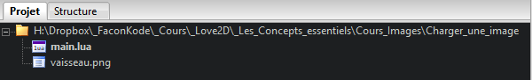
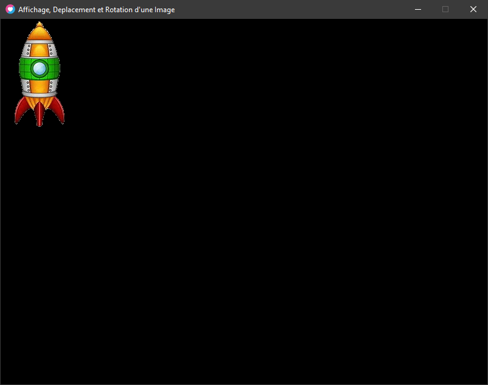

### Charger une Image

  _Cliquer sur l'icône ci-dessous pour télécharger les fichiers sources pour suivre le cours ! (code et image)_               dézipper le dossier et utiliser le fichier _main.lua_ fournit.  

<figure>

[](https://www.dropbox.com/s/d9yjm1yva4f1gv5/Charger_une_image.zip?dl=0)

<figcaption>

[https://www.dropbox.com/s/d9yjm1yva4f1gv5/Charger\_une\_image.zip?dl=0](https://www.dropbox.com/s/d9yjm1yva4f1gv5/Charger_une_image.zip?dl=0)

</figcaption>

</figure>



### Pour afficher notre image nous aurons besoin de la charger en mémoire !

**Pseudo-Code :**

```
maVariable = les métadonnées de monImage.png   
```

**Solution avec Love2D :**

* * *

[love.graphics.newImage()](https://love2d.org/wiki/love.graphics.newImage)

```
image = love.graphics.newImage( filename ) 
```

**Arguments**

[string](https://love2d.org/wiki/string) `filename` Le chemin vers votre image.

**Returns**

[Image](https://love2d.org/wiki/Image) `image` L'object Image qui peut être dessin à l'écran.

* * *

**Le Code :**

```
image = love.graphics.newImage("vaisseau.png")
print(image)
```

sortie console :

```
Image: 0x01db75a22f30
```

L'image est bien chargée ! Nous avons même son emplacement mémoire !  

##### **Important !**

| _Une image doit être chargée qu'une seule fois !_   _toujours charger une image en dehors de l'update(dt) et du draw() et de tout autres fonctions qui sera amené à être appelé de nouveau !_   _Car à chaque fois que la fonction love.graphics.newImage() est appelée il met en mémoire une nouvelle fois l'image dans une nouvelle adresse, vous aurez donc **des doublons** qui vont saturer la mémoire RAM et pourront causer des CRASH ! ! !_ |
| --- |

### Afficher l'image

Pour afficher nous savons qu'il faut utiliser la fonction love.draw() Pour afficher notre image, il nous faudra utiliser la fonction suivante

Solution avec Love2D :

* * *

[love.graphics.draw()](https://love2d.org/wiki/love.graphics.draw)

```
love.graphics.draw( drawable, x, y, r, sx, sy, ox, oy, kx, ky ) 
```

**Arguments**

[Drawable](https://love2d.org/wiki/Drawable) `drawable` L'object à dessiner.

[number](https://love2d.org/wiki/number) `x (0)` La position X

[number](https://love2d.org/wiki/number) `y (0)` La position Y

[number](https://love2d.org/wiki/number) `r (0)` La rotation de l'image (angle radian)

[number](https://love2d.org/wiki/number) `sx (1)` Le facteur de Scale X

n[umber](https://love2d.org/wiki/number) `sy (sx)` Le facteur de Scale Y

[number](https://love2d.org/wiki/number) `ox (0)` L'origine X de l'image (décalage)

[number](https://love2d.org/wiki/number) `oy (0)` L'origine Y de l'image (décalage)

[number](https://love2d.org/wiki/number) `kx (0)` Facteur de Découpage/recollage de l'image sur l'axe X

[number](https://love2d.org/wiki/number) `ky (0)` Facteur de Découpage/recollage de l'image sur l'axe Y

* * *

**Les positions, la rotation, les scaling et les découpages sont facultatifs.**

**Les valeurs par défaut sont :**

`x, y = 0, 0 -- Positions (axe x et y)`

`r = 0 -- Rotate (angle radian)`

`sx, sy = 1, 1 -- Scales (Facteur de scale (zoom/dezoom) à 1 le scale est normal)`

`ox, oy = 0, 0 -- Origins (points d'origines (par defaut en haut a gauche) )`

`kx, ky = 0, 0 -- Shearing  (Facteur de découpage/recollage)`  

**Exemple :**

```
image = love.graphics.newImage("vaisseau.png")

function love.draw()
  love.graphics.draw(image)
end
```

Rendu :



**On obtient exactement le même résultat avec :**

```
image = love.graphics.newImage("vaisseau.png")

local x = 0
local y = 0
local r = 0
local sx = 1
local sy = 1
local ox = 0
local oy = 0
local kx = 0
local ky = 0

function love.draw()
  love.graphics.draw( image, x, y, r, sx, sy, ox, oy, kx, ky )
end
```

* * *
