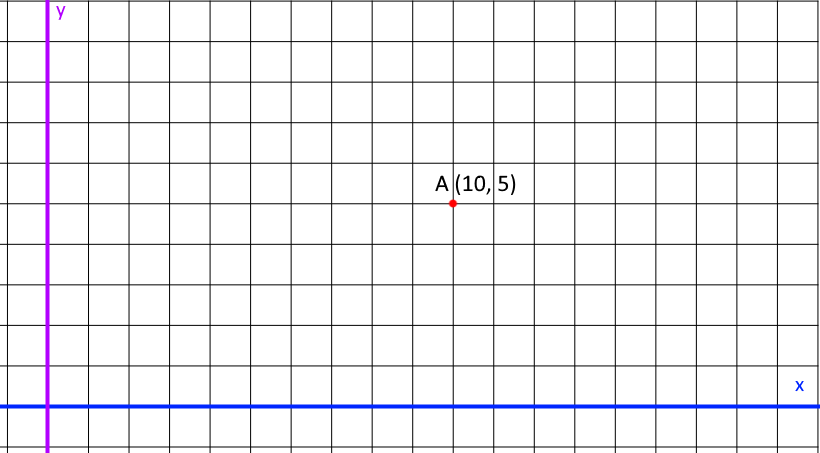

### Mise en situation :

On possède un **Object**.

On sait que notre **objet** est situé aux coordonnées x=10 et y=3.

Il se déplace d'une distance de **\-12** pixels.

sa direction est un **angle** de 70° degré.

### **On détermine le point _A_ comme point de Départ :**

Le point **A** est situé en x=10 et y=3,

soit **A(10,5)**

### **Le Vecteur _AB_ ?**

On connait son point A et le B à déterminer, on connait son angle et la distance qu'il va parcourir(-12)

### **Trouver le point _B_, notre point d'arrivée ?**

Sa position est à déterminer selon les variables du vecteur **AB**  

### Première étape :

```
local A = {x=10, y=5}

local B = {x=nil, y=nil}

local AB = {}
AB.distance = -12

AB.angleDegre = 70
AB.angleRadian = math.rad(AB.angleDegre)

AB.vector = {}
AB.vector.x = nil -- ???
AB.vector.y = nil -- ???
```

### Comment trouver le Point B ?

Représentons Le point A sur un repère orthogonal :



On connait l'angle de 70° et sa distance !

_ps : On pourrait facilement le dessiner et le représenter visuellement pour déterminer sa position... Cependant il nous faut la formule pour le calculer afin de pouvoir alimenter ces variables en temps réels pour nos jeux._

On va donc utiliser des fonctions qui vont nous y aider =)

### Les Fonctions :

  Pour déterminer le Vecteur Y, il faut utiliser la fonction [Sinus (mathématiques) — Wikipédia (wikipedia.org)](https://fr.wikipedia.org/wiki/Sinus_\(math%C3%A9matiques\))

Pour déterminer le Vecteur X, il faut utiliser la fonction [Cosinus — Wikipédia (wikipedia.org)](https://fr.wikipedia.org/wiki/Cosinus)

_Attention : Comme nous l'avons vu dans le Chapitre sur les Angles, les [Fonction trigonométrique — Wikipédia (wikipedia.org)](https://fr.wikipedia.org/wiki/Fonction_trigonom%C3%A9trique) nous renvois des angles en Radian !_

### Utiliser les Fonctions _**math.cos()**_ et _**math.sin()**_ en Code :

_Les fonctions **math.cos()** et **math.sin()** sont déjà intégrés à lua, pas besoin de les ajouter dans vos projets =)_

_math.cos(angleRadian) renvois le vecteur en abscisse X_

_math.sin(angleRadian) renvois le vecteur en ordonnée Y_  

Exemple avec un **angle de 70 degrés que l'on va convertir en Radian** :

```
local angleRadian = math.rad(70) -- radian d'un angle de 70 degre
local X = math.cos(angleRadian)
local Y = math.sin(angleRadian)

print("X = "..X)
print("Y = "..Y)
```

sortie console :

```
X = 0.34202014332567
Y = 0.93969262078591
```

### Déterminer le Vecteur AB avec _math.cos()_ et _math.sin()_ :

| _Important :_ Les valeurs retournées par **_math.cos()_** et **_math.sin()_**, sont calculées à partir de notre angle (en radian).      Ces deux fonctions nous renvoient une valeur de notre vecteur X (cos) ou un vecteur Y (sin), comprise entre -1 à 1. On dit alors que nous avons un vecteur normalisé car il est compris entre -1 à 1. La valeur ainsi normalisée nous permette de multiplier facilement ces valeurs selon une force de déplacement.      Avec un vecteur ainsi normalisé il est plus simple de calculer son prochain déplacement !   \- car il nous suffit de multiplier ce vecteur normalisé par la force de déplacer qu'on veut lui appliquer.      _**La valeur normalise corresponds à une valeur pour 1 déplacement.**_ |
| --- |

_Fin de la petite aparté._

* * *

Comme on connait la position du point A, et qu'on peut déduire le vecteur AB sur un segment de 1 avec les fonctions **math.cos()** et **math.sin()** avec son **angle**.

Il nous suffit de **multiplier cos et sin par sa vitesse** (la distance qu'il parcourt) pour déterminer le point d'arrivée de notre point **B**.

_**Ps :** il faut déterminer le point **B** en partant du point **A** !_

```
local A = {x=10, y=5} -- POINT A
 
local B = {x=nil, y=nil} -- POINT B

local AB = {} -- Vecteur AB

AB.distance = -12 -- distance parcouru

AB.angleDegre = 70 -- vers ou ? vers l'angle radian de 70 !
AB.angleRadian = math.rad(AB.angleDegre) -- conversion de l'angle en radian

-- on détermine son vecteur normalisé en utilisant cos et sin sur notre vecteur AB :
AB.cos = math.cos(AB.angleRadian) -- valeur normalisé conmprise entre -1 à 1 (x)
AB.sin = math.sin(AB.angleRadian) -- valeur normalisé conmprise  entre -1 à 1 (y)

-- On peut désormais placer le point B en partant du point A :
B.x = A.x + (AB.cos * AB.distance) -- position x + ( cos * distance)
B.y = A.y + (AB.sin * AB.distance) -- position y + ( sin * distance)

-- on peut calculer notre Vecteur AB :
AB.vector = {}
AB.vector.x = B.x - A.x
AB.vector.y = B.y - A.y

print("Le point B est situé :")
print("B("..B.x..", "..B.y..")")
print()
print("Le vecteur AB dispose des valeurs suivantes :")
print("AB angle radian = "..AB.angleRadian)
print("AB angle degre = "..AB.angleDegre)
print("AB distance = "..AB.distance)
print("AB vector x = "..AB.vector.x)
print("AB vector y = "..AB.vector.y)
```

sortie console :

```
Le point B est situé :
B(5.895758280092, -6.2763114494309)

Le vecteur AB dispose des valeurs suivantes :
AB angle radian = 1.221730476396
AB angle degre = 70
AB distance = -12
AB vector x = -4.104241719908
AB vector y = -11.276311449431
```

  Ceci est l'explication complète, étape par étape, pour vous aider à comprendre ce que l'on fait. En réalité, il existe une formule bien plus rapide pour trouver le point B !  

### Méthode Rapide pour trouver le point B !

on sait qu'on peut déterminer le cos et le sin, avec son angle.

Qu'il faut ensuite multiplier par son déplacement pour situer le point B.

### La Formule Rapide :

```
-- déplacement avec un angle 
Objet.x = Objet.x + (math.cos(Objet.angleRadian) * Objet.speed)
Objet.y = Objet.y + (math.sin(Objet.angleRadian) * Objet.speed)
```

### **_Donc pour notre Vecteur AB :_**

```
local Objet = {}

print("départ :")

Objet.x = 10
Objet.y = 5
Objet.speed = -12
Objet.angleRadian = math.rad(70)

print("Objet.x = "..Objet.x)
print("Objet.y = "..Objet.y)
print()

print("On le déplace :")
print()
Objet.x = Objet.x + (math.cos(Objet.angleRadian) * Objet.speed)
Objet.y = Objet.y + (math.sin(Objet.angleRadian) * Objet.speed)

print("arrivée :")
print("Objet.x = "..Objet.x)
print("Objet.y = "..Objet.y)
```

sortie console :

```
départ :
Objet.x = 10
Objet.y = 5

On le déplace :

arrivée :
Objet.x = 5.895758280092
Objet.y = -6.2763114494309
```


* * *
