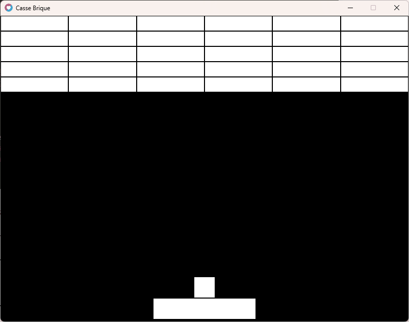
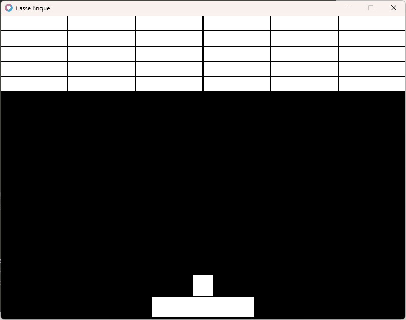

## Collision avec les briques !

Nous allons utiliser à peu de chose près la même méthode pour tester les collisions avec les briques.

il faut tester la position en X et Y, de la balle par rapport aux briques.

La différence c'est que nous testerons le bas des briques cette fois.

Et que nous devrons parcourir toutes nos briques pour savoir quelles briques sont en collision avec la balle.

Nous utiliserons une méthode simple.

## Parcourir les briques

Il faut parcourir le tableau 2D des briques.

Voyons déjà comment parcourir nos briques :

```
function love.update(dt)  
	-- collision entre la balle et les briques : 
	for ligne=1, 5 do
    	for colonne=1, 6 do
    	end
  	end
end
```

Nous utiliserons le même concept de boucle imbriquée, utiliser pour dessiner nos briques avec des variables locales X, Y, W et H pour les positions et dimensions de nos briques.

```
function love.update(dt)  
	-- collision entre la balle et les briques : 
  	local x, y, w, h -- nos variables de positions et dimensions de nos briques
  	x = 0
  	y = 0
  	w = 800 / 6
  	h = 30
	for ligne=1, 5 do
    	for colonne=1, 6 do
			x = x + w
    	end
		x = 0
		y = y + h
  	end
end
```

Maintenant nous devons tester la balle avec la brique.

Cependant nous devons être sûrs que la balle se trouve dans la brique cette fois nous testerons les deux conditions en Y.

```
function love.update(dt)  
	-- collision entre la balle et les briques : 
  	local x, y, w, h -- nos variables de positions et dimensions de nos briques
  	x = 0
  	y = 0
  	w = 800 / 6
  	h = 30
	for ligne=1, 5 do
    	for colonne=1, 6 do      		
			-- test collision en X ?
      		if balle.x + balle.w > x and balle.x < x + w then
    
    			-- test collsion en Y ?
    			if balle.y + balle.h > y and balle.y < y + h then
          			balle.y = y+h
					balle.vy = 0 - balle.vy
          		end
        	end
      		
			x = x + w
    	end
		x = 0
		y = y + h
  	end
end
```

À ce point-là, notre balle doit rebondir sur les briques.

Voici le code que vous devriez avoir :

```
love.window.setTitle("Casse Brique")

local raquette = {x=300, y=555, w=200, h=40, speed=250}

local balle = {x=0, y=0, w=40, h=40, isGlue=true, vx=-1, vy=-1, speed=300}

local briques = {} -- nos briques

-- creation des briques
for ligne=1, 5 do
  briques[ligne] = {}
  for colonne=1, 6 do
    briques[ligne][colonne] = 1
  end
end
--

function love.update(dt)
  if balle.isGlue == true then
    balle.x = raquette.x + ((raquette.w / 2) - (balle.w / 2))
    balle.y = raquette.y - (balle.h +  2)
  elseif balle.isGlue == false then
    balle.x = balle.x + (balle.vx * balle.speed * dt)
    balle.y = balle.y + (balle.vy * balle.speed * dt)
  end

  -- la balle rebondi sur le bord droit ou gauche
  if balle.x < 0 then
    balle.x = 0
    balle.vx = 0 - balle.vx
  elseif balle.x + balle.w > 800 then
    balle.x = 800 - balle.w
    balle.vx = 0 - balle.vx
  end

  -- la balle rebondi sur le bord en haut
  if balle.y < 0 then
    balle.y = 0
    balle.vy = 0 - balle.vy
  end

  -- la balle est perdue si elle a touchee le bord en bas
  if balle.y + balle.h > 600 then
    balle.isGlue = true
    balle.vy = -1
    balle.vx = -1
  end

  -- deplacement de la raquette Droite ou Gauche
  if love.keyboard.isDown("left") then
    raquette.x = raquette.x - (raquette.speed * dt)
  elseif love.keyboard.isDown("right") then
    raquette.x = raquette.x + (raquette.speed * dt)
  end

  -- limiter le deplacement de la raquette a la fenetre du jeu
  if raquette.x < 0 then
    raquette.x = 0
  elseif raquette.x + raquette.w > 800 then
    raquette.x = 800 - raquette.w
  end

  -- collision balle avec raquette :
  -- test collision en X ?
  if balle.x + balle.w > raquette.x and balle.x < raquette.x + raquette.w then

    -- test collsion en Y ?
    if balle.y + balle.h > raquette.y then

      -- 1 | on replace la balle juste au dessus de la raquette
      balle.y = raquette.y - balle.h

      -- 2 | on inverse la direction VY de la balle
      balle.vy = 0 - balle.vy

    end

  end

  -- collision entre la balle et les briques : 
  local x, y, w, h -- nos variables de positions et dimensions de nos briques
  x = 0
  y = 0
  w = 800 / 6
  h = 30
  for ligne=1, 5 do
    for colonne=1, 6 do
      -- test collision en X ?
      if balle.x + balle.w > x and balle.x < x + w then

        -- test collsion en Y ?
        if balle.y + balle.h > y and balle.y < y + h then
          balle.y = y+h
          balle.vy = 0 - balle.vy
        end
      end

      x = x + w
    end
    x = 0
    y = y + h
  end

end
--

function love.draw()

  -- notre raquette
  love.graphics.rectangle("fill", raquette.x, raquette.y, raquette.w, raquette.h)

  -- notre balle
  love.graphics.rectangle("fill", balle.x, balle.y, balle.w, balle.h)

  local x, y, w, h -- nos variables briques

  x = 0
  y = 0
  w = 800 / 6
  h = 30

  for ligne=1, 5 do

    for colonne=1, 6 do
      love.graphics.rectangle("fill", x+1, y+1, w-2, h-2)  
      x = x + w -- a chaque colonne on decale notre variable x de la largeur d une brique
    end

    x = 0 -- on remets la position x pour la ligne suivante
    y = y + h -- on decalle la position y pour la ligne suivante
  end

end

function love.keypressed(key)
  if key == "space" and balle.isGlue == true then
    balle.isGlue = false
  end
end
```

Un apercu :



Or nous, on veut supprimer les briques touchées par notre balle.

* * *

## Suppression des briques

S’il y a collision nous passerons la valeur de **brique** à 0.

Nous allons rajouter une **condition pour tester la collision avec la brique** seulement **si la valeur de brique vaut 1**.

```
  -- collision entre la balle et les briques : 
  local x, y, w, h -- nos variables de positions et dimensions de nos briques
  x = 0
  y = 0
  w = 800 / 6
  h = 30
  for ligne=1, 5 do
    for colonne=1, 6 do

      if briques[ligne][colonne] == 1 then -- on test la brique si celle-ci vaut 1

        -- test collision en X ?
        if balle.x + balle.w > x and balle.x < x + w then

          -- test collsion en Y ?
          if balle.y + balle.h > y and balle.y < y + h then
            balle.y = y+h
            balle.vy = 0 - balle.vy
            briques[ligne][colonne] = 0 -- ainsi la brique ne sera plus a tester
          end
        end

      end

      x = x + w
    end
    x = 0
    y = y + h
  end
```

il ne faut pas oublier de n'afficher que les briques non détruites dans notre update.

Nous rajouterons alors aussi cette condition.

```
function love.draw()
  local x, y, w, h -- nos variables briques
  x = 0
  y = 0
  w = 800 / 6
  h = 30

  for ligne=1, 5 do

    for colonne=1, 6 do
      if briques[ligne][colonne] == 1 then -- on affiche la brique si celle-ci vaut 1
        love.graphics.rectangle("fill", x+1, y+1, w-2, h-2)
      end
      x = x + w -- a chaque colonne on decale notre variable x de la largeur d une brique
    end

    x = 0 -- on remets la position x pour la ligne suivante
    y = y + h -- on decalle la position y pour la ligne suivante
  end
end
```

Voici le code complet :

```
love.window.setTitle("Casse Brique")

local raquette = {x=300, y=555, w=200, h=40, speed=250}

local balle = {x=0, y=0, w=40, h=40, isGlue=true, vx=-1, vy=-1, speed=300}

local briques = {} -- nos briques

-- creation des briques
for ligne=1, 5 do
  briques[ligne] = {}
  for colonne=1, 6 do
    briques[ligne][colonne] = 1
  end
end
--

function love.update(dt)
  if balle.isGlue == true then
    balle.x = raquette.x + ((raquette.w / 2) - (balle.w / 2))
    balle.y = raquette.y - (balle.h +  2)
  elseif balle.isGlue == false then
    balle.x = balle.x + (balle.vx * balle.speed * dt)
    balle.y = balle.y + (balle.vy * balle.speed * dt)
  end

  -- la balle rebondi sur le bord droit ou gauche
  if balle.x < 0 then
    balle.x = 0
    balle.vx = 0 - balle.vx
  elseif balle.x + balle.w > 800 then
    balle.x = 800 - balle.w
    balle.vx = 0 - balle.vx
  end

  -- la balle rebondi sur le bord en haut
  if balle.y < 0 then
    balle.y = 0
    balle.vy = 0 - balle.vy
  end

  -- la balle est perdue si elle a touchee le bord en bas
  if balle.y + balle.h > 600 then
    balle.isGlue = true
    balle.vy = -1
    balle.vx = -1
  end

  -- deplacement de la raquette Droite ou Gauche
  if love.keyboard.isDown("left") then
    raquette.x = raquette.x - (raquette.speed * dt)
  elseif love.keyboard.isDown("right") then
    raquette.x = raquette.x + (raquette.speed * dt)
  end

  -- limiter le deplacement de la raquette a la fenetre du jeu
  if raquette.x < 0 then
    raquette.x = 0
  elseif raquette.x + raquette.w > 800 then
    raquette.x = 800 - raquette.w
  end

  -- collision balle avec raquette :
  -- test collision en X ?
  if balle.x + balle.w > raquette.x and balle.x < raquette.x + raquette.w then

    -- test collsion en Y ?
    if balle.y + balle.h > raquette.y then

      -- 1 | on replace la balle juste au dessus de la raquette
      balle.y = raquette.y - balle.h

      -- 2 | on inverse la direction VY de la balle
      balle.vy = 0 - balle.vy

    end

  end

  -- collision entre la balle et les briques : 
  local x, y, w, h -- nos variables de positions et dimensions de nos briques
  x = 0
  y = 0
  w = 800 / 6
  h = 30
  for ligne=1, 5 do
    for colonne=1, 6 do

      if briques[ligne][colonne] == 1 then -- on test la brique si celle-ci vaut 1

        -- test collision en X ?
        if balle.x + balle.w > x and balle.x < x + w then

          -- test collsion en Y ?
          if balle.y + balle.h > y and balle.y < y + h then
            balle.y = y+h
            balle.vy = 0 - balle.vy
            briques[ligne][colonne] = 0 -- ainsi la brique ne sera plus a tester
          end
        end

      end

      x = x + w
    end
    x = 0
    y = y + h
  end

end
--

function love.draw()

  -- notre raquette
  love.graphics.rectangle("fill", raquette.x, raquette.y, raquette.w, raquette.h)

  -- notre balle
  love.graphics.rectangle("fill", balle.x, balle.y, balle.w, balle.h)

  local x, y, w, h -- nos variables briques
  x = 0
  y = 0
  w = 800 / 6
  h = 30

  for ligne=1, 5 do

    for colonne=1, 6 do
      if briques[ligne][colonne] == 1 then -- on affiche la brique si celle-ci vaut 1
        love.graphics.rectangle("fill", x+1, y+1, w-2, h-2)
      end
      x = x + w -- a chaque colonne on decale notre variable x de la largeur d une brique
    end

    x = 0 -- on remets la position x pour la ligne suivante
    y = y + h -- on decalle la position y pour la ligne suivante
  end

end

function love.keypressed(key)
  if key == "space" and balle.isGlue == true then
    balle.isGlue = false
  end
end
```

Un aperçu :



Vous pouvez profiter de votre première œuvre.

Mais il reste encore quelques mécaniques à ajouter.

_Les collisions restent primaires, mais sont fonctionnelles pour un premier jeu je ne voulais pas rendre le code trop complexe._

- Le jeu est trop simple, on peut relancer la balle indéfiniment.  
    \- Alors nous ajouterons des vies.

- Ça manque de fun, il faut au moins ajouter un score.

- À la fin du niveau quand il n'y a plus de briques, il nous faut recréer de nouvelles briques.

- Si le joueur n'a plus de vie (partie perdue) il faut remettre le jeu à son état d'origine.

Voyons tout cela ensemble dans la suite de ce cours.

* * *
