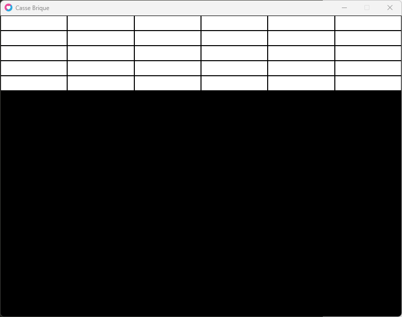
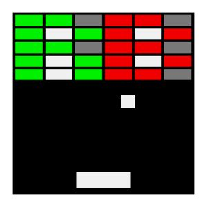
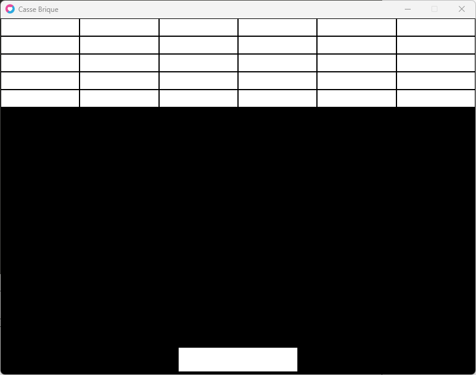
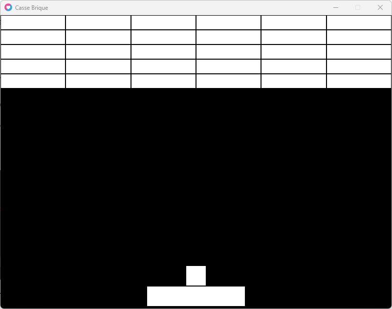

Maintenant que nous avons nos briques :



Nous allons pouvoir créer la raquette et la balle !

Rappel de notre objectif en image :



## 1- La raquette

La raquette est plus grande qu'une brique, on va essayer de reproduire a peu de chose près les mêmes dimensions.

- Une dimension W de 200

- Une dimension H de 40

- Une position X afin de centrer le rectangle au milieu de l'écran

- Une position Y vers le bas de l'écran en prenant en compte sa hauteur et un petit espace.

* * *

Pour calculer la position X :

- Notre raquette fait 200 pixels de large. Donc sa moitié fait 100 pixels.

- L'écran fait 800 pixels de large, donc la moitié de l'écran est a 400.

Pour centrer la raquette à notre fenêtre love2d on doit donc faire un petit calcul :

```
X = 400 - 100
```

Soit 300

* * *

Pour calculer la position Y :

- Notre raquette fait 40 pixels de Hauteur.  
    L’écran fait 600 pixels de hauteur

- On va laisser un espace au hasard de 5 pixels.

Pour positionner la raquette en hauteur on doit donc faire un petit calcul :

```
Y = 600 - (40 + 5 )
```

Soit 555

* * *

Pour notre raquette nous aurons donc besoin de ceci :

```
local raquette = {x=300, y=555, w=200, h=40}

function love.draw()
  
  -- notre raquette
  love.graphics.rectangle("fill", raquette.x, raquette.y, raquette.w, raquette.h)
  
end
```

* * *

Ce qui nous donne le code suivant :

```
love.window.setTitle("Casse Brique")

local raquette = {x=300, y=555, w=200, h=40}

local briques = {} -- nos briques

-- creation des briques
for ligne=1, 5 do
  briques[ligne] = {}
  for colonne=1, 6 do
    briques[ligne][colonne] = 1
  end
end
--

function love.draw()
  
  -- notre raquette
  love.graphics.rectangle("fill", raquette.x, raquette.y, raquette.w, raquette.h)
  
  
  
  local x, y, w, h -- nos variables briques
  
  x = 0
  y = 0
  w = 800 / 6
  h = 30

  for ligne=1, 5 do
    
    for colonne=1, 6 do
    	love.graphics.rectangle("fill", x+1, y+1, w-2, h-2)  
    	x = x + w -- a chaque colonne on decale notre variable x de la largeur d une brique
    end

    x = 0 -- on remets la position x pour la ligne suivante
    y = y + h -- on decalle la position y pour la ligne suivante
  end

end
```

Voici le résultat au draw :



* * *

## 2- La balle

Nous allons procéder de la même manière pour ajouter notre balle.

Seulement on veut que notre balle soit au-dessus de notre raquette.

Si l'on bouge la raquette sans avoir tiré, nous voulons que celle-ci suive alors la raquette...

Donc nous aurons besoin de ceci :

- Les positions X et Y, centrées à notre raquette

- Les dimensions W et H de 40x40 de largeur et hauteur

- Replacer la balle au centre de la raquette dans **love.update(dt)**

Comme nous connaissons les dimensions de la raquette et de notre balle, il nous suffit de faire deux petits calculs et le tour est joué.

* * *

Calculer la position X

Notre raquette fait 200 pixels, donc la moitié est de 100 pixels.

```
raquette.w / 2 = 100
```

  
La balle fait 40 pixels, donc la moitié est de 20 pixels.

```
balle.w / 2 = 20
```

  
Comme nous voulons placer la balle par rapport à la position de la raquette nous n'utiliserons pas les dimensions de l'écran mais bien la position de la raquette.

```
X = raquette.x + 100 - 20
```

* * *

Calculer la position Y

Nous connaissons la position haute de la raquette.

```
raquette.y
```

Il nous faut placer la balle au-dessus de la raquette, nous connaissons la hauteur de la raquette qui fait 20 pixels.

```
balle.h
```

Pour garder l'esprit visuel des briques on ajoutera aussi un espace de 2 pixels entre la balle et la raquette.

```
Y = raquette.y - (20 + 2)
```

* * *

Résume de la balle :

```
local balle = {x=0, y=0, w=40, h=40}

function love.update(dt)
	balle.x = raquette.x + ((raquette.w / 2) - (balle.w / 2))
	balle.y = raquette.y - (balle.h +  2)
end

function love.draw()
	love.graphics.rectangle("fill", balle.x, balle.y, balle.w, balle.h)
end
```

* * *

intégrons la balle à notre code :

```
love.window.setTitle("Casse Brique")

local raquette = {x=300, y=555, w=200, h=40}

local balle = {x=0, y=0, w=40, h=40}

local briques = {} -- nos briques

-- creation des briques
for ligne=1, 5 do
  briques[ligne] = {}
  for colonne=1, 6 do
    briques[ligne][colonne] = 1
  end
end
--

function love.update(dt)
	balle.x = raquette.x + ((raquette.w / 2) - (balle.w / 2))
	balle.y = raquette.y - (balle.h +  2)
end
--

function love.draw()
  
  -- notre raquette
  love.graphics.rectangle("fill", raquette.x, raquette.y, raquette.w, raquette.h)
  
  -- notre balle
  	love.graphics.rectangle("fill", balle.x, balle.y, balle.w, balle.h)
 
  local x, y, w, h -- nos variables briques
  
  x = 0
  y = 0
  w = 800 / 6
  h = 30

  for ligne=1, 5 do
    
    for colonne=1, 6 do
    	love.graphics.rectangle("fill", x+1, y+1, w-2, h-2)  
    	x = x + w -- a chaque colonne on decale notre variable x de la largeur d une brique
    end

    x = 0 -- on remets la position x pour la ligne suivante
    y = y + h -- on decalle la position y pour la ligne suivante
  end

end
```

* * *

Résultat :



* * *

Bien, maintenant nous avons tous nos éléments de base pour animer notre jeu :)

C'est parti !

* * *
