### Étape 1 : Créer un Object de type Rectangle

Créons un rectangle avec une position **X** et **Y**

```
x = 1
y = 10
```

ajoutons-lui une largeur **W** et une hauteur **H**

```
w = 50
h = 50 
```

rajoutons-lui également une vitesse **SPEED**

```
speed = 600
```

**Pourquoi 600 ?**

Pour rappel le _DeltaTime_ est en moyenne à _0,012_ milliseconde pour un jeu tournant a 60 Fps.

Love2D est bridé par défaut à cette vitesse de 60 Fps.

Calcul : **speed \* dt = pixels parcourus/seconde**

600 \* 0,012 = 7,2

**Conclusions :**

Notre Object Rectangle se déplacera donc de 7,2 pixels en moyenne par seconde !

Rappel **un object** **en** **Lua** est assimilé à une **table** et nous l'appellerons : _**rect**_

**Solution :**

```
local rect = {}
rect.x = 1
rect.y = 10
rect.w = 50
rect.h = 50
rect.speed = 600
```

Peut s'écrire aussi comme ceci :

```
local rect = {x=1, y=10, w=50, h=50, speed=600}
```

_ps : **local** pour rappel détermine la portée de nos variables et son accès en mémoire plus rapide, nous verrons plus tard que nos variables **locales** peuvent aussi avoir une portée **Globales**..._

### Étape 2 : Afficher notre Objet Rect

  Tout d'abord, nous allons afficher le rectangle dans love.draw() :

```
local rect = {x=1, y=10, w=50, h=50, speed=600}

function love.draw()
  love.graphics.rectangle("fill",rect.x,rect.y,rect.w,rect.h)
end
```

Rendu :

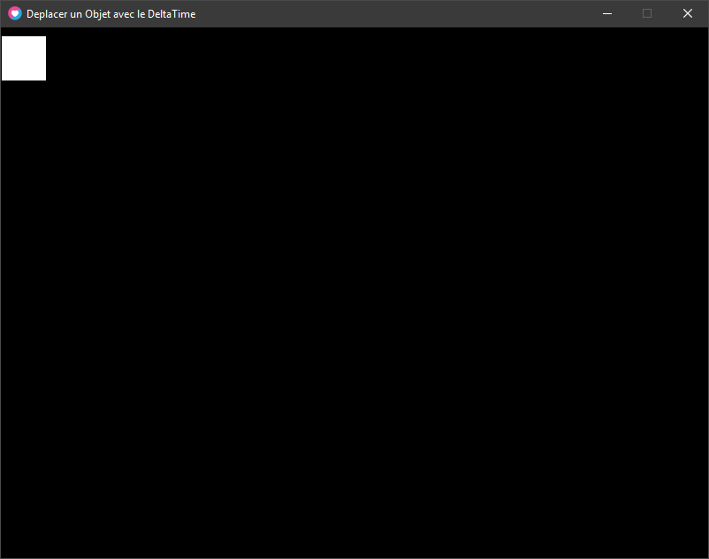

  **Notre object rectangle est bien affiché !**

Rendons notre rectangle plus autonome, créons-lui sa propre fonction draw !  

```
local rect = {x=1, y=10, w=50, h=50, speed=600}

function rect.draw()
  love.graphics.rectangle("fill",rect.x,rect.y,rect.w,rect.h)
end
--

function love.draw()
  rect.draw()
end
```

  L'intérêt de faire ceci est utile, car lorsque vous aurez plusieurs object à update et à draw, cela vous permettra de rendre votre code plus organiser, et donc plus lisible.

Sinon vous vous retrouverez avec toutes vos actions et votre code dans les 2 seules fonctions de love qui constituent votre GameLoop love.draw() et love.update(dt.  
Cela deviendra vite incompréhensible et difficile d'organiser votre code et l'ordre d'exécutions des éléments de vos jeux.

_Prenez pour habitude de faire ceci, et votre progression n'en sera que meilleure._  

### Étape 3 : Déplacer l'Object Rectangle (simplifié)

Pour déplacer l'Object Rectangle, nous devons appliquer une force de déplacement à cet object :

la vitesse !

Pour appliquer cette vitesse et lui donner une nouvelle position, il nous faut connaitre l'ancienne position.

pseudo code :

```
nouvelle position = ancienne position + vitesse
```

Ce qui nous donne pour notre Object Rectangle :

```
rect.x = rect.x + rect.speed rect.y = rect.y + rect.speed 
```

Cependant, nous devons appliquer le **Delta Time** (dt) à l'Object Rectangle, pour que notre rectangle dispose de la même vitesse sur toutes machines confondues !

#### La formule simplifié pour déplacer un Object avec le DeltaTime est le suivant :

```
function love.update(dt)
  position = position + (vitesse * dt)
end
```

Ce qui nous donne sur notre Object Rectangle un déplacement avec le Delta Time suivant :

```
function love.update(dt)
	rect.x = rect.x + (rect.speed * dt) 
    rect.y = rect.y + (rect.speed * dt)
 end
```

en Conclusion ça donne ça :

```
local rect = {x=100, y=225, w=100, h=100, speed=600}

function rect.draw()
  love.graphics.rectangle("fill",rect.x,rect.y,rect.w,rect.h)
end

function love.update(dt)

  -- Déplacement avec le DeltaTime :
  rect.x = rect.x + (rect.speed * dt)
  rect.y = rect.y + (rect.speed * dt)
  
end

function love.draw()
  rect.draw()
end
```

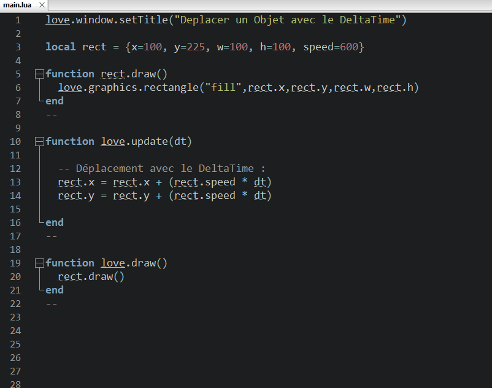

### Par contre, comme vous l'aurez constaté on a deux problèmes !

1. il part en bas à droite ? pourquoi ?

3. il sort de la fenêtre ? pourquoi ?

### Réponse au Problème 1 :

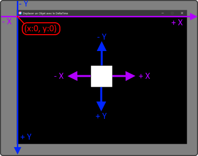

_notre rectangle part en bas à droite ? pourquoi ?_ L'object par en bas à droite, car on Ajoute une force Positive a X et Y, regarder bien le schéma ci-dessous. Si on cumule à la fois + X et +Y on se déplace bien en bas à droite !  

### solution 1 :

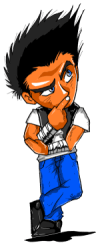

Pouvoir changer la vitesse en X et en Y selon nos choix.

Il faudrait Remplacer notre variable **speed** par une autre variable…?

### Réponse au Problème 2 :

_notre rectangle sort de la fenêtre ?_

_pourquoi ?_

Le monde 2D dans laquelle votre rectangle fait sa vie ne possède pas de limite de taille (heureusement).

Donc votre Object Rectangle continue son déplacement comme vous lui avez demandé, mais il n'est tout simplement plus visible à l'écran.

### Solution 2 :

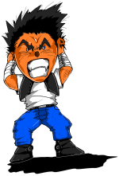

Une des solutions possible serait de limiter le rectangle à notre fenêtre...  

# Étape 4 : Améliorer le déplacement de notre Objet Rectangle

  Pour éviter que notre Object Rectangle sorte de l'écran, il nous faut déterminer une limite ! Nous allons donc, lui dire de rebondir contre les murs de la fenêtre de Love2D !

#### Connaitre la Largeur et la Hauteur de votre fenêtre de jeu Love2D :

#### 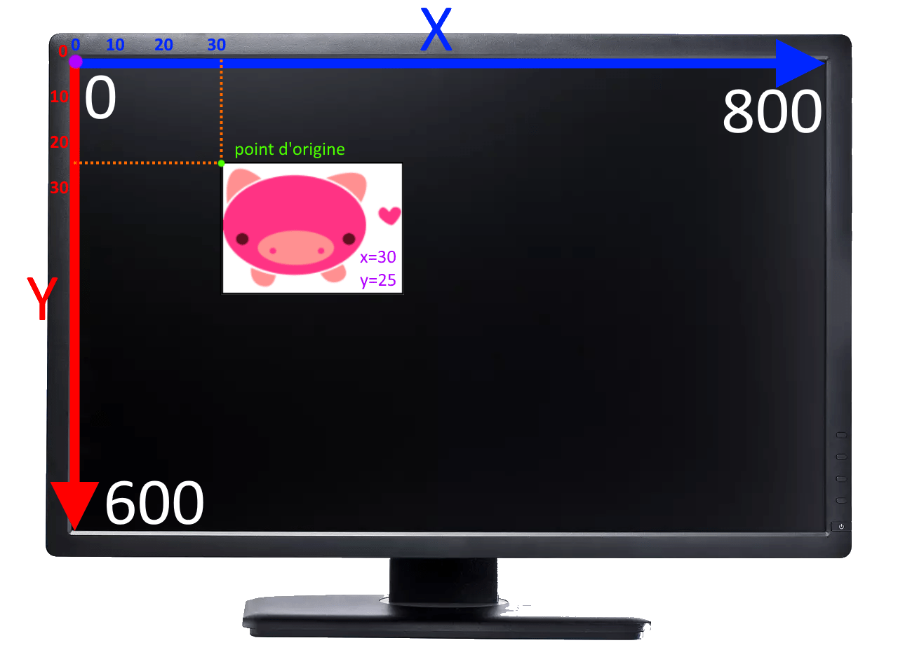

* * *

love.graphics.getDimensions( )

```
width, height = love.graphics.getDimensions() 
```

_**Arguments**_

Pas d'arguments.

_**Returns**_

[number](https://love2d.org/wiki/number) `width` La largeur de la fenêtre. (axe X)

[number](https://love2d.org/wiki/number) `height` La hauteur de la fenêtre. (Axe Y)

il renvoie donc deux variables de type nombre, le premier étant la largeur et le second la hauteur.

* * *

On va donc créer un Objet qui représentera notre fenêtre qu'on appellera : **screen**  

```
local screen = {}
screen.width, screen.height = love.graphics.getDimensions()
```

#### Connaitre les points de notre Rectangle :

Nous connaissons son **point d'origine** grâce à ses coordonnées **X** et **Y**.  

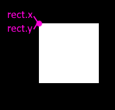

Maintenant il nous faut connaitre le point en haut à droite pour savoir quand est-ce que celui-ci touchera le bord de l'écran pour le faire repartir dans l'autre sens !

Ce point se situe sur l'**axe X** et nous connaissons sa largeur qui est **rect.w**.

Ainsi que son point d'origine **rect.x**

le calcul est donc le suivant :

```
Point_enHaut_A_Droite = rect.x + rect.w 
```

Ce qui nous donne pour avoir tous les points...  

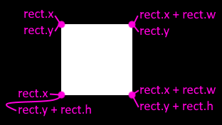

# Limiter L'Objet Rectangle a la fenêtre Love2D

maintenant que nous savons comment déterminer les 4 points qui détermine notre Rectangle, nous pouvons savoir si celui-ci est en dehors de la fenêtre Love2d ! en pseudo code cela nous donne donc ceci :

```
Si Rectangle est inférieur ou supérieur > à notre Fenetre ALORS
	On fait repartir notre rectangle dans l'autre sens
FIN
```

En Lua nous obtenons alors ceci :

```
if rect.x + rect.w >= screen.width then -- Si le côté droit du rectangle est supérieur ou egale au brod DROIT de la fenetre ALORS

    -- on repart dans l'autre sens !
  
elseif rect.x <= 0 then -- Si inférieur ou égale a Zéro ALORS

    -- on repart dans l'autre sens !

end
```

#### Déplacer correctement l'Objet Rectangle !

  **Rappel, La formule pour déplacer un Object avec le DeltaTime est le suivant :**

```
function love.update(dt)
  position = position + (vitesse * dt)
end
```

**Rappel, la position dans un monde en 2D est representé par deux axes, soit les axes X et Y :**

```
function love.update(dt)
  position.x = position.x + (vitesse.x * dt)
  position.y = position.y + (vitesse.y * dt)
end
```

On appelle souvent **vitesse.x** et **vitesse.y** également vélocité de l'object.

Ce qui nous donne alors les **VélocitéX** et **VélocitéY** de l'Object...

Comme les programmeurs n'aiment pas les noms à rallonges...

On les surnomme alors : **VX et VY !**

_ps : les vélocités X et Y sont en réalité des vecteurs..., mais nous aborderons ceci plus tard dans le cours avec les Angles..._

##### La VRAIE Solution pour notre formule de déplacement dans un Monde 2D est donc la suivante !

```
function love.update(dt)
  Objet.x = Objet.x + (Objet.vx * dt)
  Objet.y = Objet.y + (Objet.vy * dt)
end
```

##### 

#### Modifions notre Object pour répondre aux normes !

```
local rect = {x=100, y=225, w=100, h=100, speed=600, vx = 0, vy = 0}
```

Bien nous avons donc les variables VX et VY !

VX : permet les déplacements Droite ou Gauche

VY : permet les déplacements Haut ou Bas

Petit schéma démonstratif des 8 Directions classiques que l'on rencontre dans les jeux vidéos :

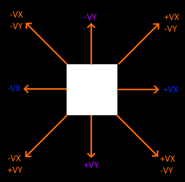

Elles sont utilisées dans les jeux qui se jouent uniquement avec une croix directionnelle (ou les touches du clavier) :

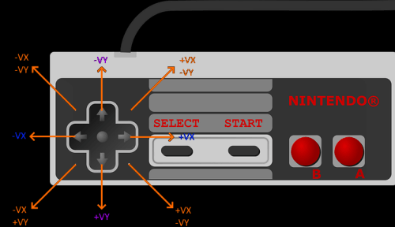

Concrètement, lorsque deux flèches de directions sont utilisés simultanément, par exemple Haut et Gauche.

C'est les directions -VX et -VY qui seront appliqués à notre Personnage (Object) !  

#### Rajoutons notre formule de déplacement a notre Object Rectangle !

Appliquons la formule de déplacement à notre Object :  

```
  rect.x = rect.x + (rect.vx * dt)
  rect.y = rect.y + (rect.vy * dt)
```

Nous avons déterminé comment savoir lorsque notre Object rectangle touche les bords de la fenêtre. Lorsque L'Object Rectangle touche un bord, nous lui dirons qu'il doit repartir dans la vitesse opposée ! Pseudo code : `Si l'Object touche le Bord Droit, il devra repartir à Gauche soit avec une VélocitéX négative !` `Si l'Object touche le Bord Gauche, il devra repartir à Droite soit avec une VélocitéX positive !`   Soit :

```
  if rect.x + rect.w >= screen.width then
    rect.vx = 0 - rect.speed
  elseif rect.x <= 0 then
    rect.vx = rect.speed
  end
```

  Appliquons également Ceci pour les Bords Haut et Bas :

```
  if rect.y + rect.h >= screen.height then
    rect.vy = 0 - rect.speed
  elseif rect.y <= 0 then
    rect.vy = rect.speed
  end
```

Appliquons tout cela dans une fonction a notre Object !

```
function rect.update(dt)

  -- Déplacement avec le DeltaTime :
  rect.x = rect.x + (rect.vx * dt)
  rect.y = rect.y + (rect.vy * dt)

  -- Rebonds sur les Bords Gauche et Droit de L'écran :
  if rect.x + rect.w >= screen.width then
    rect.vx = 0 - rect.speed
  elseif rect.x <= 0 then
    rect.vx = rect.speed
  end

  -- Rebonds sur les Bords Haut et Bas de L'écran :
  if rect.y + rect.h >= screen.height then
    rect.vy = 0 - rect.speed
  elseif rect.y <= 0 then
    rect.vy = rect.speed
  end

end
--
```

Désormais testons notre déplacement en attribuant des valeurs a VX ou VY ou les Deux en même temps =)

##### Test avec Déplacement VX :

```
local rect = {x=100, y=225, w=100, h=100, speed=600, vx = 600, vy = 600}

```

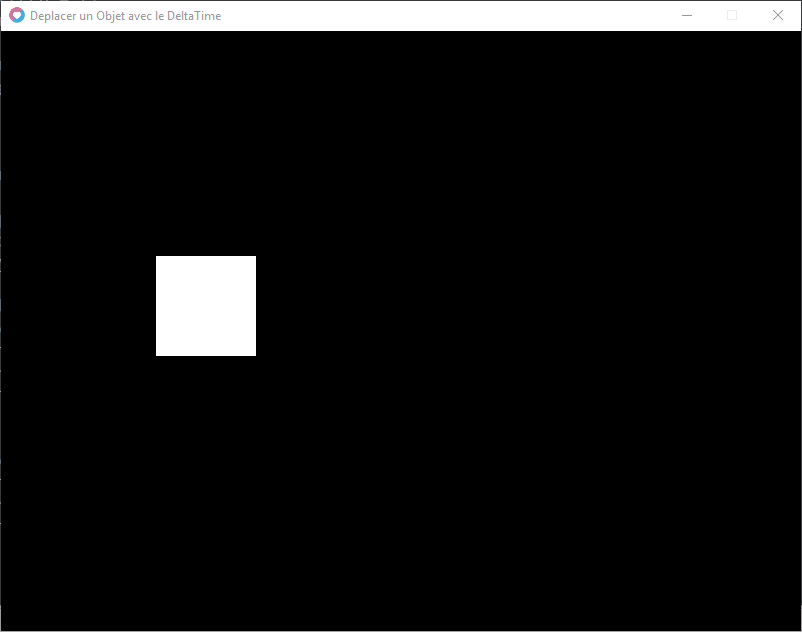

##### Test avec Déplacement VY :

```
local rect = {x=100, y=225, w=100, h=100, speed=600, vx = 0, vy = 600}
```

##### 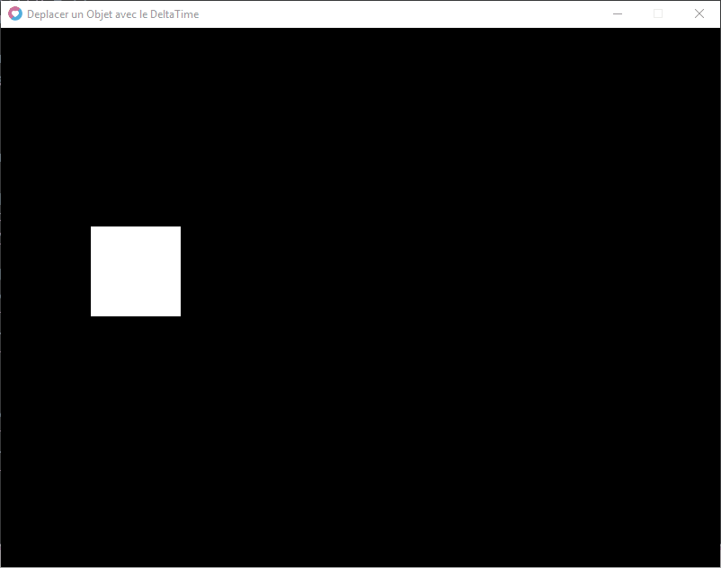

##### Test avec Déplacement VX et VY :

```
local rect = {x=100, y=225, w=100, h=100, speed=600, vx = 600, vy = 600}

```

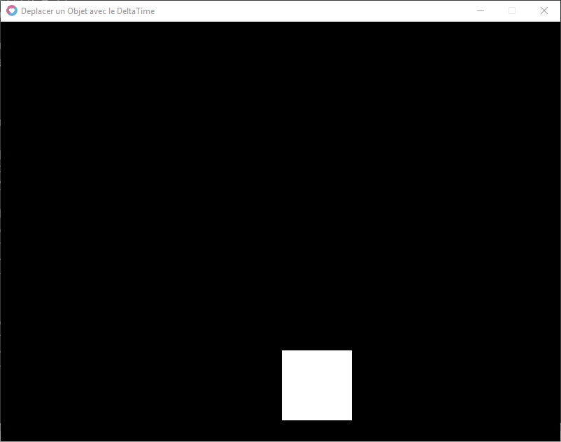

Super, c'est beau et ça fonctionne !

_Voici un bel exemple pour nos déplacements avec le DeltaTime !_

**Nous aborderons des rebonds plus réalistes dans la suite de ce cours !**    

* * *
