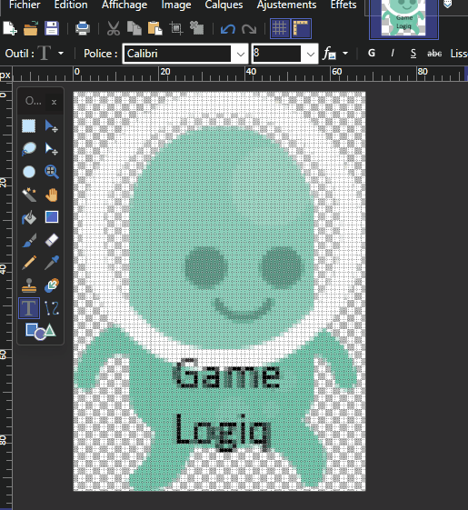
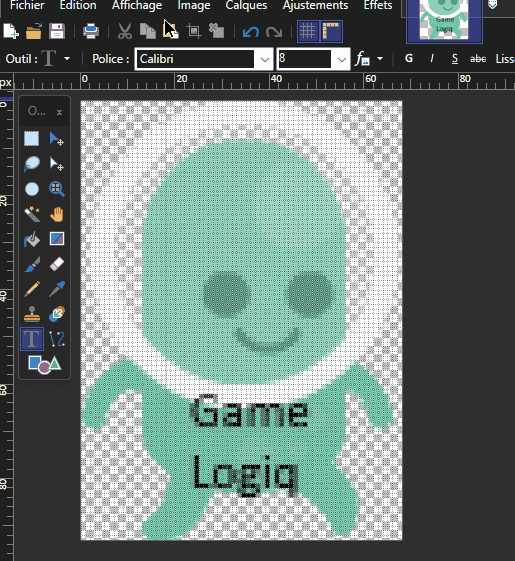
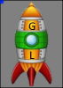
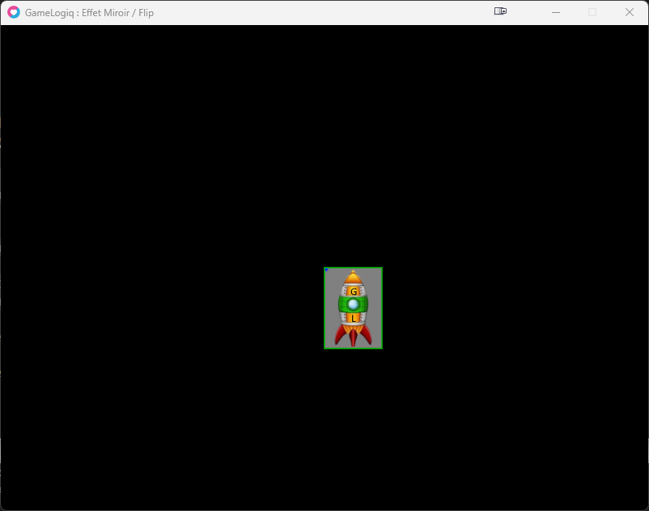
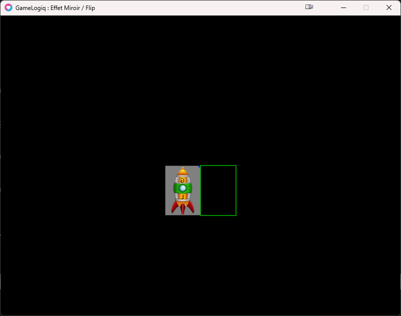
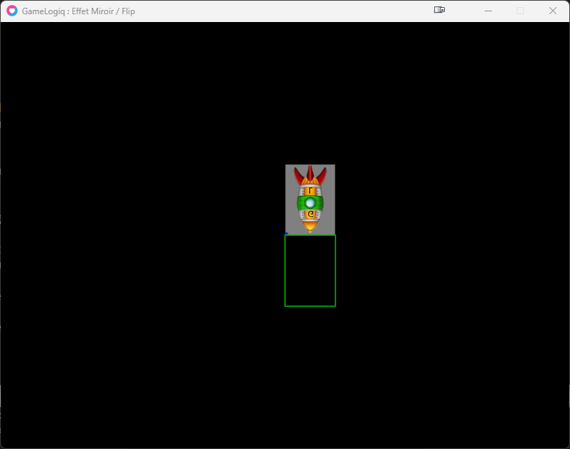
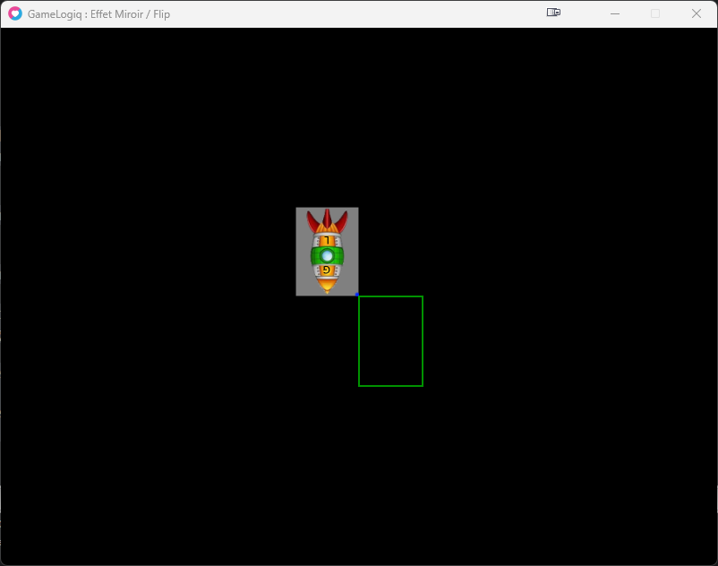
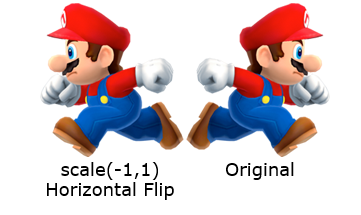

### Effet miroir, c'est quoi ?

un effet miroir c'est le fait de dessiner une image dans un sens opposé horizontale ou vertical.

Lorsque l'on dessine une image dans Love2D dans le sens horizontal on a vu que notre image se dessinait de gauche a droite, le fait d'inverser se sens notre image se dessinera donc de droite a gauche.  
  
et lorsque notre image est dessinée du haut vers le bas, si on inverse le sens vertical notre image sera donc dessinée du bas vers le haut.

_Vous connaissez peut-être mieux cette technique sous le terme de Flip Horizontal ou Vertical._

Avec des images ce sera plus parlant :

Voici les Flip Horizontal et Vertical dans des logiciels de retouches Photos (image)

<figure>



<figcaption>

Flip Horizontal (axe X)

</figcaption>

</figure>

* * *

<figure>



<figcaption>

Flip Vertical (axe Y)

</figcaption>

</figure>

* * *

Pour appliquer un effet miroir dans love2D, on utilise les variables de Scales (sx et sy).  
En appliquant un scale négatif on dessinera alors notre image en sens inverse.

### Cependant Attention !

La position quand elle restera toujours sur le point d'origine (c'est a dire le point en haut a gauche de notre image avant les modifications)

L'image utilisée dans l'exemple :



Voici le code habituel pour dessiner notre image :

```
love.window.setTitle("GameLogiq : Effet Miroir / Flip")

local image = {}

function love.load()
  -- source
  image.imgdata = love.graphics.newImage("bureau_vaisseau_GL.png")

  -- dimensions
  image.w, image.h = image.imgdata:getDimensions()
  image.ox, image.oy = image.w/2, image.h/2

  -- position
  image.x = 400
  image.y = 300

end
--

function love.draw()
  -- notre image sans modification :
  love.graphics.draw(image.imgdata, image.x, image.y)

  -- la position reel de notre image dans notre code
  love.graphics.setColor(0,1,0,1) -- vert
  love.graphics.rectangle("line", image.x, image.y, image.w, image.h)
  love.graphics.setColor(1,1,1,1) -- reset couleur en blanc
end
--
```

rendu :



### Inverser l'image Horizontalement :

```
love.window.setTitle("GameLogiq : Effet Miroir / Flip")

local image = {}

function love.load()
  -- source
  image.imgdata = love.graphics.newImage("bureau_vaisseau_GL.png")

  -- dimensions
  image.w, image.h = image.imgdata:getDimensions()
  image.ox, image.oy = image.w/2, image.h/2

  -- position
  image.x = 400
  image.y = 300
  image.rotate = 0

  -- scales :
  image.sx = -1 -- ICI en NEGATIF
  image.sy = 1
end
--

function love.draw()
  -- notre image sans modification :
-- love.graphics.draw(image.imgdata, image.x, image.y, image.rotate, 1, 1)

  -- Flip Horizontal :
  love.graphics.draw(image.imgdata, image.x, image.y, image.rotate, image.sx, image.sy)

  -- la position reel de notre image dans notre code
  love.graphics.setColor(0,1,0,1) -- vert
  love.graphics.rectangle("line", image.x, image.y, image.w, image.h)
  love.graphics.setColor(1,1,1,1) -- reset couleur en blanc
end
--
```

rendu :



Notre rectangle vert indique bien que l'image a été **dessiner à l'envers**, c'est à dire de la **droite vers la gauche**.

C'est pourquoi notre image est décalée car comme nous lui indiquons un sens négatif,

  
Love2D commence bien son dessin à la position x puis on lui demande d'aller vers un scale négatif donc il va alors finir le dessin en partant vers la gauche (soit à X - la largeur de l'image)

```
x   + (largeurImage * -1) = position a la fin du draw
400 + (71           * -1) = 329
```

On remarque bien l'inversion de l'image avec le changement de sens des lettres sur la fusée.

### Inverser l'image Verticalement :

```
love.window.setTitle("GameLogiq : Effet Miroir / Flip")

local image = {}

function love.load()
  -- source
  image.imgdata = love.graphics.newImage("bureau_vaisseau_GL.png")

  -- dimensions
  image.w, image.h = image.imgdata:getDimensions()
  image.ox, image.oy = image.w/2, image.h/2

  -- position
  image.x = 400
  image.y = 300
  image.rotate = 0

  -- scales :
  image.sx = 1
  image.sy = -1 -- ICI en NEGATIF
end
--

function love.draw()
  -- notre image sans modification :
-- love.graphics.draw(image.imgdata, image.x, image.y, image.rotate, 1, 1)

-- -- Flip Vertical :
  love.graphics.draw(image.imgdata, image.x, image.y, image.rotate, image.sx, image.sy)

  -- la position de notre image dans notre code
  love.graphics.setColor(0,1,0,1) -- vert
  love.graphics.rectangle("line", image.x, image.y, image.w, image.h)
  love.graphics.setColor(1,1,1,1) -- reset couleur en blanc
end
--
```

rendu :



Ici notre dessin est inversé dans le sens vertical, Love2D a donc dessiné notre image en partant du Bas vers le Haut.

### Inverser l'image horizontalement et verticalement :

```
love.window.setTitle("GameLogiq : Effet Miroir / Flip")

local image = {}

function love.load()
  -- source
  image.imgdata = love.graphics.newImage("bureau_vaisseau_GL.png")

  -- dimensions
  image.w, image.h = image.imgdata:getDimensions()
  image.ox, image.oy = image.w/2, image.h/2

  -- position
  image.x = 400
  image.y = 300
  image.rotate = 0

  -- scales :
  image.sx = -1 -- ICI en NEGATIF
  image.sy = -1 -- ICI en NEGATIF
end
--

function love.draw()
  -- notre image sans modification :
-- love.graphics.draw(image.imgdata, image.x, image.y, image.rotate, 1, 1)

-- -- Flip Horizontal et Vertical :
  love.graphics.draw(image.imgdata, image.x, image.y, image.rotate, image.sx, image.sy)

  -- la position de notre image dans notre code
  love.graphics.setColor(0,1,0,1) -- vert
  love.graphics.rectangle("line", image.x, image.y, image.w, image.h)
  love.graphics.setColor(1,1,1,1) -- reset couleur en blanc
end
--
```

rendu :



Notre image procede bien aux effets miroir (Flip) mais elle n'est plus du tout dans notre rectangle de position.  
Hors c'est dans ce rectangle que tout la logique de notre jeu va se passer et on ne peut pas se permettre de dessiner l'image en dehors de cette zone...

### Comment Résoudre le problème de position !

Le fait d'inverser le sens du dessin dans Love2D à pour effet de décaler notre image de notre position x et y que l'on a l'habitude d'utiliser traditionnellement.

Et bien pour résoudre ce soucis, comme nous l'avons vu précédemment dans les cours sur les images, nous allons utiliser les variables Offset X et Y !

En décalant notre image vers son centre on résout seulement une partie du problème.

Pour avoir une position correcte entre notre code et la position dessiné, nous allons donc créer des variables de positions qui suivront la position visible ainsi notre code aura sa position mise à jour continuellement avec son déplacement.  

```
love.window.setTitle("GameLogiq : Effet Miroir / Flip")

local image = {}

function love.load()
  -- source
  image.imgdata = love.graphics.newImage("bureau_vaisseau_GL.png")

  -- dimensions
  image.w, image.h = image.imgdata:getDimensions()
  image.ox, image.oy = image.w/2, image.h/2

  -- position
  image.x = 400
  image.y = 300
  image.rotate = 0

  -- scales :
  image.sx = 1
  image.sy = 1

  -- collision
  image.collider = {}
  image.collider.x = 0
  image.collider.y = 0
  image.collider.w = image.w
  image.collider.h = image.h
end
--

function love.update(dt)

  -- deplacement X
  if love.keyboard.isDown("left") then
    image.x = image.x - 60 * dt
    image.sx = -1
  elseif love.keyboard.isDown("right") then
    image.x = image.x + 60 * dt
    image.sx = 1
  end

  -- deplacement Y
  if love.keyboard.isDown("up") then
    image.y = image.y - 60 * dt
    image.sy = 1
  elseif love.keyboard.isDown("down") then
    image.y = image.y + 60 * dt
    image.sy = -1
  end

  -- update position de collision :
  image.collider.x = image.x - image.ox
  image.collider.y = image.y - image.oy
end
--

function love.draw()
  -- notre image sans probleme :
  love.graphics.draw(image.imgdata, image.x, image.y, image.rotate, image.sx, image.sy, image.ox, image.oy)

  -- Correctif de la position reel de notre image
  love.graphics.setColor(0,1,0,1) -- vert
  love.graphics.rectangle("line", image.collider.x, image.collider.y, image.collider.w, image.collider.h)
  love.graphics.setColor(1,1,1,1) -- reset couleur en blanc
end
--
```

C'est très utile pour les jeux de types plateformer, quand le personnage va vers la gauche et bien c'est mieux si le personnage regarde vers la gauche sinon le joueur serait confus.  



  
Ca s'applique également pour les jeux avec une vue de dessus comme les premiers Zelda par exemple ou plus récemment Stardew Valley (topdown view).  
  
Par contre c'est a vous de voir si vous souhaitez inverser les X ou les Y ou bien inverser les Deux X et Y...  
Ceci dépends du rendu ou du style de jeu que vous souhaitez (ou bien utiliser une inversion en Y si on veux faire tomber des personnages dans une de nos cinématiques par exemple,...) les applications de cette méthode sont multiples, c'est a vous de voir quand l'appliquer ou pas.

_Ca économise surtout beaucoup de dessin à réaliser pour notre jeu, car on ne dessine que les animation dans un seul et unique sens (généralement vers la droite)_
