### Notre premier Programme !

Maintenant que nous avons installé votre IDE (environnement de travail).

Vous êtes prêt pour faire votre tout premier programme. Le fameux Hello World !

L’objectif d’un programme c’est de réaliser une ou plusieurs tâches qu’on lui demande. Le Hello World est idéal pour commencer, car il permet de tester un nouveau langage. En effet, il s’agit de créer un petit bout de code relativement simple avec pour seule instruction d’afficher un message.

- Créer Un Dossier de projet Correct

Avant tout nous allons créer un dossier pour notre premier projet.

- L’emplacement !

Essayez de choisir un emplacement sûr, dans lequel vous aurez stocké tous ces premiers cours et à l’avenir, peut être dans 1 semaine comme dans quelques mois (année ?), vous pourrez les consulter à nouveau, à votre guise. Conserver son travail est très important et ça vous permettra de prendre des bons réflexes pour vos projets de jeux. Des créateurs de jeu ont déjà perdu leurs sources (même des grosses enseignes). De plus, reprendre ces projets plus tard permet aussi de voir votre progression, votre travail d'antan qui vous redonnera du courage pendant vos phases de perte d’énergie (oui ça arrive…). Il vous arrivera également de vous émerveiller devant ce sublime jeu que vous aviez fait au tout début ;)

Choisissez un service Cloud comme Dropbox ou autres ils seront parfaits. Ils proposent des espaces de stockage suffisants pour vos projets pour l’instant. Dropbox par exemple propose 2 Go (2 000 Mo) d’espace de stockage gratuit et comme vos projets ne prendront seulement quelques Mo, ça vous laisse une bonne marge de manœuvre pour créer des centaines de jeux.

Si vous êtes réticents à ses services, pensez à un second disque dur ou stockage externe. Quelques pistes : [https://www.quechoisir.org/conseils-sauvegarde-informatique-nos-conseils-pour-sauvegarder-vos-donnees-n25940/](https://www.google.com/url?q=https://www.quechoisir.org/conseils-sauvegarde-informatique-nos-conseils-pour-sauvegarder-vos-donnees-n25940/&sa=D&ust=1600806301264000&usg=AOvVaw11J_MJJF8Y9B7Vki0C-0tL)

- Le nommage du Dossier !

Le nom de votre dossier ne doit pas contenir de caractères spéciaux, ni d’espace, ce sont des habitudes à prendre, sinon vous risquez de passer des heures à essayer de comprendre pourquoi ça ne fonctionne pas.

Il est nécessaire de prendre cette habitude, car vos dossiers et fichiers doivent être accessibles sur n’importe quel système d’exploitation, lisibles par tous les langages, etc.

Exemple de quelques [caractères spéciaux](https://www.google.com/url?q=https://fr.wikipedia.org/wiki/Aide:Caract%25C3%25A8res_sp%25C3%25A9ciaux&sa=D&ust=1600806301265000&usg=AOvVaw1QvRPamoALC9fFCVq8xSv8) à BANNIR

| À | Á |  | à | Ä | Å | Æ | Ç | È | É | Ê | Ë | Ì | Í | Î | Ï | Ð | Ñ | Ò | Ó | Ô | Õ | Ö | Ø | Œ | Š | þ | Ù | Ú | Û | Ü | Ý | Ÿ |
| --- | --- | --- | --- | --- | --- | --- | --- | --- | --- | --- | --- | --- | --- | --- | --- | --- | --- | --- | --- | --- | --- | --- | --- | --- | --- | --- | --- | --- | --- | --- | --- | --- |
| à | á | â | ã | ä | å | æ | ç | è | é | ê | ë | ì | í | î | ï | ð | ñ | ò | ó | ô | õ | ö | ø | œ | š | Þ | ù | ú | û | ü | ý | ÿ |

| ¢ | ß | ¥ | £ | ™ | © | ® | ª | × | ÷ | ± | ² | ³ | ¼ | ½ | ¾ | µ | ¿ | ¶ | · | ¸ | º | ° | ¯ | § | … | ¤ | ¦ | ≠ | ¬ | ˆ | ¨ | ‰ |
| --- | --- | --- | --- | --- | --- | --- | --- | --- | --- | --- | --- | --- | --- | --- | --- | --- | --- | --- | --- | --- | --- | --- | --- | --- | --- | --- | --- | --- | --- | --- | --- | --- |

_source : [https://fr.wikipedia.org/wiki/Aide:Liste\_de\_caract%C3%A8res\_sp%C3%A9ciaux](https://www.google.com/url?q=https://fr.wikipedia.org/wiki/Aide:Liste_de_caract%25C3%25A8res_sp%25C3%25A9ciaux&sa=D&ust=1600806301302000&usg=AOvVaw1PCN49dunsFyX7jv7SPrpr)_

Pas d’espace non plus ! Remplacer les espaces par des underscores \_  (touche 8) et mettez des majuscules au début pour que ce soit plus lisible pour vous.

Exemples :

1. Mon\_Dossier

3. Dossier\_de\_Cours\_LUA

5. Cours\_LUA

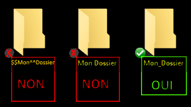

Cette première étape est terminée !

- Commencer le projet sous ZeroBrane

Notre dossier de travail est créé. Allons maintenant dans ZeroBrane et Cliquer sur Créer un Nouveau document vierge (ou Ctrl+N)

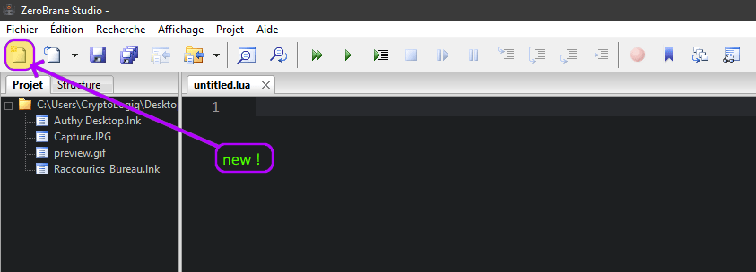

Pour exécuter notre petit programme, le programme à besoin de deux choses.

1. Connaître le fichier à exécuter

3. Connaître le dossier du fichier

Le fichier qui sert pour notre programme doit s’appeler **main.lua** c’est notre fichier principal. C’est à partir d’ici que s'exécutent toutes les instructions de notre programme.

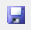

Enregistrons le fichier courant que nous venons de créer (untitled.lua) dans notre **Dossier** en cliquant sur la disquette bleue Voici une capture d'écran de ce que vous devez faire :

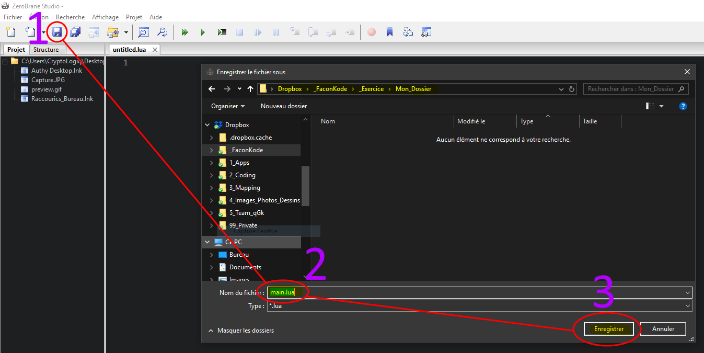

Maintenant vous devriez avoir ceci :

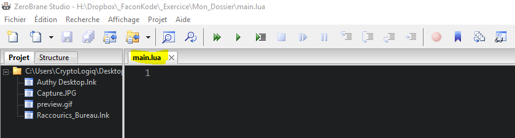

Le fichier s'appelle bien **main.lua**, il ne reste plus qu’à indiquer le dossier courant du projet.

Cliquez alors sur  pour indiquer que le dossier courant du projet se situe là où se trouve le fichier courant ouvert dans ZeroBrane

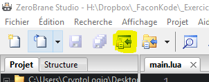

Ps : vous pouvez aussi aller chercher le dossier dans l’explorateur avec

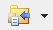

Nous pouvons vérifier le dossier courant dans l’onglet Projet :

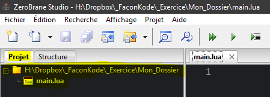

Il nous indique le bon dossier, et nous voyons bien notre fichier  **main.lua**

## Taper du Code !

Voilà on peut enfin taper notre première ligne de Code !

Dans la zone de l’éditeur de code tapez le texte suivant :

```
print("Hello World")
```

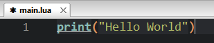

Vous remarquerez que le texte est en couleur, cela s'appelle la colorisation syntaxique.

Il s’agit simplement d’une aide visuelle dans l’éditeur de code pour aider le développeur (vous).

Cela permet de différencier les différentes instructions que le programme va devoir exécuter.

Nous approfondirons cela très prochainement.

## Exécuter le Code !

Oui, c’est tout ! On peut déjà exécuter notre premier code =)

Il vous suffit de vérifier que ZeroBrane est bien configuré pour exécuter LUA et alors nous pourrons exécuter notre programme !

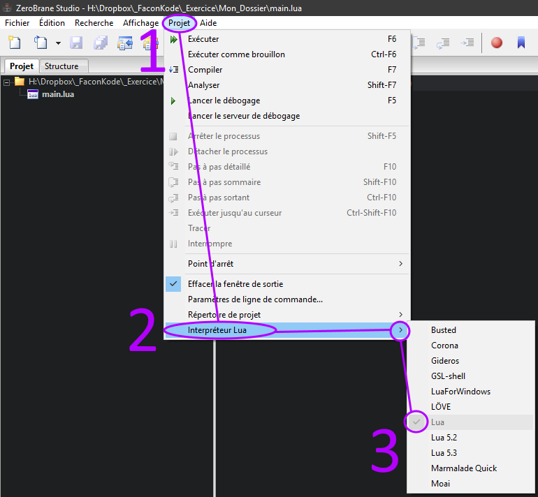

Pour exécuter le code, cliquez sur  ou F6 !

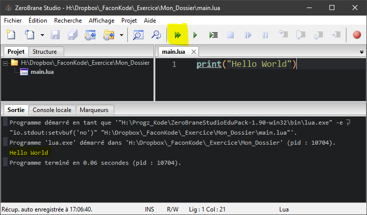

Dans l’onglet **Sortie** de la console, on voit bien le message suivant : **Hello World**

Super ! ! ! Vous avez réussi =)

## Analysons ce qu’il vient de se passer !

Nous avons tapé le code suivant :

```
print("Hello World")
```

Détaillons ce que nous avons fait :

**print** en français se traduit par imprimer, mais nous parlons ici d’une impression. Plus précisément  dans la sortie console. On dit aussi faire une trace.

**print** affiche donc ce qui se trouve entre ses parenthèses ()

**print()** est en réalité une fonction, cette fonction est présente dans tous les langages de programmation et a pour objectif d’imprimer tout ce qu’on lui donne en paramètre (arguments) entre ses parenthèses.

Nous avons mis en paramètre ceci :  **"Hello World"**

Dans un langage informatique, nous devons déterminer/indiquer au programme s’il s’agit de code ou de texte, etc.

## À retenir !

Avec le langage LUA tout ce qui se trouve entre des guillemets **" "** est donc du texte.

Un petit schéma pour visualiser tout cela :

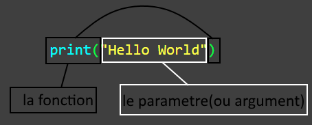

Essayons de faire d’autres print() pour aller plus loin :

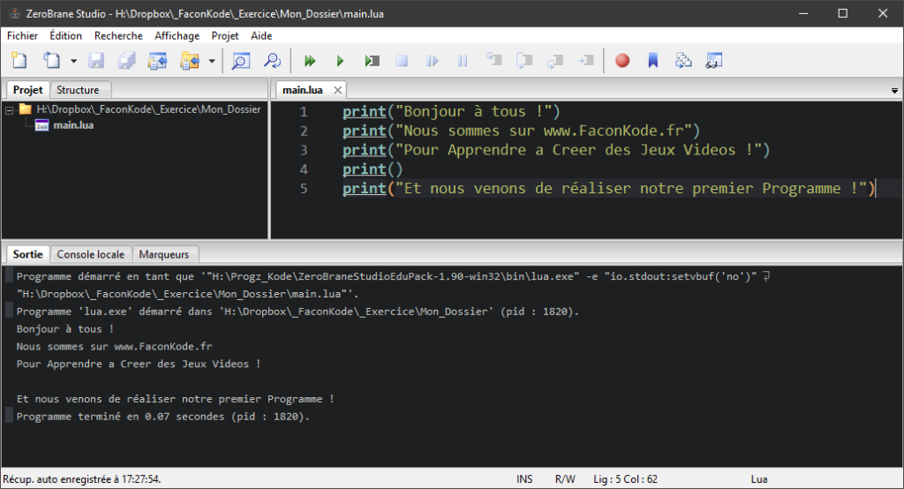

Avez-vous remarqué, qu’il a sauté des lignes dans la Sortie Console ?

Le code étant exécuté ligne par ligne par le programme qui lit le fichier main.lua comme un livre. **Le code est alors exécuté du haut vers le bas**.

Donc à chaque nouvelle ligne nous exécutons de nouvelles instructions !

Alors pourquoi une ligne est-elle restée vide ? C’est dû au fait que la fonction **print()** a été exécuté bien qu’il n’y est pas de paramètres (d’arguments) et à la fin de son exécution il fait un retour à la ligne dans la console. À vous maintenant !

## Exercice :

| Essayez d’imprimer du texte à l'écran. |
| --- |

Vous avez réussi ?

_indice, il faut écrire votre texte entre les guillemets **" "**_

* * *
