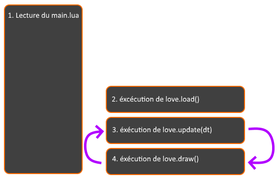
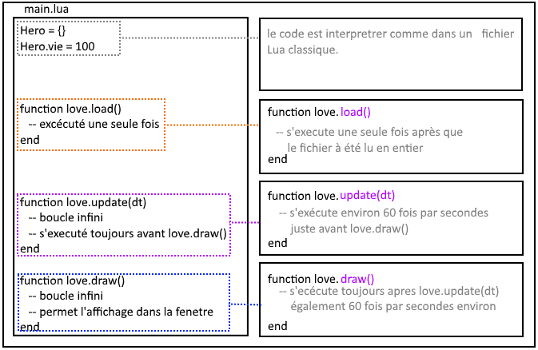
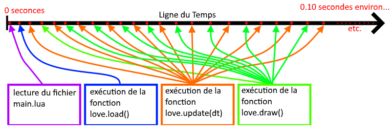
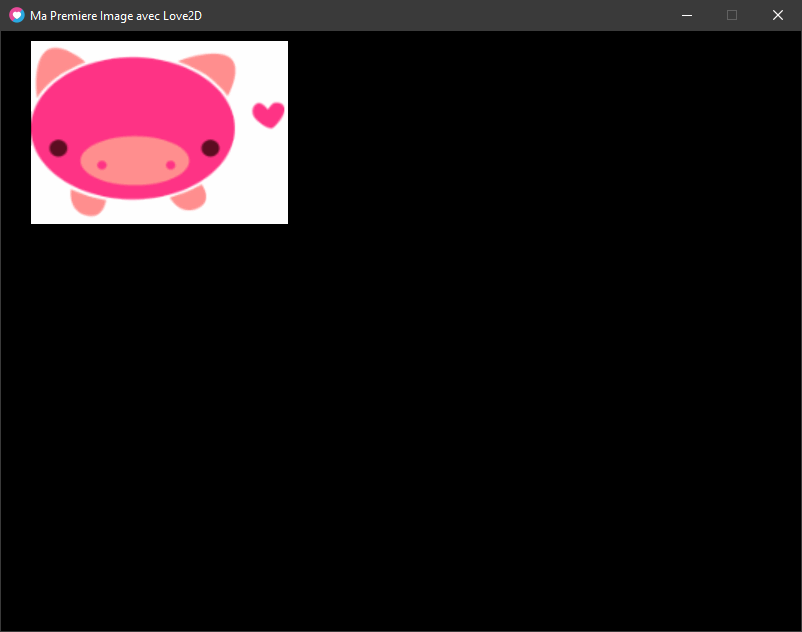

Comprendre la GameLoop !

# Le cycle d'exécution

Le cycle d'exécution, c'est l'ordre dans lesquels est interprété votre code.

Sans boucles infinies (while) votre jeu ne pourrait pas fonctionner, car le code serait exécuté, une fois puis le programme aurait terminé sa tâche.

# La GameLoop

La GameLoop c'est un cycle d'exécution qui a un ordre bien défini, souvent indiquer clairement dans la documentation de votre Moteur ou de votre Framework.

Généralement, on retrouve cette ordre-ci :

1. Load()

3. Update()

5. Draw()

Le **Load()** charge les variables et les ressources nécessaires au jeu pour fonctionner

L'**Update()** lui s'occupe de mettre à jour vos variables (déplacements, statut, etc.)

Le **Draw()** dessine les ressources graphiques après la mise à jour des déplacements effectués dans l'update().

_Cet ordre indique donc votre GameLoop._

# La GameLoop dans Love2D





```
Hero = {} 
Hero.vie = 100 

function love.load() -- exécuté une seule fois ! 
end

function love.update(dt) -- boucle infini 
  -- s'éxécute toujours avant love.draw() 
end

function love.draw() -- boucle infini
  -- permet l'affichage dans la fenetre 
end
```

Voyons ensemble un schéma pour comprendre le cycle de fonctionnement de Love2D.

**Schéma de lecture de votre fichier main.lua, interpréter par Love2D :**

1. Le fichier main.lua est d’abord interprété comme un fichier lua, traditionnel, puis les exécutions de Love2D sont effectués.

3. **love.load()** sert à charger les premières instructions, ainsi on est sûr qu’elles seront exécutées en premier et dans l’ordre établi qu’on aura choisi.

5. **love.update()** et **love.draw()** sont des boucles While, elles attendent l'évènement de la fermeture de la fenêtre pour s’arrêter.

- **love.update(dt)** sert à effectuer des calculs sur nos variables.

- **love.draw()** est utilisé pour l’affichage graphique de notre jeu.

**Un autre schéma représentant le cycle d’exécution de Love2D sur la ligne du temps :**



_l'indication de temps passé est variable selon plusieurs paramètres que l'on abordera dans le concept du delta time_

**exemple avec du code :**

```
local compteur = 1
print(compteur.." - commencement de la lecture du fichier main")

function love.load()
 compteur = compteur + 1

 print(compteur.." - exécution de love.load()")
end

function love.update(dt)
 compteur = compteur + 1

 print(compteur.." - exécution de love.update(dt)")
end

function love.draw()
 compteur = compteur + 1

 print(compteur.." - exécution de love.draw()")

 if compteur >= 10 then 
   print("   - etc.")
   love.event.quit()
 end

end

compteur = compteur + 1
print(compteur.." - fin de la lecture du fichier main")
```

sortie console :

```
1 - commencement de la lecture du fichier main
2 - fin de la lecture du fichier main
3 - exécution de love.load()
4 - exécution de love.update(dt)
5 - exécution de love.draw()
6 - exécution de love.update(dt)
7 - exécution de love.draw()
8 - exécution de love.update(dt)
9 - exécution de love.draw()
10 - exécution de love.update(dt)
11 - exécution de love.draw()
- etc.
```

### Explications du code :

- on augmente une variable compteur pour nous indiquer l’ordre d'exécution.

- **love.event.quit()** est une fonction de Love2D qui sert à fermer la fenêtre Love2D et d'arrêter l'exécution du programme.

Je ne peux que vous encourager à essayer par vous-même !  

## Code Source Love2D Minimaliste

Ci-dessous un code source pour vos projets Love2D minimaliste qui vous servira pour tous vos futurs projets !

Code Source :

```
-- Cette ligne permet d'afficher des traces dans la console pendant l'exécution
io.stdout:setvbuf('no')

-- Empêche Love de filtrer les contours des images quand elles sont redimensionnées
-- Indispensable pour du pixel art
love.graphics.setDefaultFilter("nearest")

-- Cette ligne permet de déboguer pas à pas dans ZeroBraneStudio
if arg[#arg] == "-debug" then require("mobdebug").start() end

-- debug for Visual Code
if os.getenv("LOCAL_LUA_DEBUGGER_VSCODE") == "1" then require("lldebugger").start() end

-------------
love.window.setTitle("Mon Titre de Jeu ")
-------------

function love.load()
end
--

function love.update(dt)
end
--

function love.draw()
end
--

function love.keypressed(key)
 print(key)
end
--

function love.mousepressed(x,y,button)
 print(button)
end
--
```

  
Lien direct vers le code source **main.lua** :

[https://drive.google.com/drive/folders/1OooMjMA6iTPay6jdDl0su0eXWGV62pKi?usp=sharing](https://drive.google.com/drive/folders/1OooMjMA6iTPay6jdDl0su0eXWGV62pKi?usp=sharing)

* * *

# Utiliser la gameloop pour la détection des touches du clavier

### Charger et afficher l'image

Voici le fichier image que nous utiliserons pour l’exercice :  
[https://drive.google.com/file/d/1D4flXXyzXZ2uOwitFUxJhd9kfqTLZPgC/view?usp=sharing](https://www.google.com/url?q=https://drive.google.com/file/d/1D4flXXyzXZ2uOwitFUxJhd9kfqTLZPgC/view?usp%3Dsharing&sa=D&ust=1601491830783000&usg=AOvVaw0Cxfsq6u8r12GknKKwFehZ)

Code Source :

```
-- on charge l'image
monImage = love.graphics.newImage("mascotte.png")

function love.draw()
 love.graphics.draw(monImage,30,10) -- on affiche l'image en x = 30 et y = 10
end
```

# Déplacer l'image

Nous allons détecter l'utilisation des flèches directionnelles du clavier dans l'update de Love2D.

Si la touche est appuyée alors on déplacera notre image.

_Ps : Si vous n'avez pas les flèches vous pouvez les remplacer les touches par ZQSD_

[**love.keyboard.isDown()**](https://love2d.org/wiki/love.keyboard.isDown)

**Synopsis**

```
love.keyboard.isDown( key )
```

**Arguments**

key : [KeyConstant](https://love2d.org/wiki/KeyConstant) la touche qu'on veut vérifier au format text

**Returns**

renvois un [boolean](https://love2d.org/wiki/boolean) **True** si la touche est enfoncée, **false** si ce n'est pas le cas.

* * *

Il nous faut aussi assigner des variables pour la position x et y afin de rendre plus lisible tout cela nous allons [refactoriser](https://fr.wiktionary.org/wiki/refactorisation) notre code pour que notre image et ses paramètres soit dans une table.

Indiquons un titre a notre fenêtre Love2D avec :

**love.window.setTitle()**

```
love.window.setTitle( title )
```

**Arguments**

title [string](https://love2d.org/wiki/string) Le nouveau titre de la fenêtre.

* * *

Code Source  :

```
-- titre de la fenêtre Love2D :
love.window.setTitle("Ma Premiere Image avec Love2D") 

monimage = {} -- la table de l'image
monimage.imgdata = love.graphics.newImage("mascotte.png") -- on charge l'image
monimage.x = 30 -- position X de l'image
monimage.y = 10 -- position Y de l'image

function love.update(dt) 
  
  -- les déplacement dans l'update :
  
  -- gauche ou droite
  if love.keyboard.isDown("left") and  love.keyboard.isDown("right") then -- SI gauche ET droite
    -- ne rien faire
  elseif love.keyboard.isDown("left") then -- SI gauche
    monimage.x = monimage.x - 1
  elseif love.keyboard.isDown("right") then -- SI droite
    monimage.x = monimage.x + 1
  end
  
  -- haut ou bas
  if love.keyboard.isDown("up") and  love.keyboard.isDown("down") then -- SI haut ET bas
    -- ne rien faire
  elseif love.keyboard.isDown("up") then -- SI haut
    monimage.y = monimage.y - 1
  elseif love.keyboard.isDown("down") then -- SI bas
    monimage.y = monimage.y + 1
  end
  
end
--

function love.draw()
  love.graphics.draw(monimage.imgdata, monimage.x, monimage.y)
end
```

Rendu :



# Compétences acquises :

- détecter des appuis du clavier dans love.update(dt)

- déplacer une image dans love.update(dt)

* * *
