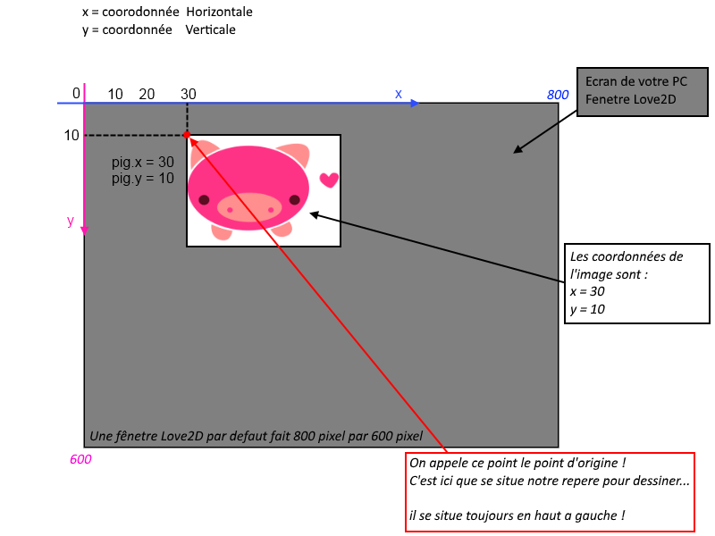
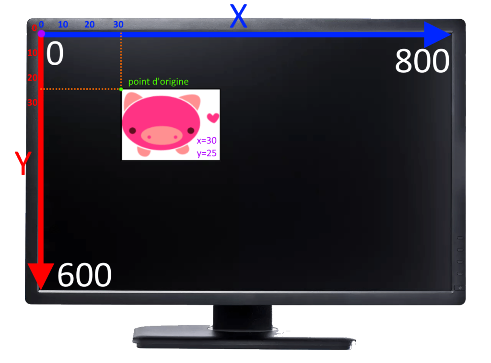
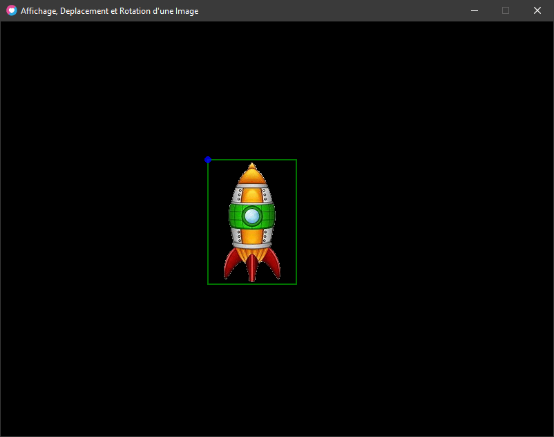

### Les points d'origines par défaut

##### **Important !** _Par défaut les points d'origines d'une image se situe toujours en haut à gauche !_





### Affichons le point d'origine a notre vaisseau

Nous souhaiterions afficher son contour en _vert_ !

Nous souhaiterions afficher l'image avec ses couleurs d'origines, soit en _blanc_ !

Nous souhaiterions afficher son point d'origine en _bleu_ !

Pour afficher ce point nous utiliserons un **cercle** plein _"fill"_ sur les coordonnées _x_ et _y_ de l'image avec un _rayon de 5_ !    

**Rappel :**

* * *

[love.graphics.setColor(r,g,b,a)](https://love2d.org/wiki/love.graphics.setColor)

```
love.graphics.setColor( red, green, blue, alpha ) 
```

**Arguments**

[number](https://love2d.org/wiki/number) `red` rouge

[number](https://love2d.org/wiki/number) `green` vert

[number](https://love2d.org/wiki/number) `blue` bleue

[number](https://love2d.org/wiki/number) `alpha (1)` transparence alpha

* * *

```
local vaisseau = {}

vaisseau.imageData = love.graphics.newImage("vaisseau.png")
vaisseau.w , vaisseau.h = vaisseau.imageData:getDimensions()

vaisseau.x, vaisseau.y = 300, 200

local color = {} -- color = {r,g,b,a}
color.white =   {1,   1,    1,    1}
color.blue =    {0,   0,    1,    0.8}
color.green =   {0,   1,    0,    0.8}

function love.draw()

  -- l'image du vaisseau :
  love.graphics.setColor(color.white)
  love.graphics.draw( vaisseau.imageData, vaisseau.x, vaisseau.y)

  -- son contour vert :
  love.graphics.setColor(color.green)
  love.graphics.rectangle("line", vaisseau.x, vaisseau.y, vaisseau.w, vaisseau.h)

  -- le point d'origine de l'image en bleue:
  love.graphics.setColor(color.blue)
  love.graphics.circle("fill", vaisseau.x, vaisseau.y, 5)

end
```

Rendu :



* * *
