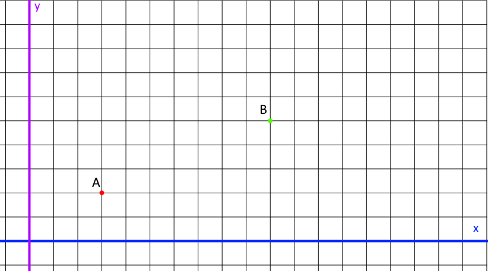
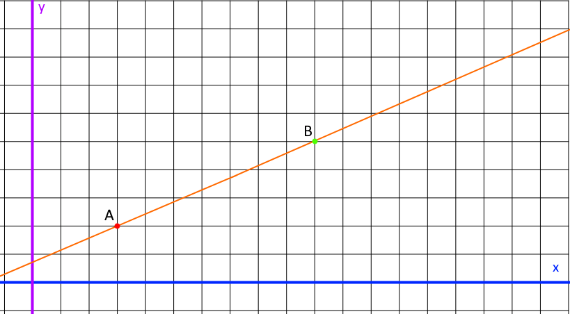
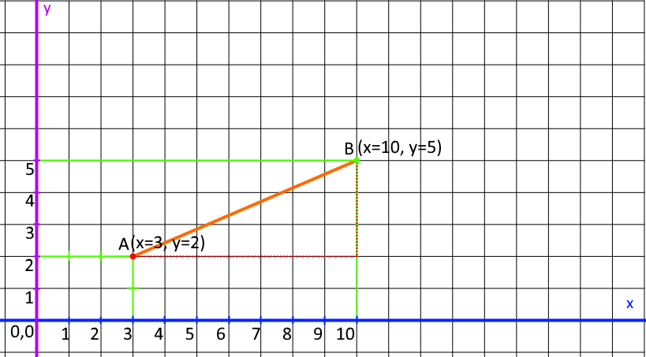
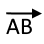
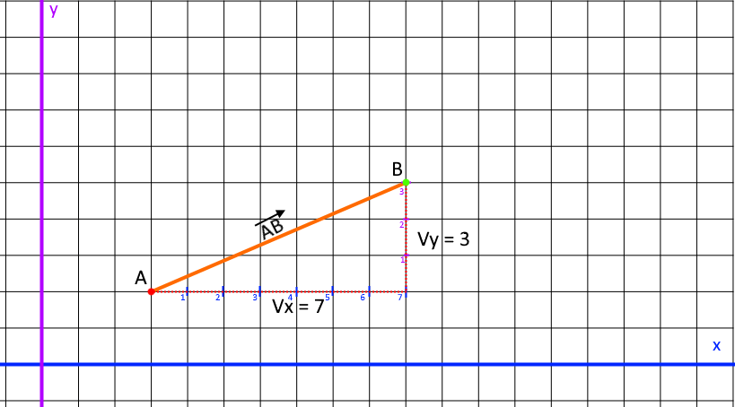
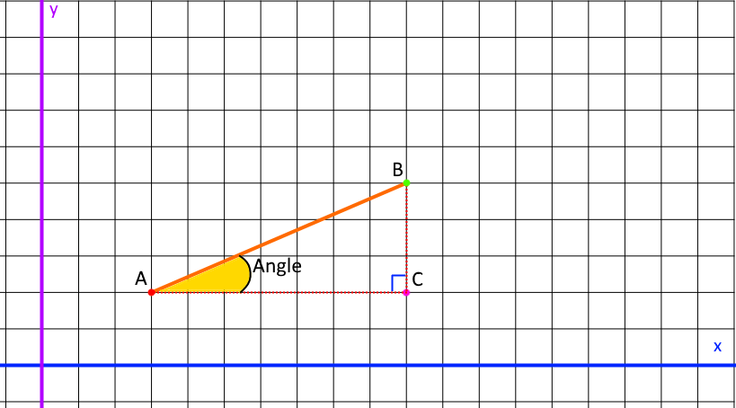

### Mise en Situation :

Nous possédons un Objet.

Cet Objet se déplace.

L'objet dispose donc de deux positions, celle de départ qu'on appellera point **A** et celle d'arrivée qui sera le point **B**.

### **Les Points A et B :**

Les points **A** et **B** forme une droite.  

### **La Droite AB :**

  Le point départ **A** et le point d'arrivée **B**, représente une distance de la droite AB, ils forment ainsi un segment.  

### **Le Segment AB :**

    les points A et B sont situés dans un repère orthogonale, ils ont donc des positions X et Y.  

### **Le Segment AB dans le repère orthogonal :**

  Désormais, on peut écrire les points de la façon suivante :

**A(x=3, y=2)**

et

**B(x=10, y=5)**

Sachant que l'on place toujours les abscisses (X) suivis des ordonnées (Y) et ceux toujours dans cet ordre !

On peut simplifier l'écriture comme ceci :

**Point(x,y)**

Après simplification on obtient donc :

**A(3, 2)**

**B(10, 5)**

On peut aussi les détailler comme ceci :

**A(x) = 3**

**A(y) = 2**

et

**B(x) = 10**

**B(y) = 5**

### Le Vecteur du Segment AB ?

Nous savons que cet Objet se déplace, alors il possède une vitesse.

Lorsqu'il se déplace, nous avons utilisé deux vitesses :

Les vélocités X et Y _(vx et vy_).

En réalité Les vélocités dans un plan, ce sont des Vecteurs.

**Nous pouvons donc déduire les vecteurs du Segment AB de la façon suivante :**

Vecteur X de AB = B(x) - A(x)

Vecteur Y de AB = B(y) - A(y)

ce qui nous donne :

**VX = 10 - 3**

Soit **VX = 7**

Et

**VY = 5 - 2**

Soit **VY = 3**

Le segment AB possède donc les vecteurs suivants,

**Vx = 7**

et

**Vy =** 3

**Petit Récapitulatif :**

Les points A et B, forme une droite.

La distance entre les points A  B, forme le segment AB.

Comme ces points représentent un départ et une arrivée, c'est donc un segment avec une direction.

On sait que le segment AB va du point A vers B.

Il s'agit alors du vecteur AB.

### Écriture du Vecteur AB ?

Le vecteur du segment AB s'écrit comme ceci :

La flèche nous indique alors sa direction, celle-ci suit le sens de la lecture.

Le sens est donc du point A vers le point B.  

Ps : On sait que Le vecteur AB possède un VX de 7 et un VY de 2.  

### **Conclusion :**

##### Le Vecteur AB :

Le croisement du Vecteur AB, forme un alors un autre point qu'on appellera **C**.

Comme il s'agit de trois points, ils forment donc un triangle.  

### Le Triangle ABC :

_remarque : un Vecteur est toujours un triangle rectangle._  

Comme le Vecteur AB, peut être représenté par un triangle, on peut alors en déduire qu'il possède un Angle !  

##### Le Vecteur AB possède donc un angle :

* * *
