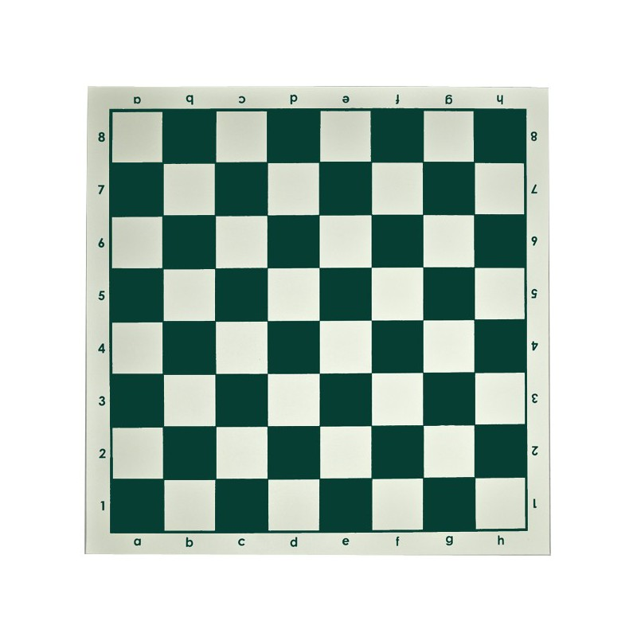
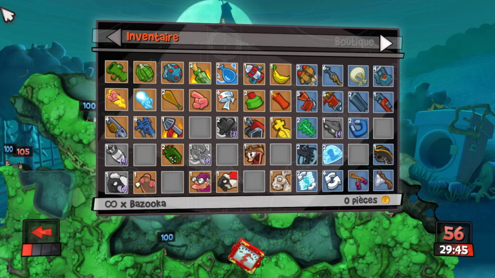
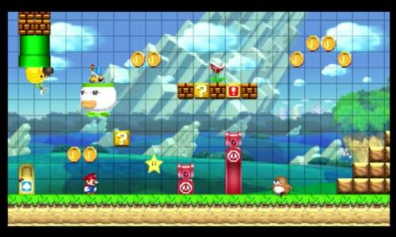

Nous connaissons déjà les tables en Lua.

```
maTable = {}
```

Ceci est donc une table, elle peut contenir des index :

```
maTable = {}
maTable[1] = "A"
```

Les index dans cet exemple représentent la première dimension.

Les dimensions représentent en réalité le niveau de profondeur des index qu'on peut parcourir.

Pour parcourir plusieurs niveaux de profondeur, il faut que notre table contienne d'autres tables en réalité.

Comme ceci :

```
maTable = {}
maTable[1] = {}
```

En faisant ceci, l'index de notre table est donc une autre table, et nous pouvons composer plusieurs niveaux...

Un tableau 2D, représente donc 2 dimensions.

Voici comment l'on crée cette 2-ème dimensions.

```
maTable = {}
maTable[1] = {}
maTable[1][1] = {}
```

Pourquoi un tableau 2D ?

Le fait de créer seulement 2D dimensions permet d'avoir un repère visuel que notre cerveau est capable de visualiser.

Tout comme Excel, il est l'exemple parfait car on appelle ces types de logiciels des tableurs.  
Excel est un tableur car il est essentiellement basé avec des tableaux à 2 Dimensions tout simplement.

* * *

Dans les jeux on utilise aussi cette méthode, on l'utilise également sur des jeux de plateaux tels que les échecs :

- La première dimension représente les lignes : 1,2,3,...,8

- La deuxième dimension représente les colonnes : A,B,C,...H



* * *

On peut aussi se servir des tableaux à 2 Dimensions pour les inventaires dans un jeu vidéo :



* * *

Également pour créer notre Carte (map) dans un jeu vidéo en 2D,

Vous avez déjà joué à Super Mario Maker ?



Voyez comme chaque élément de la Carte coïncide parfaitement avec un repère 2D comme un échiquier.

* * *

Tous les jeux en 2d sont basés sur ce concept.

Pour apprendre ce concept nous allons utiliser un jeu d'arcade ;)

Le jeu du Casse Brique !

Ça nous permettra de mettre en pratique un tableau 2D, ainsi que tous les éléments que vous avez appris jusqu'ici, déplacer un objet, utiliser le DeltaTime, afficher une image, etc.

De plus nous pourrons aborder aussi un premier concept de Collision simple.

* * *
