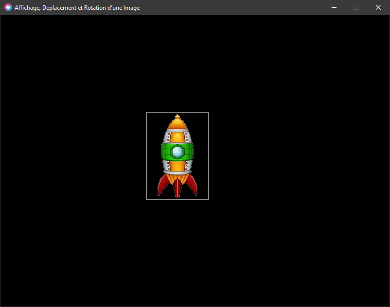

### Récupérer les données de l'image

L'image que nous avons mis en mémoires contient différentes données !

On appelle ces données une _imageData_, et elle contient les dimensions en pixels de l'image ainsi que les données de chaque pixel (r, g, b, a), son poids en octets.

Toutes les données accessibles sont détaillées ici : [ImageData - LOVE (love2d.org)](https://love2d.org/wiki/ImageData)  

Ce qui nous intéresse le plus ce sont ses dimensions et dans certains cas les couleurs des pixels.  

Par souci de praticité et d'attribution de l'image nous allons charger l'image dans une table que l'on appellera _**vaisseau** :_

```
local vaisseau = {}

vaisseau.imageData = love.graphics.newImage("vaisseau.png")
```

### Récupérer : la largeur et hauteur d'une image

[Image:getDimensions( )](http://getDimensions\( \))

```
width, height = Image:getDimensions()
```

**Returns**

[number](https://love2d.org/wiki/number) `width` La _Largeur_ de l'image, en pixels.

[number](https://love2d.org/wiki/number) `height` La _Hauteur_ de l'image, en pixels.

* * *

### **Alternative pour la Largeur :**

[Image:getWidth()](Image:getWidth\(\))

```
width = Image:getWidth()
```

### Returns

[number](https://love2d.org/wiki/number) `width` La _Largeur_ de l'image, en pixels.

* * *

### **Alternative pour la Hauteur:**

[Image:getHeight()](getHeight\(\))

```
height = Image:getHeight()
```

### Returns

[number](https://love2d.org/wiki/number) `height` La _Hauteur_ de l'image, en pixels.

* * *

  Nous allons donc stocker les valeurs de dimensions de l'image dans la table de notre _vaisseau_,

On en profitera pour lui attribuer les variables de positions x et y.

**Méthode avec _:getDimensions()_**

```
local vaisseau = {}

vaisseau.imageData = love.graphics.newImage("vaisseau.png")

vaisseau.w , vaisseau.h = vaisseau.imageData:getDimensions()

vaisseau.x, vaisseau.y = 0, 0

```

**Alternative avec _:getWidth()_ et _:getHeight()_ :**

```
local vaisseau = {}

vaisseau.imageData = love.graphics.newImage("vaisseau.png")

vaisseau.w = vaisseau.imageData:getWidth()

vaisseau.h = vaisseau.imageData:getHeight()

vaisseau.x = 0

vaisseau.y = 0
```

Vérifions que les données correspondent bien :

Dessinons l'image en position `x = 10` et `y = 50` !

Dessinons un rectangle autour de l'image, car nous avons tous les points nécessaires pour le faire !

_**x**_, _**y**_, _**w**_ et _**h**_ !

```
local vaisseau = {}

vaisseau.imageData = love.graphics.newImage("vaisseau.png")
vaisseau.w , vaisseau.h = vaisseau.imageData:getDimensions()
vaisseau.x, vaisseau.y = 300, 200

function love.draw()
  
  -- l'image du vaisseau :
  love.graphics.draw( vaisseau.imageData, vaisseau.x, vaisseau.y)
  
  -- son contour grace a ses dimensions :
  love.graphics.rectangle("line", vaisseau.x, vaisseau.y, vaisseau.w, vaisseau.h)
  
end
```



* * *
