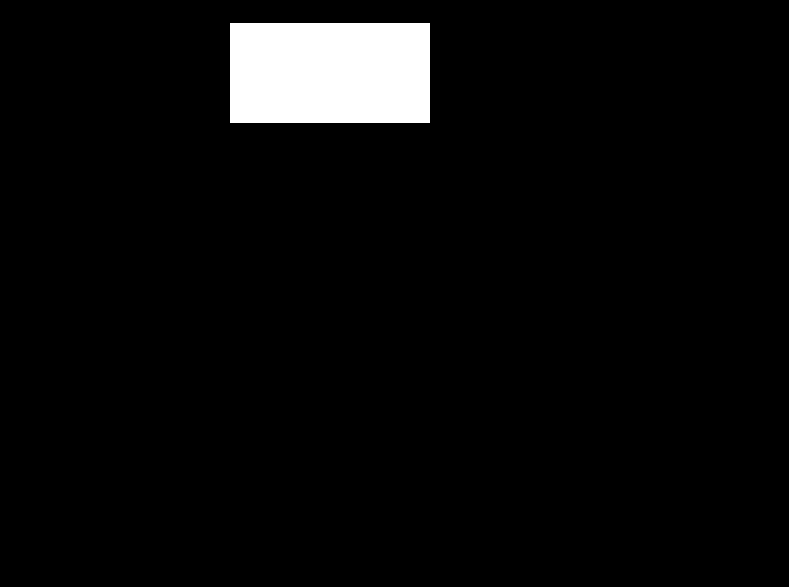
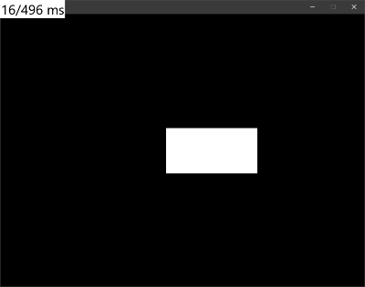
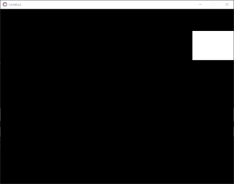
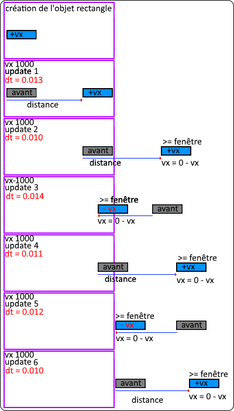
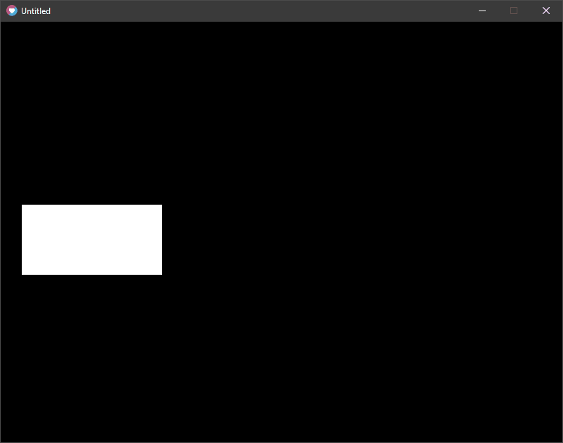

### Solution Renvois de vélocité (simple) :

  Si vous avez réussi Bravo ! Regardons ensemble la solution suivante :  

```
local Objet = {x=300, y=250, w=200, h=100, vx=500, vy=120}

function Objet.update(dt)

  -- Déplacement de l'Objet :
  Objet.x = Objet.x + (Objet.vx * dt) 
  Objet.y = Objet.y + (Objet.vy * dt)

  -- Rebonds sur les Bords Gauche et Droit de L'écran :
  if Objet.x + Objet.w >= love.graphics.getWidth() then
    -- rebond de Droite
    Objet.vx = 0 - Objet.vx
  elseif Objet.x <= 0 then
    -- rebond de Gauche
    Objet.vx = 0 - Objet.vx
  end

  -- Rebonds sur les Bords Haut et Bas de L'écran :
  if Objet.y + Objet.h >= love.graphics.getHeight() then
    -- rebond du Bas
    Objet.vy = 0 - Objet.vy
  elseif Objet.y <= 0 then
    -- rebond du Haut
    Objet.vy = 0 - Objet.vy
  end

end

function Objet.draw()
  love.graphics.rectangle("fill", Objet.x, Objet.y, Objet.w, Objet.h)
end

function love.update(dt)
  Objet.update(dt)
end

function love.draw()
  Objet.draw()
end
```

  Rendu (avec rajout de colorisation lors des rebonds) :   Cool ça Fonctionne !  



### Il reste cependant un problème !

  La solution est incomplète et il reste un problème encore, lequel et pourquoi ?  

### Lequel ?

Si l'on met une vélocité trop grande, notre Objet sortira de la fenêtre et ne reviendra pas !   Essayez avec une Vélocité X  ou Y supérieur à 10 000 ou plus !

**Avec une vélocité à 10000 (L'Objet sort littéralement de la fenêtre) :**



**Avec une vélocité à 5000 (L'Objet reste coincé dans le rebord) :**



### Pourquoi ?

Lors du déplacement notre Objet, se déplace d'une quantité en pixel par seconde.

Prenons l'exemple avec une vélocité de 10 000

La formule pour connaitre le nombre de pixels parcourus par update de notre Objet :

**`velocité * dt = pixels par update`**

Exemple d'un Object avec une vélocité à 10 000 et d'un DeltaTime fixé a 60 FPS :

**`10000 * 0.012 = 120 pixels/update`**

Pourquoi c'est un problème ?

L'objet se déplace d'un nombre de pixels en fonction de la valeur du DeltaTime (dt).

_Donc la valeur d'un Objet de pixels/update n'est pas fixe !_

Si l'objet sort et ne refait pas le chemin inverse pour revenir dans la fenêtre, il restera alors coincé à l'extérieur à tout jamais !

### Exemple et explication de cette situation

Schéma reprenant le cycle du jeu :



Au début, au load (on n’applique pas encore la vélocité), puis viens le cycle des updates !

L'Objet se déplace alorrs d'une valeur en pixel qui est dépendante du DeltaTime, cette valeur est donc plus ou moins grande a chaque update !

Lorsque l'Objet touche ou est en dehors de l'écran, l'opposition de sa vélocité est bien appliquée !

Cependant, la distance qu'il parcourt ensuite ne lui permet pas forcément de rejoindre l'écran !

Dans l'update 6, l'Objet ne sera plus jamais visible à l'écran, car celui-ci devrait parcourir deux fois la distance pour revenir dans l'écran...  

### Comment résoudre le problème ?

Heureusement, la solution a ce problème est assez simple à résoudre !

Lorsque l'Objet touche un des bords, il nous faut simplement le replacer contre le bord en question !

Ps : On n’oublie pas d'opposer sa vélocité pour le prochain update !

**Pseudo code :**

```
Si l'Objet touche le bord Gauche de la fenêtre ALORS
	- 1. Je replace l'object contre le bord Gauche     
	- 2. J'oppose sa vélocité 
FIN
```

### Solution finale avec Renvois de vélocité et Replacement de l'Objet :

```
local Objet = {x=300, y=250, w=200, h=100, vx=10000, vy=120}

function Objet.update(dt)

  -- Déplacement de l'Objet :
  Objet.x = Objet.x + (Objet.vx * dt) 
  Objet.y = Objet.y + (Objet.vy * dt)

  -- Rebonds sur les Bords Gauche et Droit de L'écran :
  if Objet.x + Objet.w >= love.graphics.getWidth() then
    -- rebond de Droite
    Objet.x = love.graphics.getWidth() - Objet.w
    Objet.vx = 0 - Objet.vx
  elseif Objet.x <= 0 then
    -- rebond de Gauche
    Objet.x = 0
    Objet.vx = 0 - Objet.vx
  end

  -- Rebonds sur les Bords Haut et Bas de L'écran :
  if Objet.y + Objet.h >= love.graphics.getHeight() then
    -- rebond du Bas
    Objet.y = love.graphics.getHeight() - Objet.h
    Objet.vy = 0 - Objet.vy
  elseif Objet.y <= 0 then
    -- rebond du Haut
    Objet.y = 0
    Objet.vy = 0 - Objet.vy
  end

end

function Objet.draw()
  love.graphics.rectangle("fill", Objet.x, Objet.y, Objet.w, Objet.h)
end

function love.update(dt)
  Objet.update(dt)
end

function love.draw()
  Objet.draw()
end
```

  Rendu avec Replacement et une vélocité à 10 000 :  



### **IMPORTANT ! Conseil à RETENIR**

**Toujours bien replacer vos objets après opposition de vélocité (ou de collisions), ça vous évitera beaucoup de bugs semblables à l'avenir !**

* * *
