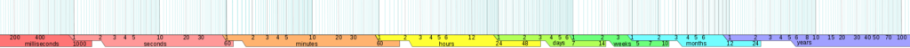
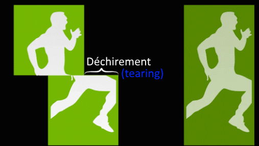

### Définition de DeltaTime :

**Delta** signifie la différence.  
**Time** signifie le temps.  
Le _DeltaTime_ c'est donc une _différence de temps_.

### Le DeltaTime dans l'utilisation du Jeu Vidéo ?

On utilise le DeltaTime pour calculer le temps écouler entre deux images affichées.

### Pourquoi ?

un jeu vidéo affiche plusieurs images par secondes comme pour un film, ainsi les actions prennent vie. Le problème, c'est que selon le support qui fait tourner votre jeu, la machine qui exécute votre jeu peut être plus ou moins rapide (puissante). On dit alors que les fps sont variables.

### Les FPS ou IPS c'est quoi ?

Les FPS (frames per second) ou IPS (images par seconde). Ces termes nous indiquent le nombre d'images affichées par secondes, ce nombre est recalculé chaque seconde écoulée,  les FPS/IPS sont donc évolutifs tout au long du jeu. Il est évolutif car selon les actions dans le jeu, la machine qui exécute le jeu, etc. tous ces paramètres pris en compte font que les FPS/IPS varient sans cesse et ceux sur un même jeu. On parle parfois de chute de fps, cela arrive lorsque votre jeu a besoin de plus de ressources pour calculer des événements dans votre jeu à un moment/lieu précis du jeu qui demande plus de ressources. Dans les jeux vidéos et avec l'évolution des consoles et des Pc/mobile, la norme minimal est devenu 30 FPS et la marge idéal est de 120 FPS. La norme la plus répandue est le 60 FPS. Afficher un jeu FPS avec 120 fps tout le temps n'est cependant pas forcément utile, car il faut aussi prendre en compte l'écran... qui lui indique sa capacité a affiché le nombre de FPS en utilisant un autre terme les HZ.

# Pour simplifier et vulgariser les termes on peut dire ceci, il faut au minimum :

**1 FPS** _pour_ **1 HZ**, car **les HZ c'est le nombre fixe d'images par secondes** qui est affiché par votre écran.

**Voici un exemple concret de pertes de ressources inutile :**

Si la carte graphique affiche 120 FPS, mais que l'écran ne peut en afficher que 60 HZ, hé bien vous ne verrez en réalité qu'une image sur deux que la carte graphique aura dessiné...  

**Et, un exemple où la machine manque de ressources :**

Si la carte graphique n'affiche que 30 FPS, mais que l'écran en affiche 240 HZ, hé bien l'écran affichera 8 fois la même image avant que la carte graphique ne dessine la prochaine.  

**En conclusion :**  

pour afficher un jeu a 120 FPS il vous faut donc au minimum un écran de 120 HZ.

C'est pourquoi la norme est de 60 FPS, car les écrans les plus répandus sont en 60 HZ ! (notamment les fréquences sur pc portables, et écran dit de bureau qui varie entre 60 et 75 Hz)

ps : Les vieilles télévisions cathodiques aussi avaient une fréquence de référence de 60 fps ou 50 fps.

C'est pourquoi c'est devenu la norme le 60 fps.

Cependant, sur PC c'est un peu différent, la norme tend de plus en plus vers un standard du 120 HZ.

**_Remarque :_**

Les jeux sur consoles qui se vendent également sur PC (multiplateforme), La fréquence réclamée sur PC étant de 120 Hz cela inclut bien souvent des modifications et des optimisations nécessaires supplémentaires au jeu, c'est pourquoi il est fréquent d'avoir un temps de retard entre les dates de sorties sur Consoles et PC, laissant le temps aux développeurs d'adapter leur jeu aux performances sur PC.  
  
Sur PC : il y a plus de calcul par secondes qui sont effectués que sur une console, et donc il y a plus d'images à affichées...

Généralement, la solution de facilité, c'est simplement de limiter la vitesse d'exécution du jeu à 60 FPS sur PC, cette technique est très répandue et n'exploitent aucunement les performances accrues d'un PC.

### L'impact des FPS dans un jeu ?

Les fps influent sur les jeux de façon assez flagrante... car la vitesse d'affichage de ces images influent directement sur la fluidité perçu par les joueurs. Plus votre jeu demandera à être réactif, plus le nombre de FPS nécessaires sera important.   Voici une vidéo de comparatif entre différentes fréquences de FPS (24, 30 et 60 FPS) : [24 FPS vs 30 FPS vs 60 FPS (comparison) - YouTube](https://www.youtube.com/watch?v=_SzGQkI-IwM&ab_channel=TechDamis) Pour marquer encore plus la différence, voici maintenant des comparatifs de hautes fréquences de FPS (240, 144, 120 et 60 FPS) : [\[Slow motion\] 240Hz vs 144Hz vs 120Hz vs 60Hz - Monitor refresh rates - YouTube](https://www.youtube.com/watch?v=Q1cmhZs1P54&ab_channel=WASD.ro) Aperçu d'un rendu avec différentes fréquences cette fois-ci assez faible de FPS (6, 12, 24 et 50 FPS) : Ps : Le Frame Rate est le nombre de Fps des capacité d'affichage de la carte graphique, le Rendu lui est bridé aux frames.  

| _important ! Le nombre d'image par seconde, donne une impression de mobilité différente, mais le déplacement de l'objet lui reste IDENTIQUE, il se déplace toujours de la même vitesse, car c'est l'écran qui est en retard..._ |
| --- |

### Le DeltaTime et les FPS ?

Comme vous avez pu le constater, les FPS sont assez importants dans les jeux vidéos et qu'ils sont également assez instables. C'est pourquoi il nous est important de connaitre le temps écoulé entre l'affichage de chacune de ces images. Ainsi avec le DeltaTime nous pouvons réaliser des déplacement identiques d'une plateforme à l'autre en accélérant ou en ralentissant nos déplacement dans le jeu selon le temps écoulé entre chacune des images affichées.

- Plus le temps est court entre les images plus le dt sera petit.

- Plus le temps est long entre les images plus le dt sera long.

### Calcul du DeltaTime

Le DeltaTime est calculé en millième de seconde soit des **millisecondes** ! 1 [milliseconde](https://fr.wikipedia.org/wiki/Milliseconde) équivaut à 1 millième d'une seconde (soit 0,001 seconde)   **Le calcul du DeltaTime (dt) est donc le suivant :**   dt = FPS \* 0,001 soit : dt = (seconde / frames) \* 0,001 soit : **dt = (60 / frames) \* 0,001**

### Exemple de DeltaTime Théorique

Ainsi si on prend une référence de **60 FPS** on obtiendra un DeltaTime de : dt = 60 / 60 \* 0,001 = 0,001 Sauf qu'entre théorie et la pratique, il y a un petit détail c'est qu'en général le processeur et la carte graphique ont un petit temps de retard de calcul, et vous obtiendrez plutôt **0,0012 pour 60 FPS** dû au retard. pour **120 FPS** théorique : dt = (60 / 120) \* 0,001 = 0.0005 pour **240 FPS** théorique : dt = (60 / 240) \* 0,001 = 0,00025 Le dt est extrêmement court sur des écrans haut de gamme (240 HZ) finalement pour **30 FPS** théorique : dt = (60/ 30) \* 0,001 = 0,002 Cela nous confirme bien que le temps écoulé est plus long entre les frames lorsque les FPS sont faibles.

### La Synchronisation Verticale (V-Sync), c'est quoi ?

Il existe différente technologies qui permette de bloquer le nombre de FPS qu'un jeu vidéo peut afficher au MAXIMUM des capacités de l'écran.

Si un écran ne dispose que de 60 HZ alors le jeu tournera a 60 FPS, même si la machine permettrait d'en afficher 200 ou plus.

La plus répandue de ces technologies de bridage, c'est la Synchronisation Verticale.

Celle-ci utilise une technique intelligente pour limiter les FPS, mais permet également de garder une fluidité des mouvements.

Puisque au lieu de simplement limiter la fréquence d'images maximum, elle duplique l'affichage par un balayage supplémentaire Verticale, oui parce que d'origine les images ont seulement un défilement Horizontales, comme une bande vidéo (cassette vidéo ou les bandes au cinéma).

Ainsi avec une Fréquence bloquer à 60 FPS avec la Synchronisation verticale, des images sont recalculées par la carte graphique en dehors de votre jeu, pour afficher des doublons d'images à la Verticale entre les images Horizontales...

Cela permet lorsque les images se déplacent trop rapidement de corriger des défauts d'affichage (retard d'affichage entre la carte graphique et l'écran).

**Croquis théorique :**

Dans l'exemple ci-dessus avec la V-sync active, la carte graphique génère une image sur deux supplémentaire ce qui permet de corriger des images qui se seraient mal affichées, cela également rend le jeu plus joli, car les déchirements d'images sont visibles moins longtemps.  

**Voici un exemple d'un déchirement d'image :**

Cela se produit lorsque l'écran n'est pas synchronisé avec la carte graphique. Que la carte graphique dessine encore la nouvelle image par-dessus l'ancienne pendant que l'écran affiche une nouvelle image à ce même instant...  

# Comment c'est possible ? Réponse :

- la carte graphique dessine de haut en bas (Vertical)

- l'écran balaye les images de gauche à droite (Horizontal)

Lorsque cela se produit cela se concrétise donc par une image qui coupe l'autre Verticalement !

La nouvelle image étant en haut et l'ancienne en bas.

Cependant, cela se produit assez rarement en temps normal et ne reste pas longtemps très visible, car ça dure le temps d'une frame (0.0012 ms pour 60 FPS)  

**Autre défaut de la V-sync :**

La V-sync provoque également une légère sensation de temps de retard, car l'image est affichée deux fois et dans les moments ou la limite de performances est atteinte.

Cela provoque un temps de retard du jeu entre l'affichage et la prise en compte des calculs, certes ça reste relativement faible !

Ce retard reste par contre problématique sur des jeux très réactifs, tel que sur des jeux de courses ou des jeux de tirs à la première personne par exemple.

# Faut-il utiliser la V-Sync, Oui ou Non ?

Dans 90 % des cas : **Oui** Il faut utiliser la V-sync, les seuls cas ou ce n'est pas conseillé, c'est dans les jeux très rapides ou les jeux dit E-Sport.

Car le moindre temps de retard coute cher aux joueurs Pro.

De toute manière, la V-sync est paramétrable dans les options des cartes graphiques et bien souvent les joueurs décident de l'activer ou non d'eux-mêmes si ça les gênes.  

### Bon à savoir :

Par défaut, les paramètres de Love2D Active la V-Sync. Si vous souhaitez la désactiver dans Love2D pour votre jeu ? Alors regarder par ici : [Config Files - LOVE (love2d.org)](https://love2d.org/wiki/Config_Files) **PS :** Si vous le faites, pensez à créer des menu d'options pour activer/désactiver la V-sync dans votre jeu.

### Remarque importante :

_V-sync Activé ou Non votre DeltaTime lui sera toujours calculé, il est donc primordial de l'utilisé !_

### Plus d'infos sur les FPS, les HZ et la V-Sync ?

Source NVIDIA : _[Pourquoi les fréquences d’images élevées (FPS) sont-elles importantes pour l’e-Sport ? (nvidia.com)](https://www.nvidia.com/fr-fr/geforce/news/what-is-fps-and-how-it-helps-you-win-games/)_ Un site spécialisé dans les écrans propose certains test sur leur site web, si cela vous intéresse d'aller plus loin sur les fréquences : **_[www.testufo.com/framerates#count=6&background=stars&pps=960](http://www.testufo.com/framerates#count=6&background=stars&pps=960)_**

* * *
