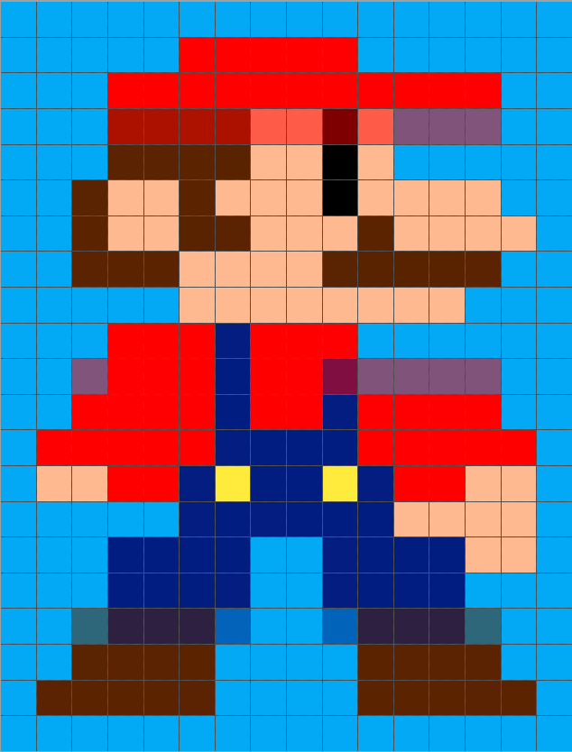
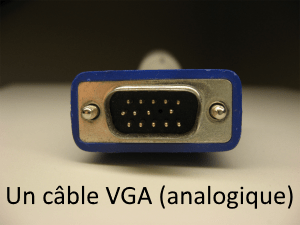
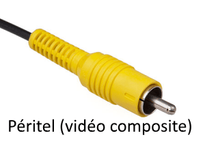
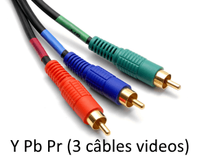

### Une image (numérique) c’est quoi ?

Ce sont toutes les formes d'_images_ (photos, dessins, vectorielle, icône, logo, etc.) qui ont été soit _acquise_, _traitée_ ou _créer_ puis qui ont été _stockées sous forme de données binaire_.

Une image est composée de plusieurs pixels !

### Un pixel c'est quoi ?

  _Pixel_ ou _px_ ou encore _p_, défini le nombre de points d'une images qui la compose.

exemple avec une image de 16 x 21 pixels :

Vu comme cela on ne voit pas grand-chose !

Alors, j'ai volontairement zoomé l'image voici la même image avec un zoom :

On distingue bien les **16** pixels de largeur (_colonnes_) et les **21** pixels de hauteur (_lignes_)

Ce qui nous donne donc un total de :

`21 x 6 = 126 px`  

### Chacun des pixels de l'image disposes d'une ou plusieurs propriétés :

les propriétés de ces pixels, varie selon la palette de couleurs utilisées et du nombre d'informations supplémentaires lié au pixel. Chaque palette contient un nombre d'informations plus ou moins grand :

- 1 bit avec 2 couleurs (image en noir et blanc) : une seule valeur est utilisée pour 1 pixel, celui-ci va de 0 à 255. 1 pixel avec une valeur de 0 sera noir et a 255 il sera blanc.

- 8 bits avec 256 couleurs : utilisé généralement en compression d'image, car on réduit le nombre de couleurs pour gagner en taille. Très utilisé dans le web (image compressée) et gère la transparence.

- 24 bits avec 16,7 millions de couleurs (couleurs vraies) : utilisé habituellement pour la photographie. Bonne qualité d'image pour le jeu vidéo 2D, de plus ce format permet aussi la transparence. R V B Couleur 0 0 0 noir 0 0 1 nuance de noir 255 0 0 rouge 0 255 0 vert 0 0 255 bleu 128 128 128 gris 255 255 255 blanc

- d'autres existent, mais nous avons listé les plus utilisés...

  Comme le nombre de propriétés par pixel diffère selon plusieurs critères de choix, Alors pour les distinguer Ils existent différents formats d'images !

##### Les formats d'images les plus courants :

|   | **Type (matriciel/ vectoriel)** | **Compression des données** | **Nombre de couleurs supportées** | **Affichage progressif** | **Animation** | **Transparence** |
| --- | --- | --- | --- | --- | --- | --- |
| **[JPEG](https://fr.wikipedia.org/wiki/JPEG)** | matriciel | Oui, réglable (avec perte) | 16,1 millions | Oui | Non | Non |
| **[JPEG2000](https://fr.wikipedia.org/wiki/JPEG2000)** | matriciel | Oui, avec ou sans perte | 4,4 milliards | Oui | Oui | Oui |
| **[GIF](https://fr.wikipedia.org/wiki/Graphics_Interchange_Format)** | matriciel | Oui, Sans perte | 256 maxi (palette) | Oui | Oui | Oui |
| **[PNG](https://fr.wikipedia.org/wiki/Portable_Network_Graphics)** | matriciel | Oui, sans perte | Palettisé (256 couleurs ou moins) ou 16 millions | Oui | Non | Oui (couche Alpha) |
| **[TIFF](https://fr.wikipedia.org/wiki/Tagged_Image_File_Format)** | matriciel | Compression ou pas avec ou sans pertes | de monochrome à 16 millions | Non | Non | Oui (couche Alpha) |
| **[SVG](https://fr.wikipedia.org/wiki/Scalable_Vector_Graphics)** | vectoriel | compression possible | 16 millions | \* ne s'applique pas \* | Oui | Oui (par nature) |

Ce tableaux nous indiquent des éléments intéressants.

**La compression et leur poids :**

Le poids est important, car toutes les images que vous ajouterez a votre jeu sera directement lié au poids de ces images. La compression nous indiquera la qualité des images.

**On peut dors et déjà éliminé les formats suivants :** **SVG**

non compressible beaucoup trop lourd !

**TIFF** :

couleur monochrome, uniquement intéressant pour un jeu en noir et blanc et encore c'est discutable car c'est un format propriétaire (sous licence, etc.)...

**JPEG2000** :

4.4millards de couleurs (photographie) beaucoup trop lourd !

**Il nous reste donc encore le choix entre le JPEG, GIF et PNG...**

Le **JPEG** offre pas mal d'avantages jusqu'ici avec 16,1 millions de couleurs, compression possible et en plus la compression est réglable avec perte selon la compression souhaitée...

**Les couleurs transparentes :**

Dans les jeux vidéos travailler sans transparence, c'est impensable.

Attention je ne dis pas que c'est impossible !

Mais cela vous compliquerait grandement la tâche...

Les Frameworks utilisent généralement les transparences d'image avec les _couches alpha_.

**On peut donc déjà éliminé les formats suivants :**

Le **JPEG** : pas de transparence, le **GIF** : transparence, mais n'utilise pas la couche alpha.

Il nous reste donc encore le **PNG**... !

### Résumé quel format utilisé ?

Nous retiendrons deux formats !

Le _**PNG**_ car celui offre tout ce que nous avons besoin, **256 couleurs ou plus** et la gestion de la transparence par couche _**alpha**_ :) **Le top !**

Le _**JPEG**_ car malgré le fait qu'il n'offre pas de transparence, c'est celui qui s'en sort le mieux niveau **qualité/compression d'image/poids** !  

### Plus d'informations sur les images :

[Image numérique — Wikipédia (wikipedia.org)](https://fr.wikipedia.org/wiki/Image_num%C3%A9rique#Images_24_bits_\(ou_%C2%AB_couleurs_vraies_%C2%BB\))  

### _Bonus_

### La Transmission des pixels et signaux vidéo :

Un signal vidéo transmet des pixels à l'écran qui diffuse l'image. (oui une vidéo c'est une suite d'images qui défilent les unes après les autres) il existe différents signaux vidéos : analogique et numérique.  

**Les signaux analogiques en voie de disparition :**

- 4 bits avec 16 couleurs ([VGA](https://fr.wikipedia.org/wiki/Video_Graphics_Array)) : la référence pour véhiculer les codes couleurs par câble vidéo analogique. Créer en 1987, et tant à disparaitre depuis 2018 avec les signaux numérique ([DVI](https://fr.wikipedia.org/wiki/Digital_Visual_Interface), [HDMI](https://fr.wikipedia.org/wiki/High-Definition_Multimedia_Interface) ou [DisplayPort](https://fr.wikipedia.org/wiki/DisplayPort))

- péritel (1 câble vidéo) ou encore le YPbPr (3 câbles vidéos) : la référence pour les moniteurs de télévision cathodique, utilisant le câble coaxiale moderne (1931), tant à disparaitre également pour les mêmes raisons.

C'est intéressant, car le type de signal vidéo utilisé nous indique la qualité d'image que nous devrons prendre en compte pour faire nos jeux selon sa plateforme de destination.

Il faudra donc choisir la qualité de l'image, et de son poids pour vos futurs jeux, surtout s’ils ont un objectif commercial. La démocratisation des signaux vidéos HD, U-HD, 4K et le 8K qui commence à arriver aussi...

Tous ces indices, nous amène clairement à réfléchir et prendre en considération la résolution cible de notre projet.

Sur téléphone mobile et consoles portables, on privilégiera un compromis poids/qualité de nos images.

Alors que sur pc et consoles de salon, on choisira une meilleure qualité au détriment du poids. **Attention :** Il ne faut pas non plus tomber dans l'extrême !

**"je mettrai une image 4K sur mon prototype, ça va leur en mettre plein la vue !"**

_Sortez-vous tout de suite cette idée de la tête !_

Déjà car, vous devrez gérer beaucoup de concepts de ratio et de proportion (mise à l'échelle) afin que votre image soit visible sur votre écran (oui tout le monde ne possède pas un écran 4K dans le salon pour tester son prototype)

Pour rappel Love2D affiche des fenêtres en 800 par 600...

il y a une réflexion derrière ce choix de la part des développeurs du framework que vous utilisez.

Quand on crée des jeux pour apprendre ou tester nos idées (des prototypes) on mettra ces paramètres HD, UHD et autres formats de côtés, car pour l'instant, on choisira une image qui fait l'affaire...

Si le projet porte à devenir commercial alors à ce moment-là il sera temps de faire un choix entre la qualité des images et leurs taille, mais seulement vers la fin de votre projet.

Ce n'est que mon point de vue, bien évidemment.

Cependant, par expérience, je sais que le poids joue un rôle important sur la décision du joueur de franchir le pas ou non pour essayer vos jeux.

* * *
