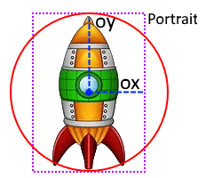
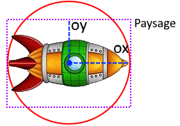

### Notre rotation actuel

Jusqu'à présent on a utilisé un variable qui augmente à l'infini pour faire tourner notre image.

```
function love.update(dt)
  vaisseau.rotate = vaisseau.rotate + dt
end
```

### Amélioration pour une utilisation du clavier

Pour cela il faut détecter l'appui de deux touches, une première touche pour la rotation négative et une autre pour la rotation positive.

- "q" ou "left" pour réduire

- "d" ou "right" pour augmenter

- une vitesse de rotation attachée à notre object vaisseau : vaisseau.speedRotate = 5

```
function love.update(dt)
  if love.keyboard.isDown("q") or love.keyboard.isDown("left") then
    vaisseau.rotate = vaisseau.rotate - (vaisseau.speedRotate *  dt)
  elseif love.keyboard.isDown("d") or love.keyboard.isDown("right") then
    vaisseau.rotate = vaisseau.rotate + (vaisseau.speedRotate * dt)
  end
end
```

### Modification de l'utilisation du rectangle

On va enlever le rectangle.

Puis le remplacer par un Cercle, car comme notre vaisseau tourne (en rond), cela crée donc un Cercle.

Nous utiliserons les points X et Y de notre vaisseau comme origine du cercle.

### Définir la dimension la plus petite comme rayon !

Selon son orientation, il faut utiliser soit l'ox, soit l'oy de l'image.

Pour une image en mode **Portrait**, on utilisera **OY** comme **Rayon** :



Pour une image en mode **Paysage**, on utilisera **OX** comme **Rayon** :



Pour définir le bon côté à tous les coups sans vous prendre la tête voici une astuce avec l'utilisation de fonctions !

### les fonctions math.min() et math.max() très utiles !

```
-- Exemples :

-- math.min(args)
-- Retourne le minimum des valeurs mise en arguments.
math.min(1,2)
return 1

math.min(1.2, 7, 3)
return 1.2

math.min(1.2, -7, 3)
return -7

-- math.max(args)
-- Retourne le maximum des valeurs mises en arguments.

math.max(1.2, -7, 3)
return 3

math.max(1.2, 7, 3)
return 7
```

### Définir le rayon avec math.max()

```
vaisseau.rayon = math.max(vaisseau.ox, vaisseau.oy)
```

### Dessinons le Cercle

```
function love.draw()

  -- son contour vert :
  love.graphics.setColor(color.green)
  --love.graphics.rectangle("line", vaisseau.x, vaisseau.y, vaisseau.w, vaisseau.h)
  love.graphics.circle("line", vaisseau.x, vaisseau.y, vaisseau.rayon)

end
```

### Le Code Complet :

```
local vaisseau = {}

vaisseau.imageData = love.graphics.newImage("vaisseau.png")
vaisseau.w , vaisseau.h = vaisseau.imageData:getDimensions()
vaisseau.ox = vaisseau.w/2
vaisseau.oy = vaisseau.h/2
vaisseau.rayon = math.max(vaisseau.ox, vaisseau.oy)

vaisseau.x, vaisseau.y = 300, 250

vaisseau.rotate = 0

vaisseau.speedRotate = 5

local color = {} -- color = {r,g,b,a}
color.white =   {1,   1,    1,    1}
color.blue =    {0,   0,    1,    0.8}
color.green =   {0,   1,    0,    0.8}

function love.update(dt)
  if love.keyboard.isDown("q") or love.keyboard.isDown("left") then
    vaisseau.rotate = vaisseau.rotate - (vaisseau.speedRotate *  dt)
  elseif love.keyboard.isDown("d") or love.keyboard.isDown("right") then
    vaisseau.rotate = vaisseau.rotate + (vaisseau.speedRotate * dt)
  end
end

function love.draw()

  -- l'image du vaisseau :
  love.graphics.setColor(color.white)
  love.graphics.draw( vaisseau.imageData, vaisseau.x, vaisseau.y, vaisseau.rotate, vaisseau.sx, vaisseau.sy, vaisseau.ox, vaisseau.oy)

  -- son contour vert :
  love.graphics.setColor(color.green)
  love.graphics.circle("line", vaisseau.x, vaisseau.y, vaisseau.rayon)

  -- le point d'origine de l'image en bleue:
  love.graphics.setColor(color.blue)
  love.graphics.circle("fill", vaisseau.x, vaisseau.y, 5)

end
```

* * *
