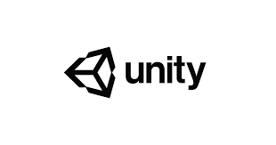
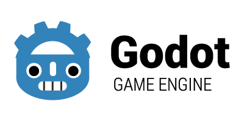
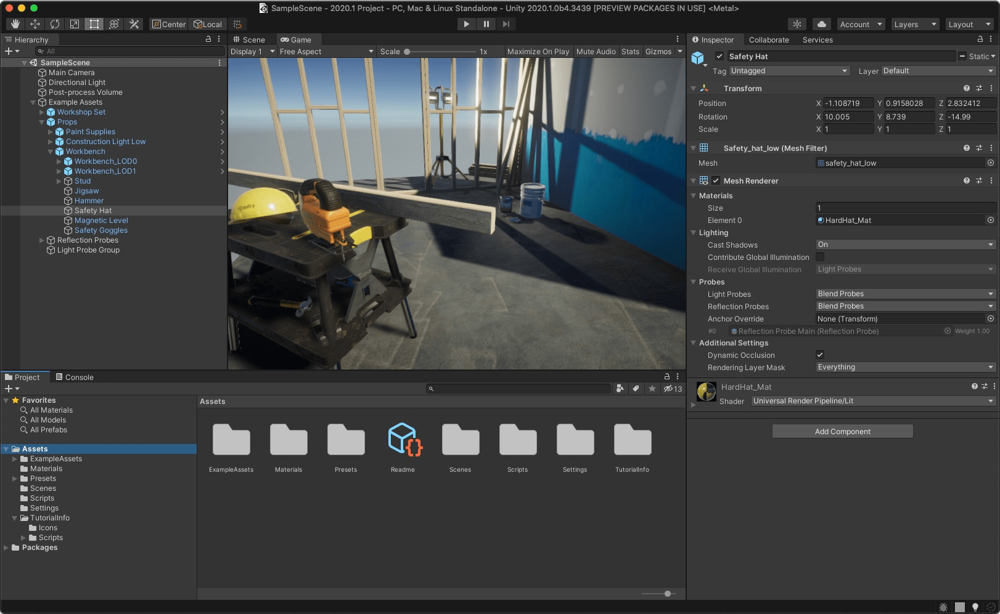
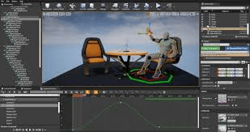
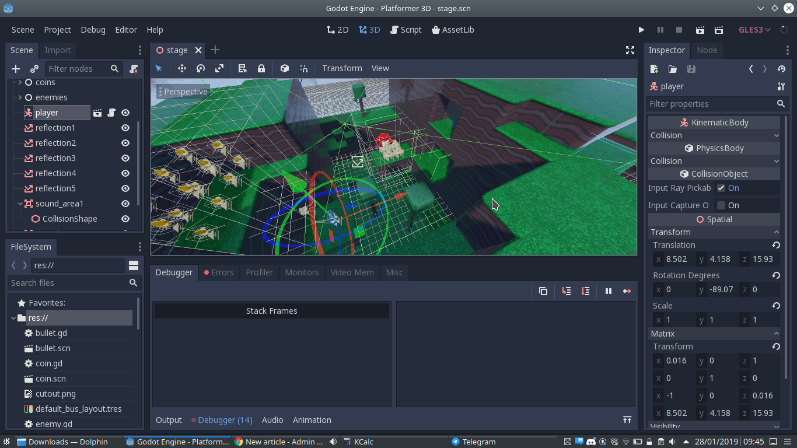

Tout d’abord les plus connus et reconnus dans le milieu ce sont les moteurs tel que Unity, Unreal Engine, Godot, Game Maker et d’autres…

#### Les Moteurs

| unity | Unreal Engine | Godot |
| --- | --- | --- |
|  |  |  |
|  |  |  |

Ceux-ci sont pilotés par une Interface Graphique (GUI) dans lequel vous interagissez avec les éléments de votre jeu, que l’on appellera des objets. Vous concevez donc le jeu en déplaçant les objets avec votre souris et en attribuant des valeurs tel que des point de vie, par exemple, et en ajoutant à ces objets des événements tels que la collision avec le sol qui représente un état.

En apparence simple certes, et cependant se cachent derrière des concepts qui vous sont cachés et qui sont dictés par des lignes de code que le moteur gère en amont. Ainsi, le moteur nécessitera des scripts uniques créés par vos soins pour rendre votre jeu unique.

Les moteurs n’ont pas tous la même logique de conception, chacun ont des approches différentes et proposent pour les reconnus des guides d’utilisation. Or il nécessite souvent des connaissances en programmation minimaliste, ou un minimum de connaissances sur ce qu’est une image, des vecteurs, des quads, la vélocité, un canvas, et d’autres.

Les moteurs proposent généralement des Stores pour faciliter les utilisateurs avec des intégrations de scripts, de modèles 3D ou 2D, etc. Cependant, pour les utiliser, il faut apprendre à s’en servir, une étape de plus que celle d’apprendre à utiliser le moteur. (à revoir)

- Avantages : propose une interface simple d'accès, les objets ont des valeurs et des événements.

- Inconvénients : il faut savoir scripter ces propres événements pour se démarquer des autres.

#### Les Frameworks

|  |  |  |
| --- | --- | --- |

Quand on parle de développer un jeu vidéo cela prend tout son sens quand on fait un retour aux sources.  
Parce que développer un jeu vidéo ça veut dire être un développeur de jeux vidéos et un développeur, c’est une personne qui utilise du code pour créer, concevoir et moduler à sa guise ce qu’il imagine. Il n’a pas besoin de moteur pour réaliser des choses simplement, car les moteurs sont également des programmes qui utilisent du code créé par l’utilisateur (les scripts).

Les premiers jeux vidéos n'étaient pas conçus avec des moteurs, est pourtant est-ce que cela enlève de leur charme ? Non, qui n’a pas apprécié jouer à Mario Bros, Sonic Edge, Tetris, un casse brique, etc. Ce sont tous des jeux codés par des développeurs créatifs de leur génération.  
Il y a encore beaucoup de jeux qui sortent sans utiliser de moteur, vous en trouverez plein sur Steam, par exemple, et ce sont même des jeux à succès qui se vendent bien… Oui ça parait fou et incroyable, mais en réalité ce n’est pas si surprenant que cela. C'est même l’essence même de ce qu’est un jeu vidéo, ce sont des lignes de codes tout simplement. Parce que ce soit une application, un site web, un système d’exploitation, un GPS ou un jeu, etc. Ce sont tous des programmes informatiques dictés par des lignes de codes et créées par des développeurs.

Les développeurs pour créer des jeux vidéos utilisent des outils qui intègrent des solutions graphiques 2D ou 3D voir les deux. Ces outils ce sont des frameworks, moins connus du public, ils utilisent des bibliothèques de rendu graphique tel que DirectX ou OpenGL qui sont les deux principaux acteurs majeurs dans les jeux vidéos 2D/3D. Il y a d’autres bibliothèques qui se démarquent également pour le web, c’est WebGL et Java3D.

Il existe également d’autres bibliothèques, mais celles-ci sont généralement des forks à OpenGL (des versions basées sur OpenGL avec des ajouts ou des modifications de celle-ci) il y a bien évidement beaucoup d’autres bibliothèques, mais qui sont moins utilisées ou reconnues pour le jeu vidéo.

Résumé :  
\- OpenGL offre un support multiplateforme.  
\- DirectX est plus adapté aux plateformes sous Windows, cependant la compilation des bibliothèques DirectX vers le multiplateforme a été hautement simplifié avec le temps.  
\- WebGL est également multiplateforme, mais réservé aux navigateurs web.  
Ps : Vulkan concurrent direct  et plus récent à OpenGL et DirectX se démarque peu à peu également, à surveiller donc.

- Avantages : simple, rapide et les langages s'apprennent relativement vite.

- Inconvénients : la programmation 3D est plus longue et complexe que par un moteur.

#### Conclusion : Moteurs ou Frameworks ?

Les moteurs offrent des facilités pour la création rapide, car ils offrent un visuel immédiat, mais ceux-ci nécessitent deux apprentissages bien cachés de leurs concepteurs si vous souhaitez être autonome et indépendant de leurs stores qui sont des attrape-mouches. Ils vous vendent la facilité par le biais de leur store en vendant des produits aux utilisateurs. Pour ne pas passer votre fortune dans ces outils, ce qu’il vous faut, c’est l’apprentissage de leurs outils et bien souvent de leurs langages interne :

\- Unity aborde le langage via les GameObjects et nécessite des bases en C#

\- Unreal Engine lui aborde le langage via ses Blueprint et nécessite des bases en C++

\- Godot utilise le GdScript qui est un langage interne à leur moteur lui-même dérivé du Python (ou du moins très similaire) mais nécessite plus que des bases, il faut savoir programmer.

Ces trois langages, sont des langages objets. Qui nécessite déjà quelques notions en programmation pour bien comprendre ces langages et être vraiment à l’aise avec ceux-ci.

Oui, ces moteurs proposent des apprentissages directement depuis leurs Communautés, et les personnes qui le font, arrivent à leurs fins, mais à quel prix ? En suivant des tutoriels et un autre et encore un autre pour arriver à faire ceci ou cela… Finalement, leurs jeux ressemblent à tout sauf au jeu qu’ils avaient imaginés à la base, car les menus sont réalisés avec tel script, ces effets sont faits avec tels assets, et la gestion de l’inventaire, c’est le tutoriel blueprint disponible sur YouTube, etc.

Quid des tutoriels directement disponibles sur le site web du moteur et leur formule e-learning. Celui-ci même qui sont visités par des milliers de personnes et qui vont utiliser le même script que les autres, car ils ont recopié et n’ont pas fait leurs propres scripts avec leurs idées…

Je suis sûr que vous avez déjà remarqué cela sur certains jeux, ou l’on a l'impression que c’est la copie d’un autre jeu, mais avec des graphismes différents, voir parfois qui vont jusqu'à se ressembler dans les menus, dans la gravité des objets, etc. C’est simplement, car c’est le même moteur utilisé et certainement les mêmes scripts utilisés.

Ne soyez pas comme eux, apprenez à lire, comprendre, analyser et reproduire selon vos propres connaissances ces mêmes scripts en allant plus loin voir en procédant différemment et le rendu sera tout autre, c'est garanti ! C’est cela qui rendra vos jeux originaux et qui donnera une signature unique à vos jeux.

  
Sur GameLogic.dev notre vision de conception d’un jeu avec vous, c’est d’abord de vous familiariser avec les termes de la programmation, les concepts utilisés et ensuite les outils adaptés à vos besoins. Nous explorerons des langages simples, des frameworks adaptés et on pourra s’attaquer aux moteurs.

C’est pourquoi nous commencerons donc par l’apprentissage d’un langage simple, suivi d’un framework. Pour vous donner des armes contre ces géants les moteurs et vous alors vous serez maître de ces outils et non l’inverse ! Vous serez libre de choisir de les utiliser ou non...

