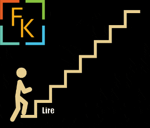

# Introduction

Bonjour,

Je me présente, M. BOTTURI Cédric, je suis programmeur autodidacte et passionné.

Je suis né en janvier 1985 à l’époque où le jeu vidéo vivait son plein essor. C’est également des années assez rock & roll ainsi que la génération 70-80 qui a contribué à démocratiser le jeu vidéo dans notre société.  
  
Passionné de jeux vidéos depuis mon enfance, j’ai pu posséder et jouer sur Atari, Nes, Snes, Master System(s), CPC amstrad 464, Nintendo 64, Playstation(s), Dreamcast, Xbox(s), PC, Wii(s), et d’autres supprots...

Je compte partager avec vous une expérience humble et gratifiante, celle de créer votre premier jeu vidéo le plus simplement possible.

Étant autodidacte certaines de mes approches peuvent déplaire aux plus aguerris. Je vais cependant essayer de respecter au mieux les conventions et de vous montrer et de vous prouver à vous-même que même sans diplôme on peut réaliser des jeux vidéos.

#### Prérequis Conseillés :

- Avoir de la motivation. C'est un moteur qui vous poussera vers l'avant.
- Savoir ce qu'est une addition, soustraction, multiplication, division.
- Savoir ce qu'est un rectangle et ses côtés, un cercle et son rayon.
- Savoir prendre son temps et relire si nécessaire les modules et leurs chapitres.
- Ne pas avoir peur de demander de l'aide sur notre serveur communautaire.  
    _C'est un Serveur Discord, si vous ne connaissez pas, ne vous inquiétez pas, ce sera expliqué au début des modules de votre parcours._
- Savoir prendre du plaisir à apprendre et à créer des jeux simples.

- Il est essentiel de pratiquer régulièrement ainsi que de faire des pauses pour assimiler ces nouveaux concepts.
- Savoir reporter au lendemain si l'on rencontre des difficultés et que l'on ne comprend plus ce que l'on fait.  
    (trop de nouveaux concepts assimilés en peu de temps, fatigue, etc.)

#### Prérequis qui vous aideront à aller plus vite (facultatif) :

- Il est avantageux d'avoir des bases solides en math et notamment en géométrie analytique, c'est un plus indéniable.
- Il est avantageux d'avoir fait des études dans l’informatique ou au moins de s’y intéresser un minimum et de savoir comment tout cela fonctionne au moins théoriquement.
- Il est avantageux de savoir programmer avant de commencer la création de jeu vidéo.

_Cependant, si comme moi, vous n’avez pas tous ces prérequis :_

Ce n’est pas très grave, car rien ne vous empêche d’apprendre, tout en prenant plaisir à le faire.

Parce que vous le ferez en apprenant à créer des jeux vidéos !

Il n’y a rien de plus motivant que d’apprendre quand on réalise nos rêves et de voir que finalement on y arrive et que ce n’était pas si dur finalement une fois les caps franchis.

Même si vos calculs ou formules ne sont pas parfaites, ce n’est pas très grave en soi, car l’essentiel en dernier lieu, c’est que vos formules fonctionnent.

On ne vous demandera pas de déposer une navette spatiale, juste de déposer une navette représentée par une image sur un sol qui n'existe pas, donc s'il arrive un peu trop fort contre le sol je vous promets que personne ne vous en voudra et qu'il n'y aura aucun blessé ! (mis à part votre ego peut-être)

  
Il n’y aura personne pour vous dire que votre calcul est digne d’un niveau primaire, car le joueur ne saura pas comment tout cela fonctionne…

Si vous pouvez vous relire et comprendre facilement ce que vous avez fait, c’est bien comme ça et largement suffisant !

[Commencer le cours](https://gamelogiq.dev/liste-des-differents-cours/decouverte-du-monde-du-jeu-video-et-de-ses-outils-de-developpement/les-origines-du-jeu-video/)
