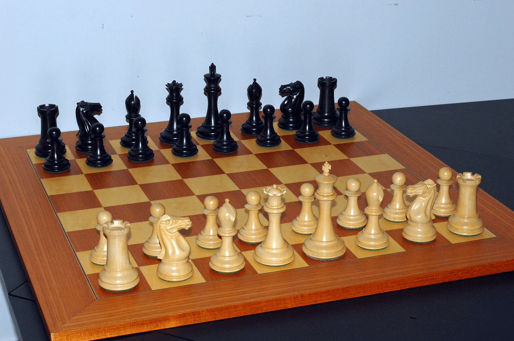
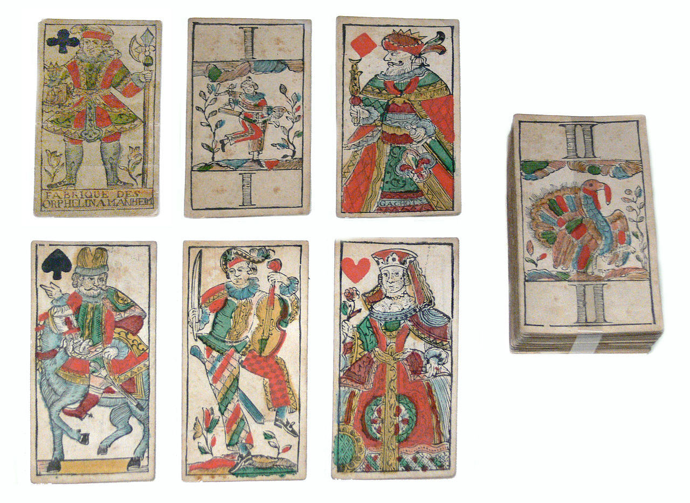
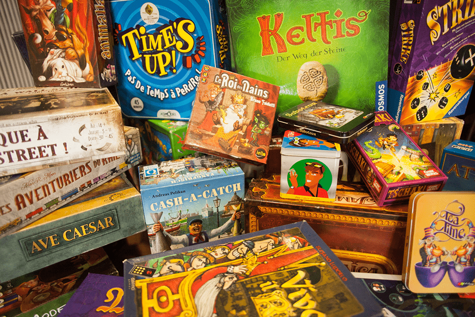
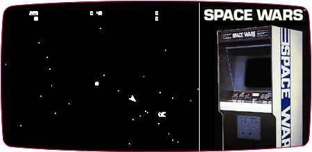
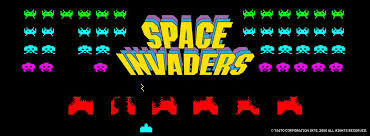
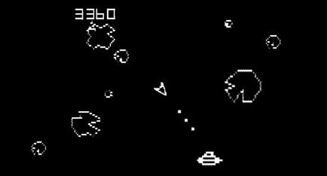
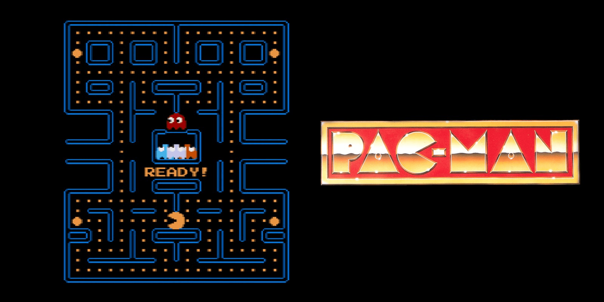

  
Revenons aux origines du jeu vidéo afin de bien comprendre ce que c’est réellement.

Pour cela, remettons-nous dans le contexte, le jeu vidéo est apparu dans les années 70-80, mais avant d’être sous cette forme vidéoludique, ils étaient mieux connus sous la forme traditionnelle telle que les jeux de cartes, jeux de plateau ou jeux de rôles.

Les jeux traditionnels ont des règles, un but et une rejouabilité simple, c’est ça qui les rend attrayants (addictif).

Là où réside la quintessence des jeux finalement c’est de donner envie de rejouer, tout simplement, en simplifiant l’approche des règles en éliminant le maximum de complexité. Hormis certains jeux destinés aux experts comme les échecs le plus connu dans ce domaine.  
Ces jeux doivent avant tout procurer du plaisir aux joueurs et si cet objectif est atteint, c’est grâce à cela que des jeux mythiques persistent dans notre société comme :

- Les jeux de plateaux :  les dames, les échecs, les petits chevaux ou plus moderne comme le Monopoly, etc.

- Les jeux de cartes :  la bataille, la belote et ses dérivés, le tarot, le poker, etc.

|    [Les échecs](https://fr.wikipedia.org/wiki/%C3%89checs) |    [Le tarot](https://fr.wikipedia.org/wiki/Tarot_\(carte\)) |    [Jeux de société moderne](https://www.philibertnet.com/fr/9552-pour-s-initier-aux-jeux-modernes) |
| --- | --- | --- |

Maintenant parlons des jeux vidéos, qui nous intéresse le plus. Revenons en 1970… pour parler de…

## L’histoire du jeu vidéo

Ou plutôt comment le jeu vidéo est-il arrivé dans notre société ?

Les premiers jeux vidéos n’ont pas toujours respecté ces règles de simplicité ou des mécaniques auxquels les joueurs étaient habitués, pour certains jeux, ce fut une révélation, pour d’autres un flop et parfois même ce fut même un choc pour certains (culturel ou social).

Nous allons survoler rapidement ces premiers jeux vidéos qui ont ainsi marqué l’histoire du jeu vidéo.

Comment parler de jeu vidéo sans parler des premiers jeux à succès sortis sur les bornes d’arcade tels que Space Wars en 1977, Space Invaders en 1978, Asteroids en 1979, PacMan en 1980, Missile Command en 1980 et bien d’autres encore.

|  | [Space Wars 1977](https://en.wikipedia.org/wiki/Space_Wars) |
| --- | --- |
|  | [Space Invaders 1978](https://en.wikipedia.org/wiki/Space_Invaders) |
|  | [Asteroids 1979](https://en.wikipedia.org/wiki/Asteroids_\(video_game\)) |
|  | [PacMan 1980](https://en.wikipedia.org/wiki/Pac-Man) |
|  | [Missile Command 1980](https://en.wikipedia.org/wiki/Missile_Command) |

C’est cet engouement de nouveauté qui a été le déclic de toute une génération de jeux d’arcade, c’est eux qui ont permis de propulser le jeu vidéo sur nos petits écrans de télévision avec la première console, l’Atari. Ainsi que tous les acteurs qui ont aidé à démocratiser le jeu vidéo et ont fait ce qu’il est devenu aujourd’hui, sans la passion de ces développeurs et de l’engouement autour de ce nouvel outil qu’était l’informatique.

Sans cette nouvelle technologie le jeu vidéo n’aurait pas connu l'âge d’or qui faisait vibrer le cœur de ces joueurs de cette génération et qui fait encore vibrer celui des collectionneurs.

Tous ces titres qui ont fait le succès des salles d’arcades ont inspirés les futures générations sur les codes à suivre et de la direction artistique à prendre.

Oui, car pour créer un bon jeu vidéo, il y a des règles à respecter parce que c’est un art après tout.  
Le jeu vidéo est un mélange de l’art audiovisuel comme le cinéma, mais l’art du récit d’un bon livre et même parfois l’art de la contemplation ou de la transcendance.

Les premiers jeux vidéo ont posé les premiers fondamentaux du jeu vidéo, un jeu simple, rejouable et addictif…

Alors comment le rendre simple ? Pourquoi doit-il être rejouable ? Comment peut-il rendre addict ? Tout cela réside dans le rôle du Game Designer qui va dicter aux Développeurs les règles à suivre pour concevoir un bon jeu.

### Voici les trois règles d’or à respecter :

- La simplicité

Un jeu se doit d’être simple à comprendre ou être simple à prendre en main. Que ce soit son gameplay (la façon d’y jouer) ou bien le but du jeu.  
Il est subtil parfois de mélanger les deux, mais cela demande soit de l’imagination, soit de l’expérience.

- La rejouabilité

Un jeu doit pouvoir se finir et on doit avoir la possibilité de le recommencer du début facilement, sinon vous prenez le risque de frustrer les joueurs ou pire de les dégoûter (aie). C’est un peu moins vrai aujourd’hui avec les sauvegardes de la progression du joueur et de la durée des aventures qui augmente, mais généralement ce sont des jeux qui demandent de l'expérience. Alors, je vous conseille dans un premier temps déjà de créer des jeux simples et facilement rejouable.

- L’addiction (le flow)

Lorsqu’un joueur se retrouve absorbé par le jeu, généralement avec un score à battre pour les jeux d’arcade avec des commandes qui répondent bien, le joueur reste dans un état de concentration durant de longues périodes et enchaîne alors les parties pour battre le meilleur score affiché à l'écran (score ou classement).  On appelle ce phénomène “**Le Flow**” ou “**La Zone**”. Source : [https://fr.wikipedia.org/wiki/Flow\_(psychologie)](https://fr.wikipedia.org/wiki/Flow_\(psychologie\))

- Conclusion

Ce sont les trois fondamentaux les plus importants à garder en tête pour les créateurs de jeu vidéo.  
S'ils souhaitent faire ressentir du plaisir aux joueurs, ce sont les éléments clés qui ont été approuvés avec les jeux à succès. Alors ce sera également votre objectif ! Vous devrez atteindre cet objectif même sur des petits projets, car c’est le retour d'expérience des joueurs qui joueront à vos jeux et qui vous feront un retour du plaisir qu’ils ont eu ou pas en jouant à vos jeux. Ces retours vous aideront et vous motiveront pour progresser et réaliser de meilleurs jeux, ou bien ce jeu dont vous rêvez secrètement.

### Les ressources utiles

Maintenant que nous avons les idées claires sur vos futurs objectifs  j'espère que vous serez assez curieux pour chercher de vous-même des documentaires, des reportages sur le sujet, car ils seront des sources d’inspirations, de motivation et de vraies mines d’or pour vos créations !

Commencez par chercher des documentaires sur vos jeux de cœurs, sur leurs développements ainsi que sur les entreprises qui les ont créés.

YouTube, Wikipédia et Netflix sont mes trois meilleures sources que je peux vous conseiller. Voici quelques idées :

\- Chercher sur Wikipédia le nom des jeux qui vous inspire le plus et renseignez-vous sur ces jeux, leurs créateurs et ensuite chercher les titres qui les ont eux-mêmes inspirés.

Je suis prêt à parier que pour certains jeux que vous admirez, vous serez étonné parfois de leurs sources d’inspirations.

Vous pouvez aussi chercher les noms des constructeurs de consoles les plus connus tels que Sony, Nintendo, Sega et Microsoft.

\- Sur YouTube commencez par ici : [https://www.youtube.com/results?search\_query=documentaire+jeu+video](https://www.youtube.com/results?search_query=documentaire+jeux+video)

\- Sur Netflix, il a un documentaire : [High Score l’âge d’or du Gaming](https://fr.wikipedia.org/wiki/High_Score_:_L%27%C3%82ge_d%27or_du_gaming).

Ainsi qu’un manga portant quasiment le même nom, même si cela parle beaucoup de jeu d’arcade cela peut permettre de découvrir certains titres intéressants : [High Score girl](https://www.manga-news.com/index.php/serie/Hi-Score-Girl).

\- Les magazines en lignes :

 [Guide\_Metiers\_NUMERIQUES\_2019\_V3.pdf](https://drive.google.com/file/d/19hako1K6kdHjVOJqghzvIkALLTYWpb-X/view)

