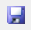

# Quels outils pour programmer en LUA ?

**Pour programmer en lua, nous aurons besoin :**

- d’un éditeur de texte pour taper votre code
- d’un compilateur ou d’un interpréteur pour exécuter notre code
- d'une fenêtre ou d'une console pour afficher les résultats de notre code.

Heureusement, un logiciel tout-en-un, propose déjà tout cela il s'agit d'un IDE !

## Qu’est-ce qu’un IDE ?

|  |  |  |
| --- | --- | --- |

**IDE** Signifie :  
**Integrated Development Environment  
**le nom français :  
**Environnement de Développement** **Intégré** (EDI).

Nous utiliserons pendant le parcours majoritairement **les termes en anglais**, pour la simple et bonne raison que lors de vos futures recherches sur internet il vous faudra les connaître en anglais, car le langage informatique utilise des termes en anglais.

Alors pas la peine de vous prendre la tête à connaître par cœur les termes en français-anglais, si ce n’est pour votre propre culture et par curiosité.

Concrètement, un IDE c’est un logiciel de traitement de texte évolué qui propose de nombreuses palettes d’outils destinés au développeur pour organiser son code, le déboguer et l'exécuter.

Comme notre objectif est d’utiliser par la suite le framework LUA de Love2D.  
On peut voir sur leur site web, ils nous conseillent 3 - 4 IDE différents.

| [ZeroBrane Studio](http://studio.zerobrane.com/),  [Sublime Text](https://love2d.org/wiki/Sublime_Text),  [Notepad++](https://love2d.org/wiki/Notepad%2B%2B),  and  [SciTE](https://love2d.org/wiki/SciTE) allow you to launch the game from within their code editors.   source : [https://love2d.org/wiki/Getting\_Started](https://love2d.org/wiki/Getting_Started) |
| --- |

Nous retiendrons une attention particulière à **ZeroBrane** qui propose des palettes d’outils simples, déjà préconfiguré et dispose de l’essentiel tout simplement. De plus, il est disponible sur Windows, Mac et Linux. Cet IDE est idéal pour débuter.

Note : Je l’utilise moi-même personnellement lorsque je veux coder en Lua, car je le trouve simple, rapide et efficace.

**Voici une capture d’écran pour voir à quoi ressemble ZeroBrane :**


**Aperçu avec un thème sombre :**


## Installation de ZeroBrane (Windows)

Première chose, allons chercher la version qui correspond à votre système d’exploitation (Windows, Mac ou Linux).

Si vous êtes sous Windows voici une version préparée par nos soins :

Archive Zip de GameLogic.dev (ZeroBrane + Packages + Configuration) :

- [https://drive.google.com/file/d/1VOJXNPTHUkX5mOpQ8uMY8icLaB274vTa/view?usp=sharing](https://drive.google.com/file/d/1VOJXNPTHUkX5mOpQ8uMY8icLaB274vTa/view?usp=sharing)

_Il s'agit de la version v.1.90 du 09 février 2020  (merci de nous avertir si la version est obsolète)_

Sinon voici le lien du site web :

- [https://studio.zerobrane.com/](https://studio.zerobrane.com/)

Le lien vers la page de téléchargement :

- [https://studio.zerobrane.com/download?not-this-time](https://studio.zerobrane.com/download?not-this-time)

Une fois sur la page de téléchargement (Download) ressemblant à l'image ci-dessous :


Sélectionner la version qui convient à votre système. Une fois le téléchargement terminé, suivez les instructions d’installation. À la fin de l’installation ZeroBrane, ouvrez ZeroBrane Studio.

Voici un aperçu de l’installation (v1.90) :

[](https://www.faconkode.fr/wp-content/uploads/2020/09/install.gif)Cliquez sur l'image pour la voir en pleine page

# Configuration de ZeroBrane

  
Nous allons maintenant configurer celui-ci avant de le découvrir ensemble.

Même si vous avez téléchargé la version préconfigurée, je vous conseille quand même de suivre cette étape ne serait-ce que pour savoir comment faire et également modifier si cela ne vous convient pas selon vos goûts (notamment le thème et la taille du texte).

Allez dans la barre de menu puis dans :

  
\- Edit > Préférences > settings : user  
\- Édition > Préférences > Paramètres : utilisateur

Cette action a pour effet d’ouvrir le fichier user.lua visible dans la barre des fichiers ouverts.


Une fois dans le fichier **user.lua** Allez à la fin du fichier pour ajouter ces paramètres :

Si celles-ci sont déjà présentes modifiez-les comme les exemples ci-dessous :

\- Respectez bien la mise en forme avec les guillemets **" "** si vous ne savez pas les faire, ils s'écrivent avec la touche 3 juste au-dessus des touches Z et E de votre clavier.

\- Respecter également les minuscules et majuscules, sinon ça ne fonctionnera pas !

\- Nous allons renseigner la **langue en français** en ajoutant cette ligne :

```
language = "fr"
```

\- Nous allons également **charger les thèmes** :

```
styles = loadfile('cfg/tomorrow.lua')('TomorrowNight') 
stylesoutshell = styles -- apply the same scheme to Output/Console windows 
styles.auxwindow = styles.text -- apply text colors to auxiliary windows 
styles.calltip = styles.text -- apply text colors to tooltips
```

\- Nous allons rajouter cette ligne pour modifier **la taille de la police d’écriture** par défaut :

```
editor.fontsize = 14
```

Celle-ci est à 12 par défaut, à vous de tester celle qui vous convient le mieux par rapport à votre écran.

\- Enfin nous allons ajouter cette ligne de paramètre pour avoir accès à vos variables via nos différents fichiers ouverts (chose qui nous sera bien utile plus tard) :

```
acandtip.nodynwords = false
```

Maintenant vous devriez avoir quelque chose de comparable à ceci :


Si ce n’est pas le cas et que vous n’y arrivez pas… Voici le lien vers mon fichier user.lua

Ouvrez-le avec ZeroBrane et faites un copié - coller dans votre fichier user.lua

**Fichier source :**

[https://drive.google.com/file/d/1kCcZCgqJnkzGzIIRCpLHKAxsgfIFsXMl/view?usp=sharing](https://drive.google.com/file/d/1kCcZCgqJnkzGzIIRCpLHKAxsgfIFsXMl/view?usp=sharing)

Une fois que vous avez fini de paramétrer ZeroBrane, Sauvegarder en cliquant sur la petite Disquette Bleue  :  


Maintenant relancez ZeroBrane (fermer le complètement, et ouvrez-le à nouveau) et vous devriez avoir les menus en français.

Je vous conseille de retourner dans le fichier user.lua et de mettre un thème sombre pour réduire la fatigue oculaire.

Personnellement j’utilise celui-ci : TomorrowNightEighties

## Changer de thème

Pour changer de thème, il vous suffit de cliquer sur son lien dans le fichier user.lua comme ceci :


# Découverte de l’outil de développement

Maintenant nous allons faire un tour très rapide de l’interface de ZeroBrane pour comprendre à quoi sert les différents éléments de l’interface =)


- 1 : La **Barre des Menus** vous permet de naviguer dans les menus suivants :  
    \- fichier.  
    \- affichage.  
    \- recherche.  
    \- Projet.
- 2 : La **Barre d’outils** contient le condensé des raccourcis utilisés fréquemment :  
    \- pour créer un nouveau fichier, ouvrir un fichier et le sauvegarder.  
    \- ouvrir un dossier et déterminer le dossier du projet courant.  
    \- exécuter votre code.  
    \- accès à l’essentiel du débogueur.
- 3 : L’**Onglet de Navigation** **du projet**, contient deux onglets :  
    \- Projet qui affiche les dossiers, sous dossiers et fichiers de votre projet.  
    \- Structure, qui lui affiche l’organisation de votre fichier de code (très utile).
- 4 : La **Barre d’onglets des Fichiers** Ouverts (parle d’elle-même)
- 5 : **La Console** affiche les erreurs et les traces que vous souhaitez afficher.

Nous reviendrons sur ces éléments plus en détails au cours de votre parcours.

## **Les Numéros de lignes**

Chose intéressante que nous devons connaître ce sont les numéros de lignes.  Elles nous permettent de nous repérer dans notre code. Bien souvent lorsqu'une erreur se produira, on vous indiquera le numéro de la ligne qui vous pose problème.

Cette information vous sera alors d'une grande aide.

Une ligne sera ajoutée à votre code lorsque que vous utiliser un retour charriot (saut de ligne avec la touche "Entrée").

Vous trouvez les numéros de lignes comme ceci dans l'éditeur de code :


Bravo ! On a terminé, vous pouvez passer à la suite ;)

**[Vous pouvez retourner à la liste des cours.](https://gamelogiq.dev/?page_id=18 "Vous pouvez retournez à la liste des cours.")**
