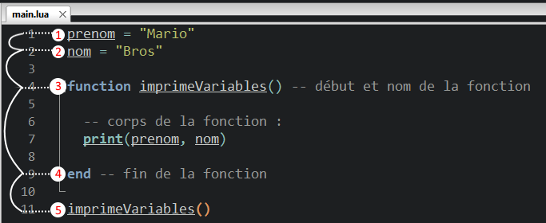
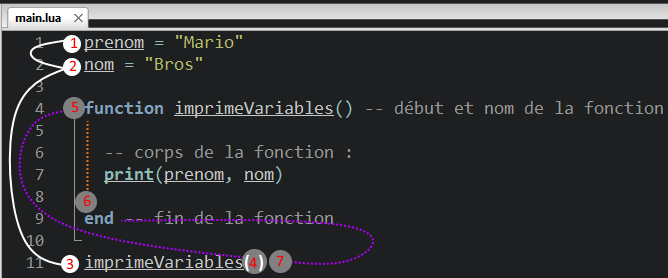

#### Nous savons créer une variable et qu’une variable possède différents types.

On a vu :

- les **type(string)**

```
monTexte = "texte"
```

- les **type(number)**

```
monNombreentier = 9
-- et
monNombreDecimal = 9.50
```

- les **type(boolean)** true ou false

```
monBool = true
-- ou
monBool = false

```

- les **type(nil)** car elle est vide (valeur d'une variable par défaut)

```
maVariable = nil
-- ou
monAutreVariable
```

Maintenant nous allons rendre notre code un peu plus intelligent et lui faire exécuter des tâches… Ces tâches ce sont des fonctions et elles sont aussi des variables !

Vous en connaissez déjà deux ! print() et tostring() qui sont des fonctions intégrées à LUA… Maintenant nous allons voir comment créer nos propres fonctions !

Il existe deux écritures différentes pour créer une fonction, cependant celles-ci font exactement la même chose.

Syntaxe (recommandée) :

```
function maFonction()
-- contenu de la fonction
end
```

Syntaxe équivalente :

```
maFonction = function()
-- contenu de la fonction
end
```

Sur la deuxième écriture cela démontre bien qu’une fonction est une variable !

Nous utiliserons la première écriture, car c’est l’écriture recommandée dans la documentation officielle de LUA (le référentiel).

Vérification du type de la variable :

```
function maFonction()
end
print( type(maFonction) )
```

sortie console :

```
function
```

## Commençons par créer notre propre fonction !

Nous appellerons notre première fonction **imprimeVariables**, qui exécutera un print de nos variables.

_Il est recommandé de sauter une ligne entre la fonction et un_ _end._

Allez c’est parti !

Commençons par créer le bloc de la fonction.

Syntaxe :

```
function imprimeVariables()
end
```

Analysons un peu ce que nous venons d’écrire...

1- On tape en premier le mot clé  **function**  qui indique que l’on va créer une fonction après le mot clé. 2- Ensuite il attend le nom de la fonction suivi de 2 parenthèses :  **imprimeVariables( )** _Ces parenthèses ont un nom, la première s’appelle l’ouvrante et la dernière la fermante._ 3- Enfin nous fermons une fonction par un  **end**  pour indiquer la fin de la fonction.

Résumé : Le mot clé function ouvre la fonction et elle attend le mot clé end pour savoir ou elle se termine.

Le corps de la fonction représente ce qui se situe dans la fonction, le corps détermine les instructions qui seront exécutés lorsque nous appellerons cette fonction.

Exemple :

```
function imprimeVariables() -- début de la fonction

-- ici sera exécuté le corps de la fonction

end -- fin de la fonction
```

* * *

## Utiliser une fonction !

Pour utiliser notre fonction, nous allons faire ce qu’on appelle un appel de fonction.

Syntaxe d’appel de fonction :

```
imprimeVariables()
```

À ce stade, la fonction ne fait rien, et vous n’aurez donc aucun résultat dans la console.

On va donc devoir créer le contenu de la fonction.

Nous souhaitons qu’elle affiche deux variables. Nous allons donc utiliser un **print()**.

Il va aussi nous falloir initialiser ces deux variables à afficher.

À partir de là, nous pourrons enfin utiliser dans notre code notre fonction.

Exemple :

```
prenom = "Mario"
nom = "Bros"

function imprimeVariables() -- début et nom de la fonction
 
 -- corps de la fonction :
 print(prenom, nom)
 
end -- fin de la fonction

imprimeVariables() -- appel de la fonction
```

sortie console :

```
Mario Bros
```

Cependant Il reste une chose importante à savoir c’est que le code contenu dans vos fichiers est lu une fois en entier avant d'être exécuté !

Pendant cette première lecture, il garde en mémoire l’emplacement des fonctions qu’il a vues !

* * *

## Analysons ce qu’il s’est produit !



Le code a été lu une première fois et les éléments suivants ont étés mémorisés :

1. il existe une variable **prenom**

3. il existe une variable **nom**

5. il existe une **fonction qui débute à la ligne 4**

7. cette même **fonction  se termine à la ligne 9**

9. une **fonction sera appelée à la ligne 11** (mais il ne l'exécute pas !)

Après et seulement après cette première lecture, il exécutera le code !

C’est pourquoi malgré le fait que le code soit lu (interprété) de haut en bas, notre fonction a pu être exécutée !

Parce qu'il mémorise une première fois ou se situe les fonctions, et qu’il fait des allers-retours entre le code qu’il lit et les fonctions qu’il mémorise.

C’est comme si l’on marquait les pages d’un livre pour aller les relire par la suite puis de pouvoir revenir sur la page où l'on était juste avant grâce à des marques-pages.

## Analysons ce qu’il se produit pendant l’exécution :



1. création de la variable **prenom** et de sa valeur

3. création de la variable **nom** et de sa valeur

_! entre l’étape 2 et 3, il crée la fonction **imprimeVariables****()** !_

3. il **exécute** l’appel de la fonction **imprimeVariables()**

5. il **mémorise** **sa position** actuelle (ligne 11)

7. il **retourne** **ligne 4 au début de imprimeVariables()** (qui vient d’être appelée)

9. **exécution du corps de la fonction imprimeVariables()** jusqu’au end

11. **la fonction est terminée, il retourne** **à la ligne 11** à la  position mémorisée dans l'étape 4.

### Autres exemples de démonstration.

Dans l’exemple suivant, nous avons un Héros qui subit une attaque d’un ennemi.

```
vieHero = 100
frappeEnnemi = 10

function Attaque() -- début et nom de la fonction
 vieHero = vieHero - frappeEnnemi
 print(vieHero) -- corps de la fonction
 
end -- fin de la fonction

print(vieHero)
Attaque()
Attaque()
Attaque()
```

sortie console :

```
90
90
```

_Le print() effectue le calcul pour l’impression, mais ne modifie pas les valeurs des variables..._

Alors corrigeons cela :

```
vieHero = 100
frappeEnnemi = 10

function&nbsp;Attaque() -- début et nom de la fonction
&nbsp;vieHero = vieHero - frappeEnnemi
&nbsp;print(vieHero) -- corps de la fonction
&nbsp;
end&nbsp;-- fin de la fonction

print(vieHero)
Attaque()
Attaque()
Attaque()
```

sortie console :

```
100
90
80
70
```

De cette manière la variable est bien modifiée !

* * *
