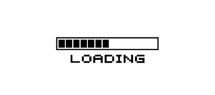

Maintenant que nous savons ce qu'est une Fonction() ! Abordons une solution pour effectuer le calcul d’une attaque et de retourner un résultat à la variable appelant la fonction Attaque()

`return`  permet de retourner un résultat. Le résultat du `return` peut être assigné à la variable qui appelle la fonction.

Syntaxe pour une fonction avec un return :

```lua
function maFonction()
  return valeur
end
```

Exemple d'un return  de valeur fixe :

```lua
function maFonction()
 return 100
end

print( maFonction() )
```

sortie console :
```
100
```

print() **appelle** la fonction **maFonction()** et celle-ci **retourne** la valeur 100.

On peut aussi retourner une variable :

```lua
vieMax = 100

function maFonction()
 return vieMax
end

print( maFonction() )
```

sortie console :
```
100
```

Bien, ça commence à prendre forme, on va voir comment on peut stocker le return d’une fonction dans une variable.


Syntaxe pour récupérer la Valeur du return  d’une fonction :

```lua
maVariableAppelante = leReturnDeCetteFonction()
```

| Créons une fonction  MaxVie()  qui remonte la vie de notre Héros à 100. |
| --- |

Solution :

```lua
vieHero = 20
print(vieHero)

function MaxVie()
 return 100 -- valeur retourné à la variable appelante
end

vieHero = MaxVie()
print(vieHero)
```

sortie console :
```
20 
100
```

**MaxVie()** retourne  toujours le nombre 100 à la **variable appelante**.

## Allons encore plus loin !

Voyons maintenant le return d’un calcul qu’on effectue dans le corps de la fonction Attaque()

**Attaque()** doit  retourner la valeur contenu dans une variable qu’on appellera  **resultat** à la variable appelante **vieHero**

Démonstration :

```lua
vieHero = 100
frappeEnnemi = 10

function Attaque() -- début et nom de la fonction
 resultat = vieHero - frappeEnnemi -- resultat vaut la valeur du calcul
 return resultat -- return renvois la valeur de resultat à l'appelant
end -- fin de la fonction

vieHero = attaque() -- vieHero vaut la valeur return par Attaque()
print(vieHero)
```

sortie console :
```
90
```

- Exercice

| \- Créer un héros, celui-ci sera notre combattant (jeu de combat dans la rue) avec une vie avec 100 points de vie. - Notre héros doit subir une ou plusieurs attaque de la part d’un adversaire. - Enfin le héros doit restaurer sa vie à son plein potentiel en mangeant une part de poulet. - Essayez d’exécuter du texte dans les fonctions pour donner un peu de vie à tout cela... |
| --- |

_Solution à la suite… Seulement si vous avez essayé !_




### Solution :

Reprenons les bases des deux fonctions que nous venons de créer :

```lua
vieHero = 80
vieMax = 100
frappeEnnemi = 20

function AttaqueHero()
  resultat = vieHero - frappeEnnemi
  print("le hero possede "..vieHero.." pts de vie avant l'attaque, il subit une attaque de "..frappeEnnemi.." pts. Il a désormais "..resultat.." pts de vie")
  return resultat
end

function VieMaxHero()
  resultat = vieMax - vieHero
  print("le hero mange un poulet frit et recupere "..resultat.." pts de vie ! Il est désormais en pleine forme avec "..vieMax.." pts de vie !")
  return vieMax
end

vieHero = AttaqueHero()
vieHero = AttaqueHero()
vieHero = AttaqueHero()

vieHero = VieMaxHero()
```

sortie console :

```
le hero possede 80 pts de vie avant l'attaque, il subit une attaque de 20 pts. Il a désormais 60 pts de vie

le hero possede 60 pts de vie avant l'attaque, il subit une attaque de 20 pts. Il a désormais 40 pts de vie 

le hero possede 40 pts de vie avant l'attaque, il subit une attaque de 20 pts. Il a désormais 20 pts de vie 

le hero mange un poulet frit et recupere 80 pts de vie ! Il est désormais en pleine forme avec 100 pts de vie !
```

Plutôt cool non ? =D

**Je vous attends au prochain cours !**


