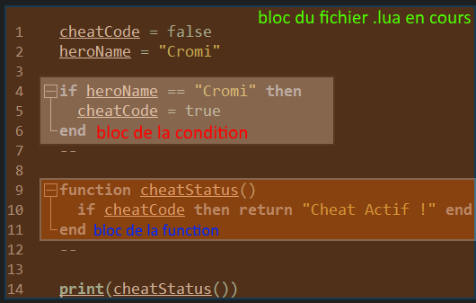

## Comprendre les Blocs et leurs portés

Nous utilisons déjà des blocs et ceux depuis le début, sans le savoir. Les blocs sont l’ensemble d’une exécution.

Une condition représente donc un bloc :

**IF… bloc…END**

Une fonction représente aussi un bloc : 

**FUNCTION...bloc...END**

Exemple avec un petit schéma visuel :



les **IF** et les **Function** ouvrent des blocs et les **END** les referment.

dans cet exemple, on distingue donc 3 blocs distincts.

- 1ᵉʳ bloc du fichier tout le fichier (par défaut main.lua)

- 2ᵉ bloc de la condition (du If jusqu’au end qui ferme la condition)

- 3ᵉ bloc de la fonction (de function jusqu’au end qui ferme la fonction)

_Ainsi chaque bloc dispose ainsi de sa propre portée._

On dit que cette portée est donc **local** **à son bloc**.

_Le bloc peut être le programme, une fonction, une boucle ou le fichier ou elle se trouve._ Toutes les **variables locales** que l’on peut créer dans ces blocs seront exécutables seulement dans le bloc qui les contrôlent.

- soit le bloc d’une condition

- d’une boucle

- d’une fonction

- un fichier lua.

_info :  L’imbrication est un sous-bloc d’un bloc parent._


## La Portée LOCAL des Variables

Pour qu’une variable bénéficie de la portée d’un bloc, Elle doit être initialisée avec le mot clé **local** devant :

Syntaxe :

```lua
local maVariableLocal = 10
```

La portée d’une variable locale est vivante uniquement dans le bloc et ses sous-blocs ou elle a été initialisée.

Exemple simple d’une portée de fonction :

```lua
local heroName = "Cromi"

function printName()
 local heroName = "Izac"
 print(heroName)
end
--

printName()
print(heroName)
```

sortie console :
```
Izac Cromi
```

Dans cet exemple, **heroName** `= "Cromi"` est accessible dans tout le fichier. Or dans la fonction on a initialisé une autre variable local et celles-cis portent le même nom !

Une variable local n'écrase jamais les données d’une autre variable portant le même nom en dehors de la portée de la variable local.

il existe donc dans ce cas deux variables du même nom, mais avec des portées différentes ! _Elles sont physiquement enregistrées à deux adresses mémoires différentes_

Quand il existe des variables du même nom que celle attendu pendant l’exécution du code, l’ordre de priorité sera toujours la portée locale en premier, car c’est les variables vérifiées en premier dans la mémoire.

\- Dans la fonction c’est Izac qui est print est non pas Cromi, car **heroName**`= "Izac"` est local dans la fonction, il existe deux variables portant le nom de **heroName** à cet instant hors la variable local la plus proche est celle contenant la valeur **Izac** !

\- Le second print lui n’a pas accès à Izac, car il est restreint au bloc de la fonction. Comme **heroName**`= "Izac"` n’existe pas en dehors de la fonction ! Cette fois-ci c’est **heroName** `= "Cromi"` qui est print !

Si c'est assez flou, pour vous, je ne peux que vous inciter à tester de vous-même. Pour résumé :

**heroName** `= "Izac"` n'existe donc que dans la fonction !


## La Portée GLOBAL des Variables

Une variable globale est disponible dans tous les blocs !

Ainsi les variables globales sont accessibles en dehors des blocs et même d’un fichier !

Les variables globales sont celles initialisées par défaut si on ne met rien avant leurs déclarations :

```lua
maVariableGlobal = 10 -- ceci est une déclaration de variable globale
```

Même si ça fait un peu rêver, d’avoir des portées globales de partout, c’est la chose à ne surtout pas faire en réalité !

Car on en paye le prix, de par sa lenteur et la lourdeur d'exécution. Je vous rappelle que les variables locales sont d'abord testées en premier… ensuite et seulement **si la variable recherchée n'existe pas en local ce sont les variables globales qui sont vérifiées.** Cela veut dire que pour chaque appel d'une variable il y a en réalité deux recherches : _La première dans les variables locales puis enfin la seconde dans les variables globales._

De plus, les variables globales étant donnés que celle-cis doivent être accessibles de partout, sont stockées à des emplacements différents dans la mémoire de votre ordinateur,  ces emplacements sont à des espaces mémoire plus éloignés que les variables locales.

Les variables locales sont donc à prioriser la plupart du temps. Déjà, car on peut dans 90% du temps se passer des variables globales et que votre programme répondra plus rapidement avec des variables locales. Nous verrons par la suite les cas où les variables globales sont vraiment utiles =)

# Conclusion :

| **prioriser l'utilisation des variables locales autant que possible !** |
| --- |

**Fin de ce chapitre, passons à la suite !**


