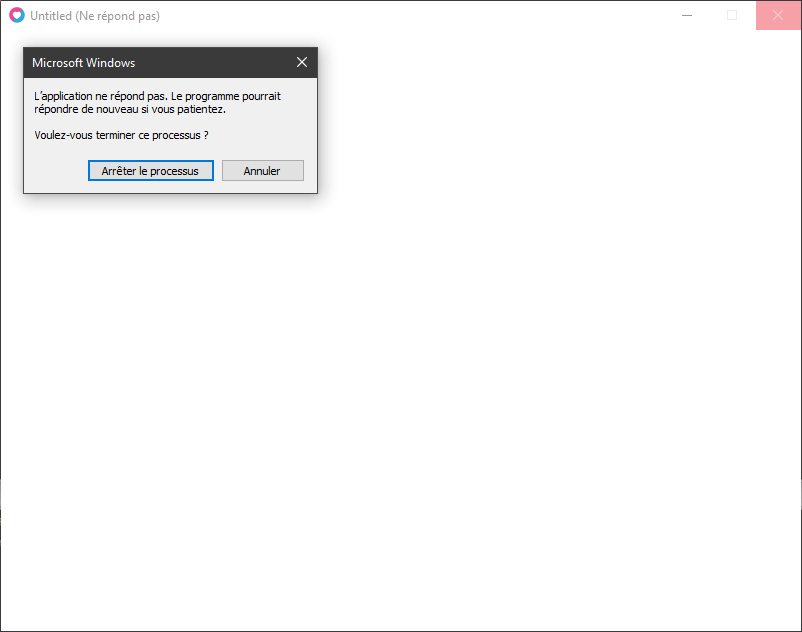

Si nous ne connaissons pas le nombre de fois qu’une boucle doit se répéter nous utiliserons alors les boucles **WHILE** ou **REPEAT** qui s'exécutent avec un test de condition.

- **WHILE :**  
    \-La boucle s'exécute SI la condition est vraie.  
    \-La boucle se répète TANT QUE la condition est vraie.  
    \-La condition est vérifiée avant l'exécution du corps de la boucle.

- **REPEAT :  
    **\-La boucle s'exécute au minimum une fois puis se répète TANT QUE la condition est vraie.  
    \-La condition est vérifiée après l'exécution du corps de la boucle.

## La Boucle While

  
La boucle while vérifie d’abord la condition avant d’être exécuté la première fois.  
Tant que la condition est vraie la boucle s'exécute !

Pseudo-code Boucle While :

| TANT QUE la condition est vraie ALORS   fais ceci   FIN |
| --- |

Syntaxe :

```lua
while condition do
end
```

exemple :

```lua
pieces = 0

while pieces < 100 do
 pieces = pieces + 1
end

print(pieces)
```

sortie console :
```
100
```

La boucle s’est exécuté tant que **pieces** était encore inférieur à 100, une fois que la condition est devenue fausse (**pieces** égale à 100) la boucle s’est arrêtée.

La boucle while ne s'exécute que SI la condition est VRAIE exemple :

```lua
pieces = 0

while pieces > 0 do
 pieces = pieces - 1
end

print(pieces)
```

sortie console :
```
0
```

Comme **pieces** n’est pas supérieur à 0 **la boucle ne s’est pas exécuté** et n’a donc pas enlever de pièces à notre joueur.

Un exemple avec l'utilisation d’un booléen :

```lua
loop = true
pieces = 0

while loop do
 pieces = pieces + 1
 if pieces == 100 then
   loop = false
 end
end

print(pieces)
```

sortie console :
```
100
```

Tant que **loop** vaut true, la boucle continue et on a mis une condition qui dit que **si pièces est égale à 100 alors loop vaut false**, ainsi la boucle peut s’arrêter.


## La Boucle Repeat Until

La boucle **REPEAT**, est particulière puisqu’elle s’exécute toujours la première fois, car **la condition n'est pas vérifiée au début, mais à la fin de celle-ci.  
**  
Tant que la condition est vraie la boucle s'exécute !

  
Pseudo-code Boucle While :

| FAIT   ceci   ET TANT QUE la condition est vraie RECOMMENCE sinon STOP la boucle. |
| --- |

Syntaxe :

```lua
repeat
until condition
```

exemple :

```lua
pieces = 0

repeat
 pieces = pieces + 1
until pieces >= 100

print(pieces)
```

sortie console :
```
100
```

Comme vous pouvez le remarquer c’est assez semblable à une boucle While, cependant **une des majeures différences entre les deux, c'est le moment ou la condition est vérifiée**, regardez l’exemple suivant pour bien comprendre la différence.

exemple :

```lua
pieces = 0

repeat
 pieces = pieces - 1
until pieces <= 0

print(pieces)
```

sortie console :
```
-1
```

ICI **pieces** est bien inférieur ou égale à ZÉRO cependant la boucle repeat s'exécute avant la vérification de la condition.

_C’est pourquoi le joueur a perdu une pièce !_

## ATTENTION

Les boucles **While** et **Repeat** sont relativement dangereuses si elles sont mal utilisées, car on peut facilement bloquer un programme dans le cas où une condition ne peut pas changer dans l'exécution de la boucle !

  
C’est d’autant plus vrai avec l’utilisation de booléen. il faut bien penser à changer la valeur du booléen dans la boucle, sinon on restera coincé dans une boucle infinie...

Restez bien attentif et contrôler bien ces boucles si vous êtes amené à les utiliser.

On préférera toujours une alternative avec une boucle FOR seulement si cela est possible, bien évidement.

_**Comment ? Vous voulez vraiment un exemple !?**_


Bon d’accord, mais **ATTENTION** !

**_exemple à ne surtout pas refaire dans vos jeux ! ! !_**

```lua
pieces = 0

repeat
 pieces = pieces + 1
until pieces <= 0

print(pieces)
```

La condition n’est jamais atteinte, donc le programme reste coincé dans une boucle infinie ! résultat :  


Je vous aurai prévenu =)

Donc à utiliser avec précaution :D

**Rendez-vous au cours suivant !**


