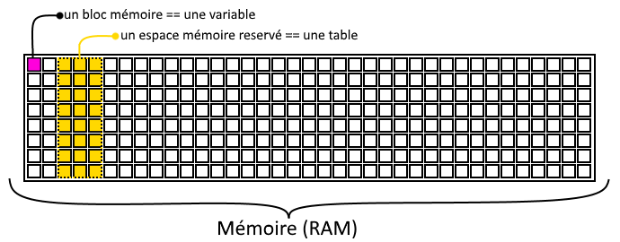
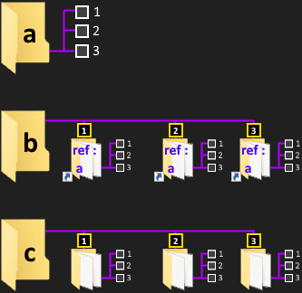

Les références appelés aussi pointeurs, représentent les adresses mémoires des tables Lua.

Lorsqu’une table est créée une première référence vers une adresse mémoire lui est retournée.

D’ailleurs lorsqu’on print une table, c’est son adresse mémoire qui nous est communiqué :

```lua
a = {}
print(a)
```

sortie console :

```
table: 0x25c56d98
```

**0x25c56d98** représente l’adresse mémoire de la table **a = {}**

Cette espace mémoire où  est créé la table n’est pas limité à un usage destiné uniquement avec la variable **a**

C’est pour cela qu’on dit qu’une table est une variable complexe, car contrairement aux variables simple qui ne sont pas modulables ni en taille ni en espace mémoire, les variables simples sont un seul et unique bloc de mémoire :  
  
Les tables créent un bloc de mémoire partageable :

```lua
a = {}
b = a
print(a)
print(b)
```

sortie console :
```
table: 0x1d566da8
table: 0x1d566da8
```

**a** et **b** sont bien des **références**, au même espace/bloc mémoire !


## Utilisation des références

Les références s’utilisent souvent dans des fonctions ou directement dans votre code.

Je vais vous montrer un exemple assez simple avec une table :

```lua
carte_identification_du_service_restauration_du_3_eme_etage = {} carte_identification_du_service_restauration_du_3_eme_etage.name = "Dead" carte_identification_du_service_restauration_du_3_eme_etage.firstname = "Pool" carte_identification_du_service_restauration_du_3_eme_etage.numero = 231035130132043 

local a = carte_identification_du_service_restauration_du_3_eme_etage
a.numero = 001001001
print(carte_identification_du_service_restauration_du_3_eme_etage.numero)
```

sortie console :
```
001001001
```

La variable **local a** est devenu une **référence à la table :** carte\_identification\_du\_service\_restauration\_du\_3\_eme\_etage ce qui nous simplifie alors la manipulation de celle-ci.

Ainsi en passant la table en référence vers une variable plus courte ça nous évite aussi les erreurs de frappes et également ça simplifie fortement notre code.

Exemple avec une table **game** constituée d’une sous-table **map** et aussi d'**index numériques** :

```lua
game = {}
game.map = { 1, 1, 1}

for i = 1, 3 do
local cell = game.map[1]
cell[i] = 0 -- cell[i] == game.map[i]
end

for i = 1, 3 do
print(game.map[i])
end
```

sortie console :
```
0
0
0
```

**cell** est donc une référence aux index de **_game.map\[valeur de i\]_**

Un autre exemple avec une fonction :

```lua
hero = {}
hero.vie = 10
hero.vieMax = 100
hero.state = "en vie"

baton = {}
baton.magie = {}
baton.magie.soin = 100

function useObject(pCible, pEffect)
	pCible.vie = pCible.vie + pEffect
	--
	if pCible.vie > pCible.vieMax then
		pCible.vie = pCible.vieMax
	elseif pCible.vie <= 0 then
		pCible.state = "mort"
	end
	--
end

print("Avant le soins notre hero dispose de "..hero.vie.." pts de vie.")

useObject(hero, baton.magie.soin)

print("Après le soins notre hero dispose de "..hero.vie.." pts de vie.")
```

sortie console :
```
Avant le soins notre hero dispose de 10 pts de vie.
Après le soins notre hero dispose de 100 pts de vie.
```

**pCible** et **pEffect** sont des **références** passées en arguments de fonction.

Soit dans notre exemple :

```lua
pCible == hero
pEffect == baton.magie.soin
```

- Attention aux manipulation avec références

Les références sont belles et bien les mêmes données modifiées !

Voyons l’exemple suivant :

```lua
a = {1,1,1}
b = {a, a, a}
c = {{1,1,1}, {1,1,1}, {1,1,1}}

-- modifs
a[2] = 2

b[2][2] = 3

c[3][2] = 0

function tablePrint(pTable, pIndex)
local index = pIndex or 1
for k, v in ipairs(pTable) do
if type(v) == "table" then
tablePrint(v, index)
index = index + 1
else
print("["..index.."]["..tostring(k).."] : "..tostring(v))
end
end
end

print("a : ")
tablePrint(a)
print("b : ")
tablePrint(b)
print("c : ")
tablePrint(c)
```

La table **b** possède 3 index, chacuns de ses index sont des références à la table a.

La table **b** possède donc 2 dimensions :  b\[dimension 1\]\[dimension 2\] .

Si **a** est modifié, les tables de **b** le seront aussi car ils sont une simple référence de **a** 

En résumé la table **b**  ne possède aucune donnée dont elle possède le contrôle !

_Observez bien la sortie console :_

```
a :
[1][1] : 1
[1][2] : 3
[1][3] : 1  
b :
[1][1] : 1
[1][2] : 3
[1][3] : 1
[2][1] : 1
[2][2] : 3
[2][3] : 1
[3][1] : 1
[3][2] : 3
[3][3] : 1  
c :
[1][1] : 1
[1][2] : 1
[1][3] : 1
[2][1] : 1
[2][2] : 1
[2][3] : 1
[3][1] : 1
[3][2] : 0
[3][3] : 1
```

  
Lorsque la table  **a**  à été modifié la table  **b**  l’est aussi, car le contenu de ses index sont des **références**, on pourrait visualiser cela comme si notre table  **b**  était un dossier contenant **3 dossiers**, contenant eux-mêmes des raccourcis vers le dossier de table **a**  


**Fin du chapitre !**
