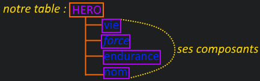
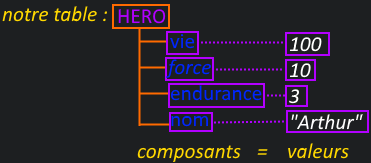
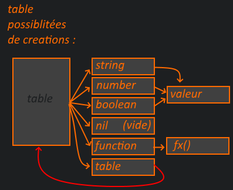
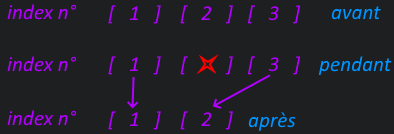

Tout d’abord au début des premiers chapitres nous avons vu les Variables Simples.

Petit rappel des différents types de ces variables :

```
age = 10 -- number
name = "robert" -- string
enVie = true -- boolean
inventaire = nil -- nil (void / vide)
```

Ensuite nous avons abordé le nommage de ces variables :

```
heroVie = 100
heroName = "Arthur"

ennemiVie = 60
ennemiName = "Bidule"
```

  
Nous avons aussi vu qu’une variable pouvait être aussi une fonction :

```
maFonction = function()
        -- corps de la fonction
end

-- strictement égale à :

function maFonction()
        -- corps de la fonction
end
```

### Les 8 types de variables LUA qui existent :

Les variables simples (vu) :

- number -- vu

- string -- vu

- boolean -- vu

- nil -- vu

variables complexes :

- function -- vu

- table -- **On en est là !**

celles que nous n’aborderons pas dans les chapitres " Les bases Lua" (niveau plus avancé) :

- userdata

- thread

Maintenant il nous reste donc à aborder les variables de **type(table)** !


# Une table c’est quoi ?

  
C’est un plateau généralement en bois auquel on rajoute des pieds pour le supporter. Ce qui nous forme alors une table… Non je déconne =)

Une table, c'est une espace de stockage où l’on va mettre un ensemble de variables qui la compose. Je vous l’accorde ça fait un peu définition de dictionnaire dit comme ça…

Prenons l’exemple dans un jeu vidéo, le héros par exemple doit être une table !  
Car dans la table héro on voudra retrouver une variable vie, une variable nom, une variable force, une variable endurance, etc.

La table Héros serait donc composée de différents types de variables… :  


On peut aussi visualiser la table HERO comme une grande armoire…  
\- La table Héro est une armoire.  
\- Chaque tiroir qui la compose sont ses composants.  
\- Dans chaque tiroir se trouve sa valeur.  


Pseudo-code :

| Hero est une Table   Hero est composé d'un composant vie qui vaut cette valeur   Hero est composé d'un composant force qui vaut cette valeur   Hero est composé d'un composant endurance qui vaut cette valeur   Hero est composé d'un composant nom qui vaut cette valeur |
| --- |

Syntaxe d’une table :

```
maTable = {} -- creation d'une table qui se nomme maTable
maTable.composant = "valeur"
```

**Les constructeurs** **{}** nous indiquent qu’il s’agit d’une table vide !

L'utilisation d'un point apres **maTable** indique que l'on veut accèder/créer à un des composants de la table.

Donc pour notre héros :

```
Hero = {} -- on créer la table Hero

Hero.vie = 100 -- on créer un composant "vie" avec sa valeur 100

Hero.force = 10 -- on créer un composant "force" avec sa valeur 10

Hero.endurance = 3 -- on créer un composant "endurance" avec sa valeur 3

Hero.nom = "Arthur" -- on créer un composant "nom" avec sa valeur "Arthur"
```

Plutôt pratique non ? =)

Les tables permettent de ranger (structurer) son code plus facilement !

Vous ne trouvez pas que tout de suite c’est plus clair et lisible ?!

## Comment accéder aux valeurs de la table ? :

```
Hero = {}
Hero.vie = 100

print(Hero.vie)
```

sortie console :

```
100
```

Tout simplement =)

# Les bons termes à utiliser :

```
Hero.vie = 100
```

- **Hero** est une **table**

- **vie** est un **index alphanumérique** de la table **Hero**

- **100** est la **valeur de l'index** vie de la table **Hero** soit **Hero.vie**

Vous avez vu c’est nouveau ça : **index** et  **alphanumériques** !

Ça tombe bien, car dans l'étape suivante aborde les différents types d’index dans une table…

# Les Différents types d'index

ils existent 2 types ! **alphanumériques** et **numériques** !


### Les index alphanumériques

Un index alphanumériques représente un index d’une table, il est de type **string**.

Comme un string peut contenir des lettres et des chiffres c’est pourquoi on utilise le terme alphanumérique.

Voyons les différentes écritures pour créer/accéder à un index alphanumérique :

```
Hero = {}
Hero.vie = 100
print(Hero.vie)
```

sortie console :

```
100
```

**Les crochets \[\]** nous permettent aussi d'accéder à l’index d’une table !

```
Hero = {}
Hero["vie"] = 100
print(Hero["vie"])
```

sortie console :

```
100
```


### Les index numériques

  
On peut créer des index numériques dans une table.

Pour cela, nous devons utiliser les crochets **\[\]**.

_En Lua les index numérique commencent à 1 !_

Exemple :

```
Inventaire = {}
Inventaire[1] = 150
Inventaire[2] = "épée"
Inventaire[3] = "bouclier"

print(Inventaire[1])
print(Inventaire[2])
print(Inventaire[3])
```

sortie console :

```
150
épée
bouclier
```

Notre table inventaire contient 3 index numériques !

- l’index \[1\] de la table Inventaire contient la valeur 150

- l’index \[2\] de la table Inventaire contient la valeur "épée"

- l’index \[3\] de la table Inventaire contient la valeur "bouclier"

On utilise le terme de tableaux pour l'utilisation des index numériques du fait de leur écriture similaire à d’autres langages avec l’utilisation des \[\] pour les créer...

_Attention à ne pas mélanger les index numériques et alphanumériques !_

```
Inventaire = {}
Inventaire[1] = "epée"

print(Inventaire[1])
print(Inventaire["1"])
```

sortie console :

```
epée
nil
```

  
**Inventaire.1** n’existe pas **car "1" est un string !**

Cependant, **Inventaire\[1\]** existe bien et c’est un index numérique !

_**De plus, on ne peut pas créer de variable en commençant par un nombre !**_


# Les itérateurs pairs et ipairs

Pour voir le contenu d’une table il existe des boucles spécialement conçues pour les tables !

La boucle pairs, qui parcourt tous les types d’index, alphanumériques et numériques !

La boucle ipairs, qui parcourt uniquement les index numériques !

Nous utiliserons donc les boucles pairs pour explorer tout le contenu d’une table alphanumérique et les boucles ipairs pour explorer les contenus d’index numériques.

  
Voyons leurs syntaxes et des exemples =)


### La Boucle pairs

Pseudo-code boucle pairs:

| POUR chaque index, et sa valeur contenu dans ( la table ) FAIT       ceci   FIN |
| --- |

  
Syntaxe d’une boucle pairs :

```
for k, v in pairs(table) do
  -- corps de la fonction
end
```

k = index alphanumériques et/ou numériques (on utilise **K** pour key en anglais)

v = valeur (on utilise **V** pour value en anglais)

Voyons un exemple de la boucle _pairs_ avec une table _Hero_…

Boucle **_pairs_**, elle parcourt tous les index qu'ils soient alphanumériques ou numériques :

```
Hero = {}
Hero.vie = 100
Hero.force = 10
Hero.endurance = 3
Hero.nom = "Arthur"
Hero[1] = 1
Hero[2] = 2
Hero[3] = 3

for k, v in pairs(Hero) do
 print(tostring(k).." : "..tostring(v))
end
```

sortie console :

```
1 : 1
2 : 2
3 : 3
vie : 100
nom : Arthur
endurance : 3
force : 10
```

Tous nos index ont été identifiés et print()


### La Boucle ipairs :

Pseudo-code boucle **_ipairs_**:

| POUR chaque index NUMÉRIQUES, et sa valeur contenu dans ( table ) FAIT       ceci   FIN |
| --- |

  
Syntaxe d’une boucle ipairs :

```
for k, v in ipairs(table) do
  -- corps de la fonction
end
```

k = index numérique **_uniquement_**

v = valeur

  
Boucle **_ipairs_** : seulement numériques !

```
Hero = {}
Hero.vie = 100
Hero.force = 10
Hero.endurance = 3
Hero.nom = "Arthur"
Hero[1] = 1
Hero[2] = 2
Hero[3] = 3

for k, v in ipairs(Hero) do
 print(tostring(k).." : "..tostring(v))
end
```

sortie console :

```
1 : 1
2 : 2
3 : 3
```

Seuls les index numériques ont été identifiés et print ! Parfait !


# L’imbrication des tables

Les tables bénéficient des imbrications tout comme les boucles, les test de conditions et les fonctions.

imaginons que nous voulions créer une table **Hero**, qui contiendrait des variables simples et une autre table dans cette même table pour gérer son inventaire ?!

C’est tout à fait réalisable car une table est une variables complexes qui peut donc contenir des variables, d’index alphanumériques ou numériques, des fonctions, d’autres tables qui contiennent elles-mêmes aussi d’autres variables, fonctions, tables, etc.  
Les possibilités sont quasiment infinies !

Créons, par exemple, notre table Hero avec des variables tels que vie, force, endurance et nom. Nous ajouterons une table inventaire dans la table Hero !

Exemple :

```
Hero = {}
Hero.vie = 100
Hero.force = 10
Hero.endurance = 3
Hero.nom = "Arthur"
Hero.inventaire = {}
Hero.inventaire[1] = 1
Hero.inventaire[2] = 2
Hero.inventaire[3] = 3

print("adresse de la table Hero : "..Hero)

print("Contenu de la table Hero : ")
for k, v in pairs(Hero) do
	print("Hero."..tostring(k) .. " : " .. tostring(v))
end

print("\n" .. "Contenu de la table Hero.inventaire : ")
for k, v in ipairs(Hero.inventaire) do
	print( "Hero.inventaire["..tostring(k).."] : " .. tostring(v) )
end
```

sortie console :

```
adresse de la table Hero : table: 0x10a22541 Contenu de la table Hero :
Hero.vie : 100
Hero.force : 10
Hero.inventaire : table: 0x10a27410
Hero.nom : Arthur
Hero.endurance : 3 Contenu de la table Hero.inventaire :
Hero.inventaire[1] : 1
Hero.inventaire[2] : 2
Hero.inventaire[3] : 3
```

  
**Hero.inventaire** est bien une sous-table de la table **Hero** =)

Car 0x10a27410 est l'adresse mémoire de l’emplacement de la table inventaire et elle est différente de celle de Hero !

Cela peut nous permettre de les identifier, pour comparer des données, et donc savoir s’il s’agit d’une même adresse de table ;)

# Bien Comprendre et Gérer ses tables !

Une table afin de bien saisir le concept, car c’est important ! C’est une grande boîte qui contient d’autres boîtes de toutes tailles et ceux jusqu’à l’infini !

_enfin presque à l’infini, mais avant d’atteindre le maximum, faut vraiment y aller fort !  
_  
Chaque boite peut donc contenir des allumettes, ou un briquet voire d’autres boîtes, etc.

Schéma pour résumé :  


_La flèche orange indique une variable de variables._

_La flèche rouge indique une boucle infini de créations !_

Reprenons cela sous une autre forme… :

Si on veut créer une table on utilise le constructeur {}  
_par défaut elle ne comporte pas de composants._

```
maTable = {}
```

  
\-Une table peut contenir des index alphanumérique :

```
maTable["maVar"] = valeur
maTable.monAutreVar = valeur
```

  
\-Une table peut contenir des index numériques :

```
maTable[number] = valeur
```

  
\-Une table peut contenir des fonctions :

```
function maTable.maFonction()
    -- bloc
end
```

\-Une table peut contenir d’autres tables

```
maTable.maSousTable = {}
```

_On dit alors que maTable.maSousTable est au 2ᵉ niveau de la table maTable._

_maTable.maSousTable.monAutreTable = {} serait donc au 3ᵉ niveau…_


### _Il faut Relire si vous doutez d’avoir bien compris ce qu'est une table…_

Si vous n’avez pas bien saisi, il n’y a rien de mieux que d'expérimenter…

Relisez calmement. Puis essayez de créer d’autres tables, de les print(), pour bien comprendre le fonctionnement de celles-cis.

C’est dans ces tables que nous travaillerons le plus, il est primordial de bien saisir au moins comment on y accède et comment créer des index et/ou des variables. Voir d’autres tables dans des tables...

Même si ça reste assez flou (abstrait) si vous savez au moins comment les creer et y acceder c’est l’essentiel pour l’instant =)

Si vous pensez avoir compris cela, on va approfondir légèrement plus les tables !


# Construire une table Numérique avec une boucle !

  
On va reproduire l’exemple ci-dessous avec une boucle :

```
inventaire = {}
inventaire[1] = 1
inventaire[2] = 2
inventaire[3] = 3
```

exemple :

```
inventaire = {}
for i = 1, 3 do
 inventaire[i] = i
end

for k, v in ipairs(inventaire) do
 print("inventaire["..k.."] : "..v)
end
```

sortie console :

```
inventaire[1] : 1
inventaire[2] : 2
inventaire[3] : 3
```

Parfait !


### On peut connaître le nombre d’index numérique d’une table avec le symbole dièse #

Syntaxe :

```
maTable = {}
maTable[1] = 1
maTable[2] = 5
maTable[3] = 8

print(#maTable)
```

sortie console :

```
3
```

Exemple pour parcourir une table numérique en utilisant # (lenght) :

```
inventaire = {}
for i = 1, 3 do
 inventaire[i] = i
end

print("total d'index de la table inventaire : "..#inventaire.."n")

for i = 1, #inventaire do
 print("inventaire["..i.."] : "..inventaire[i])
end
```

sortie console :

```
total d'index de la table inventaire : 3   inventaire[1] : 1 inventaire[2] : 2 inventaire[3] : 3
```

ça fonctionne très bien, et personnellement je préfère cette méthode car on est sûr qu’elle sera parcourue dans l’ordre souhaité soit dans l’ordre d’incrémentation ou l’ordre de décrémentation.

Un autre exemple d’utilisation de # avec une variable string.

\# permet aussi de donner le total de char d'une variable string.

exemple :

```
inventaire = "mon inventaire"
print(#inventaire)
```

sortie console :

```
14
```

14 étant le nombre de **char** (caractères) contenu dans la variable string espace inclus.  
Oui l'espace est un caractère, certes vide, mais c'est un caractère quand même.


# Gérer les index numérique avec une fonction Lua…

il existe une fonction dans lua qui sert à manipuler les index de table numérique… **table.insert()** et **table.remove()** :

## table.insert()

```
table.insert(table, valeur) -- Permet d'ajouter un index à la fin

table.insert(table, index, valeur) -- Permet d'ajouter un index à l'emplacement souhaité
```

## table.remove()

```
table.remove(table, index) -- Permet de supprimer un index

table.remove(table) -- Permet de supprimer le dernier index
```

###   
Comment  ajouter des index :

```
inventaire = {}
-- #inventaire = 0 : total d'index = 0
-- si on fait un table.insert(inventaire, valeur) alors : #inventaire vaut +1 (ajout d un index)

table.insert(inventaire, 1) -- equivaut a inventaire[1] = 1 :: #inventaire vaut desormais 1 (ajout d un index)
table.insert(inventaire, 2) -- equivaut a inventaire[2] = 2
table.insert(inventaire, 3) -- equivaut a inventaire[3] = 3

print("nombre d'index de la table inventaire : "..#inventaire.."n")

for i = 1, #inventaire do
 print("inventaire["..i.."] : "..inventaire[i])
end
```

sortie console :

```
nombre d'index de la table inventaire : 3 
inventaire[1] : 1
inventaire[2] : 2
inventaire[3] : 3
```


### Comment supprimer des index :

```
inventaire = {}
for i = 1, 3 do
 inventaire[i] = i
end

print("total d'index de la table inventaire avant suppression : "..#inventaire.."n")

table.remove(inventaire, 3) -- on supprime l'index n°3 !

print("total d'index de la table inventaire apres suppression : "..#inventaire.."n")

for i = 1, #inventaire do
 print("inventaire["..i.."] : "..inventaire[i])
end
```

sortie console :

```
total d'index de la table inventaire avant suppression : 3 
total d'index de la table inventaire apres suppression : 2
inventaire[1] : 1
inventaire[2] : 2
```

l’index 3 à bien été supprimé !

Que se passe-t-il si l’on supprime un index au milieu ?

### Démonstration :

```
inventaire = {}
for i = 1, 3 do
 inventaire[i] = i
end

print("#inventaire avant supression : "..#inventaire.."n")

table.remove(inventaire, 2) -- on supprime l'index 3 !

print("#inventaire apres supression : "..#inventaire.."n")

for i = 1, #inventaire do
 print("inventaire["..i.."] : "..inventaire[i])
end
```

sortie console :

```
#inventaire avant supression : 3
#inventaire avant supression : 2
inventaire[1] : 1
inventaire[2] : 3
```

  
Quand l’index 2 a été supprimé tous les index suivant change de numéro d’index, dans notre cas l’index n°3 est devenu l’index n°2…


Voyons l'explication précédentes avec des schémas :

Que se passe-t-il réellement lors de l’utilisation de **table.remove(inventaire, 2)** ?  


```
inventaire = {} 
inventaire[1] = 1 
inventaire[2] = 2 
inventaire[3] = 3   

avant : il y a 3 index a la table inventaire :
inventaire[1] = 1 
inventaire[2] = 2 
inventaire[3] = 3

pendant : table.remove(inventaire, 2) 
l’index n°2 va être supprimé…
l’index n°3 devient l’index n°2…
ps : si l’index n°4 existe il devient l’index n°3, et cela jusqu’au dernier index...
et enfin le dernier index est supprimé !

après table.remove :
il ne reste plus que 2 index :   
inventaire[1] = 1
inventaire[2] = 3 
inventaire[3] = index supprimé...  
```

Si vous ne comprenez pas tout, relisez au moins une fois ou deux, mais ne vous inquiétez si vous ne comprenez pas tout !

Parce que nous évoquerons de nouveau ces concepts lors d’exercices concrets avec des éléments attachés à ces index, comme des ennemis ou d’autres éléments qui se trouve dans un jeu vidéo et cela vous semblera beaucoup plus parlant qu’un simple schéma comme celui-ci.

Ce qu’il faut mémoriser c’est que le nombre total d’index d’une table change à l’ajout et/ou à la suppression de ses index !


## Deplacement des index lors de l'utilisation de table.insert()

Comme nous venons de le voir, les index se décalent a leur suppression.

c'est aussi le cas lorsque nous inseront un nouvel index a un emplacement deja existant ;)

```
compteur = {}
-- #compteur vaut 0 : soit un total d'index de 0

table.insert(compteur, 1) -- compteur[1] = 1 :: #inventaire vaut desormais 1 (ajout d un index)
table.insert(compteur, 3) -- equivaut a compteur[2] = 3
table.insert(compteur, 2, 2) -- equivaut a compteur[2] = 2, et deplacement de l'ancien index 2 en position 3.

--[[

le fait d'inserer un nouvel index a un index existant, deplace les index existant a l'index superieur.

Dans notre cas voici, ce qu'il se passe lors de l'tilisation de table.insert(compteur, 2, 3) :

- compteur[2] est déplacé a l'index 3 soit : compteur[3] = 2

PUIS 

- l'index 2 est recrer avec sa nouvelle valeur soit : compteur[2] = 2

]]--

print("nombre d'index de la table compteur : "..#compteur.."n")

for i = 1, #compteur do
 print("compteur["..i.."] : "..compteur[i])
end
```

sortie console :

```
nombre d'index de la table compteur : 3
compteur[1] : 1
compteur[2] : 2
compteur[3] : 3
```

Cela démontre bien que le déplacement des index, peut être effectuer avec table.insert() et table.remove()

**Fin de ce chapitre sur les tables et tableaux !**


