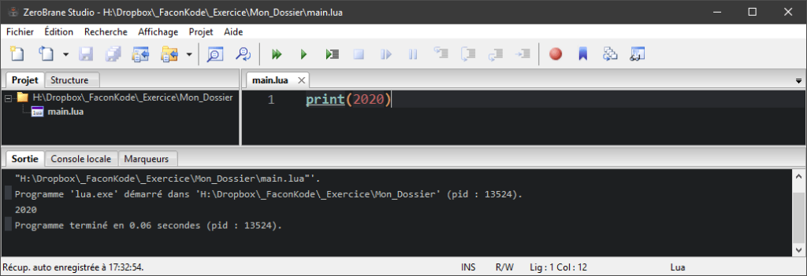
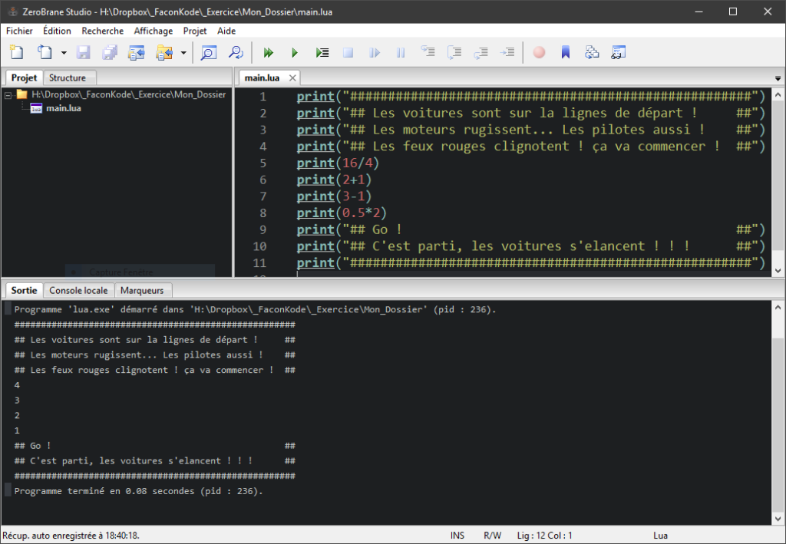

#### Faire des calculs !

Bien maintenant, nous allons faire un petit peu de math (niveau primaire) !

Tels que des additions, soustractions, multiplications et divisions, car la fonction print() permet aussi d’afficher des nombres.


|  **print()** sert à afficher du texte, mais il sait aussi afficher des nombres. |
| --- |



Voyez par vous-même : _Dorénavant, je ne mettrais plus les captures d’écrans, car j’estime que vous avez compris et qu’il vous faut exécuter le code par vous-même afin de vous habituer à taper votre propre code._

Avec le temps et la pratique régulière, cela deviendra assez naturel vous verrez ;)


- Les calculs arithmétiques simples

Alors comment faire ? Pendant l'exécution du programme lorsqu'il arrive sur une instruction avec un calcul il effectue alors l'opération et ensuite donne le résultat à print() qui à son tour l’afficher à l'écran.

Les calculs sont exécutés par le biais des opérateurs mathématiques suivants :

| \+ - \* / |
| --- |

**Important !** print() ne sert pas à calculer, il convertit  seulement les paramètres qu’on lui donne en texte. C'est l'interpréteur qui fait le calcul à la lecture du code.

##### Addition :

```
print(1 + 1)
```

Sortie Console :

| 2 |
| --- |

##### Soustraction :

```
print(4 - 1)
```

Sortie Console :

| 3 |
| --- |

##### Multiplication :

```
print(2 * 2)
```

Sortie Console :

| 4 |
| --- |

##### Division :

```
print(10 / 2)
```

Sortie Console :

| 5 |
| --- |

Maintenant que nous savons imprimer du texte, des nombres et des résultats de calculs simples…

Pourquoi ne pas simuler un petit jeu en texte ?!


#### EXERCICE TP :

| \- Faites une petite introduction d’un jeu de course en texte. - Simulez le top départ avec des calculs simples pour afficher (4, 3, 2, 1, Go !) faites cela en vous aidant avec  +  -  \*  /  (symboles arithmétiques) |
| --- |

SOLUTION ?... Vous avez essayé avant quand même… ?

Non ? faites un effort =)

Alors vous avez réussi ?!

Oui ou Non ?

Non… Essayez encore un peu, une dernière fois… =)

Non toujours pas, bon c’est pas grave, allez voir et vous devrez essayer de le refaire à nouveau jusqu'à ce que ça fonctionne !


Ma solution que je vous propose :



Si vous n’avez pas réussi voici le code source :

```
print("#####################################################")
print("## Les voitures sont sur la ligne de départ !      ##")
print("## Les moteurs rugissent... Les pilotes aussi !    ##")
print("## Les feux rouges clignotent ! ça va commencer !  ##")
print(16/4)
print(2+1)
print(3-1)
print(0.5*2)
print("## Go !                                            ##")
print("## C'est parti, les voitures s'élancent ! ! !      ##")
print("#####################################################")
```

_ps : un code source est le code originel créé par vous ou un autre programmeur._

Félicitations ! Cette première introduction au langage LUA est maintenant terminée !

**Je vous attends pour la suite sur les bases de LUA où nous aborderons ensemble, point par point l’essentiel pour simuler un vrai petit jeu dans la console !**


