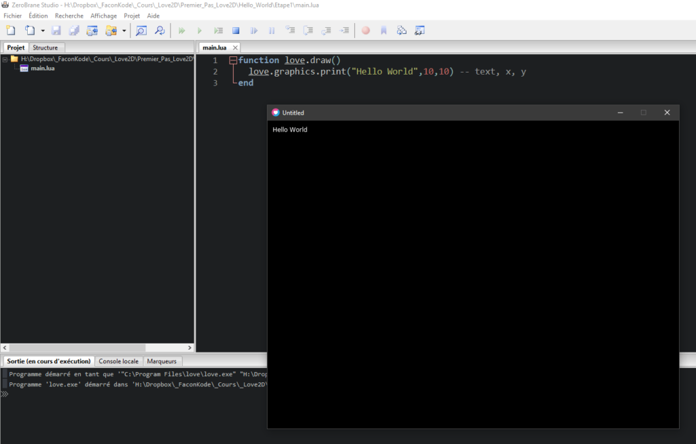

Pour afficher du texte, nous devons utiliser `love.graphics.print()`

## Faire un Hello World dans Love2D

  
Comment créer un Hello World dans la fenêtre Love2D ?

1 - Créer un nouveau dossier :  Mes\_Premiers\_Pas\_Love2D

2 - Créer un fichier : main.lua, puis ouvrez-le avec ZeroBrane Studio.  
3 - Cliquez sur l'icône : Définir le répertoire du projet à partir du fichier courant 

4 - Tapez ceci dans votre fichier main.lua :

```
function love.draw()
 love.graphics.print("Hello World",10,10) -- text, x, y
end
```

5 - Exécuter ! avec F6 ou 

Fin - Vous devriez avoir ceci :




- Analysons ce que nous avons fait !

1. le fichier **main.lua** a été lu

3. il a trouvé la fonction **love.draw()**

5. comme **love.draw()** est présent, il est alors appelé par le framework

7. **love.draw()** appelle une fonction de love qui s'intitule **love.graphics.print()**

9. la fonction **love.graphics.print()** _sert à afficher du texte_ (string) à l'écran.

**Syntaxe de love.graphics.print()**

```
love.graphics.print( text, x, y)
```

**Arguments**

text : [string](https://www.google.com/url?q=https://love2d.org/wiki/string&sa=D&ust=1601491830776000&usg=AOvVaw03-FIAZSt7HRX3gYdZe-sL) The text to draw.

x : [number](https://www.google.com/url?q=https://love2d.org/wiki/number&sa=D&ust=1601491830777000&usg=AOvVaw3ArITv0QIes8bzhLgXPsDT)  (0) The position to draw the object (x-axis)

y : [number](https://www.google.com/url?q=https://love2d.org/wiki/number&sa=D&ust=1601491830778000&usg=AOvVaw1_xlQQ66VZqjR7VcLpJn7W)  (0)The position to draw the object (y-axis)

Plus d’infos : [https://love2d.org/wiki/love.graphics.print](https://www.google.com/url?q=https://love2d.org/wiki/love.graphics.print&sa=D&ust=1601491830779000&usg=AOvVaw3W_6TDvEPr8f8cODv0lLb9)

Nous pouvons remarquer que l'on peut mettre également en paramètres les positions X et Y.


