# Les Fonctions love.graphics de formes géométriques

Love2D nous simplifie la tâche pour afficher des formes géométriques dans love.draw() Il existe les fonctions suivantes :

| Drawing geometry  |
| --- |
| [love.graphics.circle](https://love2d.org/wiki/love.graphics.circle) | Dessine un cercle. |
| [love.graphics.arc](https://love2d.org/wiki/love.graphics.arc) | Dessine un arc de cercle. |
| [love.graphics.ellipse](https://love2d.org/wiki/love.graphics.ellipse) | Dessine une ellipse. |
| [love.graphics.line](https://love2d.org/wiki/love.graphics.line) | Dessine des lignes entre des points(x,y). |
| [love.graphics.points](https://love2d.org/wiki/love.graphics.points) | Dessine un ou plusieurs points. |
| [love.graphics.polygon](https://love2d.org/wiki/love.graphics.polygon) | Dessine un a polygone. |
| [love.graphics.rectangle](https://love2d.org/wiki/love.graphics.rectangle) | Dessine un a rectangle. |
| [love.graphics.stencil](https://love2d.org/wiki/love.graphics.stencil) | Dessiner des formes géométriques avec un crayon. (méthode avancée de comparaison de pixel, pour donner un effet de style...) |

Nous nous intéresserons essentiellement aux formes simples

# Les formes simples

nous verrons donc les **rectangles**, les **cercles** et les **lignes**.

# Dessiner des Lignes

Une ligne c'est quoi ? c'est une droite d'un point A vers un point B. rappel un point contient deux coordonnées :

- une coordonnée X

- une coordonnée Y.

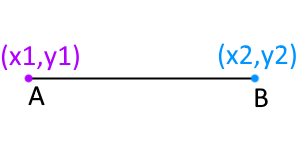

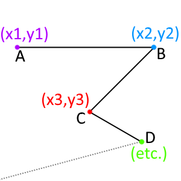

Soit le point **A = {x1 , y2}** Et le point **B = {x2 , y2}** On peut aussi dessiner plusieurs lignes en indiquant plusieurs points à cette fonction : Plus d'infos : [https://fr.wikipedia.org/wiki/Segment\_(math%C3%A9matiques)](https://fr.wikipedia.org/wiki/Segment_\(math%C3%A9matiques\))

| love.graphics.line() love.graphics.line( x1, y1, x2, y2, ... ) **Arguments** [number](https://love2d.org/wiki/number) `x1` La position du premier point dans l'abscisse X (axe horizontale). [number](https://love2d.org/wiki/number) `y1` La position du premier point dans l'ordonnée Y (axe horizontale). [number](https://love2d.org/wiki/number) `x2` La position de l'axe X du second point. [number](https://love2d.org/wiki/number) `y2` La position de l'axe Y du second point. [number](https://love2d.org/wiki/number) `...` Vous pouvez continuer ainsi les successions des points que vous souhaitez. On appelle ceci une [polyligne](https://fr.wikipedia.org/wiki/Ligne_polygonale). |
| --- |

Exemple entre deux points :

```
function love.draw()
   love.graphics.line(
    100, 100, -- 1er  point 
    200, 200  -- 2eme point
    )
end
```

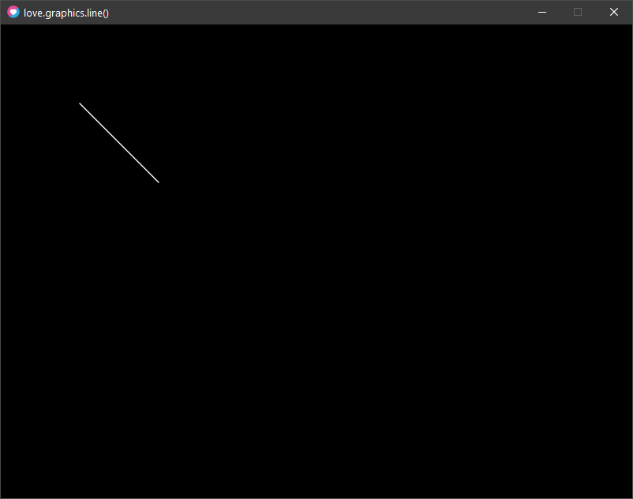

Rendu : l'arguments **...** nous indique qu'on peut dessiner plusieurs points, alors essayons cela =) Exemple d'une suite de Points :

```
function love.draw()
   love.graphics.line(
    100, 100, -- 1er  point 
    200, 200, -- 2eme point 
    300, 100, -- 3eme point 
    400, 200  -- 4eme point 
    )
end
```

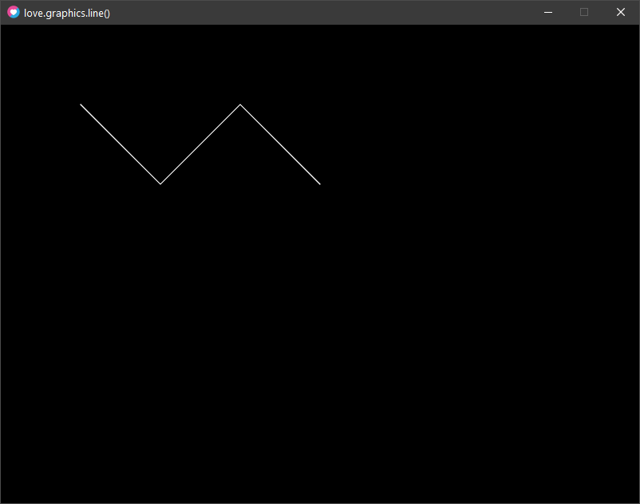

Rendu : Exemple avec une position en mouvement (votre souris) :

```
centerX = 400 -- largeur par defaut fenetre love2D fait 800 soit 800/2 = 400
centerY = 300 -- hauteur par defaut fenetre love2D fait 600 soit 600/2 = 300

function love.draw()
   local mx, my = love.mouse.getPosition()  -- retourne la position x et y de la souris
   love.graphics.line(centerX, centerY, mx, my)
end
```

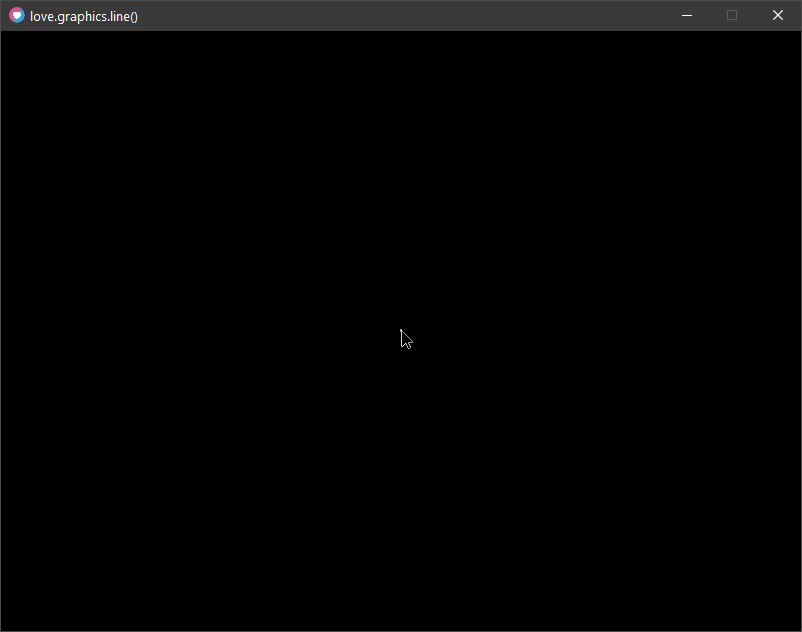

Rendu :

# Dessiner des Rectangles

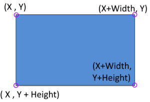

un rectangle qu'est-ce que c'est ?

c'est un ensemble de 4 points.  
Love2D utilise un seul point de reference pour afficher un rectangle.  
on le nommera : **A = {x,y}**

celui-ci possede des propriétés de largeur et de hauteur qui forme son espace.

Soit **A = {x, y, width, height}**

_**width** = largeur_

_**height** = hauteur_

Plus d'infos : [https://fr.wikipedia.org/wiki/Rectangle](https://fr.wikipedia.org/wiki/Rectangle)

* * *

love.graphics.rectangle()

```
love.graphics.rectangle( mode, x, y, width, height, segments ) 
```

**Arguments**

[DrawMode](https://love2d.org/wiki/DrawMode) `mode` Comment voulez-vous dessiner le rectangle ? Forme pleine ou uniquement le contour ? **_"fill"_** dessine un rectangle plein **_"line"_** dessine le contour du rectangle

[number](https://love2d.org/wiki/number) `x` La position **X** (en haut à gauche du rectangle) Soit position **X** du point d'origine du rectangle

[number](https://love2d.org/wiki/number) `y` La position **Y** (en haut à gauche du rectangle) Soit position **Y** du point d'origine du rectangle

[number](https://love2d.org/wiki/number) `width` **W**idth = sa largeur en pixel.

[number](https://love2d.org/wiki/number) `height` **H**eight = sa hauteur en pixel.

**`[number](https://love2d.org/wiki/number) segments (nil) --> Facultatif`**    Le nombres de segments (nombre de  points) utiliser pour dessiner les arrondis des coins du rectangle (voir l'exemple ci-dessous).

* * *

Exemple Rectangle :

```
function love.draw()
  
    love.graphics.setColor(1, 1, 1) -- blanc
    love.graphics.rectangle("fill", 100, 100, 100, 40)      -- Rectangle plein (blanc)    
    love.graphics.rectangle("fill", 100, 200, 100, 40, 10)  -- Rectangle plein (blanc)
    love.graphics.rectangle("fill", 100, 300, 100, 40, 20)  -- Rectangle plein (blanc).
    
    love.graphics.setColor(1, 0, 0) -- rouge
    love.graphics.rectangle("line", 400, 100, 100, 40)      -- Rectangle contour (rouge)    
    love.graphics.rectangle("line", 400, 200, 100, 40, 10)  -- Rectangle contour (rouge) avec 10 segments pour les arrondis des coins.
    love.graphics.rectangle("line", 400, 300, 100, 40, 20)  -- Rectangle contour (rouge) avec 20 segments pour les arrondis des coins.
    
end
```

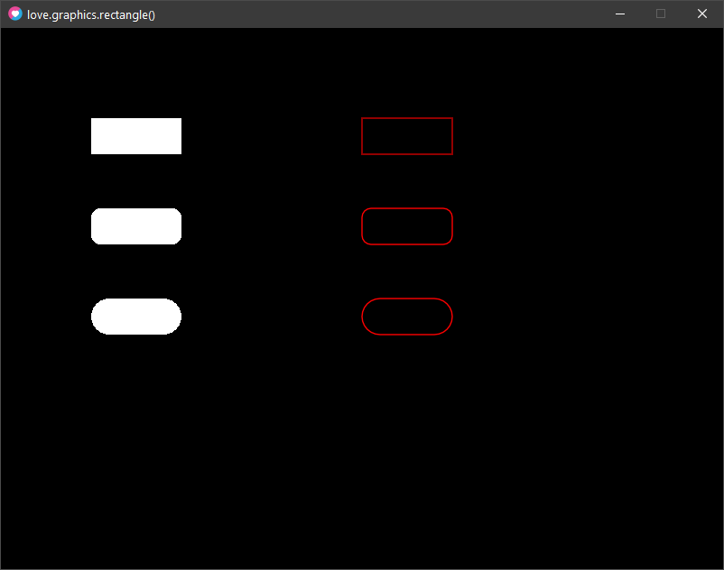

Rendu :

# Dessiner des Cercles

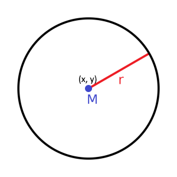

un cercle c'est quoi ?

C'est un point M = {x, y}

avec une propriété de rayon.

Le **rayon** est représenté par la droite **r** dessiné en rouge sur le schéma ci-dessous.

Rappel : le rayon c'est le diamètre d'un cercle divisé par deux.

_rayon = diamètre / 2_

Soit  **M = {x , y, rayon}**

Plus d'infos : [https://fr.wikipedia.org/wiki/Cercle](https://fr.wikipedia.org/wiki/Cercle)

* * *

love.graphics.circle()

```
love.graphics.circle( mode, x, y, radius ) 
```

**Arguments**

[DrawMode](https://love2d.org/wiki/DrawMode) `mode` Comment voulez-vous dessiner le **Cercle** ? Forme pleine ou uniquement le contour ? **_"fill"_** dessine un rectangle plein **_"line"_** dessine le contour du rectangle

[number](https://love2d.org/wiki/number) `x` La position **X** du _centre_ du cercle.

[number](https://love2d.org/wiki/number) `y` La position **Y** du _centre_ du cercle.

[number](https://love2d.org/wiki/number) `radius` Le [rayon](https://fr.wikipedia.org/wiki/Rayon_\(g%C3%A9om%C3%A9trie\)) du cercle.

[number](https://love2d.org/wiki/number) `segments --> Facultatif` Le nombres de segments (points) pour dessiner le cercle (voir l'exemple)

* * *

Exemple Cercles :

```
function love.draw()
  
  
    love.graphics.setColor(1, 1, 1)
    love.graphics.circle("fill", 100, 100, 40) -- Cercle plein (blanc)    
    love.graphics.circle("line", 100, 200, 40) -- Cercle contour (blanc)
    love.graphics.circle("fill", 100,300, 40, 3) -- Cercle plein (blanc) avec 3 segments.
    
    love.graphics.setColor(1, 0, 0)
    love.graphics.circle("line", 400, 100, 100, 3)   -- Cercle rouge avec 3 segments.
    love.graphics.circle("line", 400, 300, 80, 8)    -- Cercle rouge avec 8 segments.
    love.graphics.circle("line", 400, 500, 100, 16) -- Cercle rouge avec 16 segments.
    
end
```

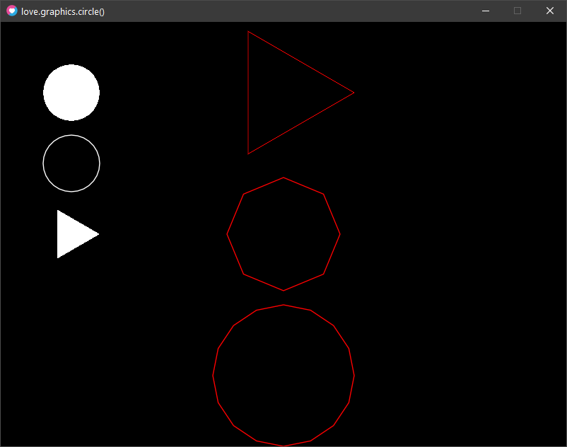

Rendu :

# Bonus Dessiner un Arc de Cercle

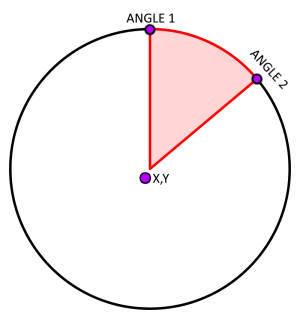

Un arc de cercle c'est quoi ?

C'est un cercle M = {x,y, rayon} avec des proriétés d'un angle de début et de fin.

Soit **M = {x, y, rayon, Angle1, Angle2}**

Plus d'infos : [https://fr.wikipedia.org/wiki/Arc\_(g%C3%A9om%C3%A9trie)](https://fr.wikipedia.org/wiki/Arc_\(g%C3%A9om%C3%A9trie\))

Dans les jeux vidéos, c'est souvent utiliser comme "Champ de vision" d'une unité en patrouille...

Petit exemple tiré du jeu **Metal Gear Solid** de **Konami** :

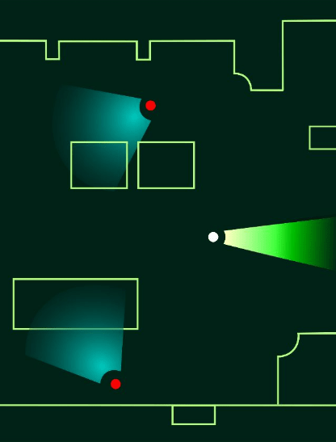

On distingue parfaitement les arcs ici, non ?  =)

* * *

love.graphics.arc()

love.graphics.arc( drawmode, arctype, x, y, radius, angle1, angle2, segments )

**Arguments**

[DrawMode](https://love2d.org/wiki/DrawMode) `drawmode` Comment voulez-vous dessiner l'**arc de cercle** ? Forme pleine ou uniquement le contour ? **_"fill"_** dessine un rectangle plein **_"line"_** dessine le contour du rectangle

[ArcType](https://love2d.org/wiki/ArcType) `arctype (facultatif) --> arctype "pie" par défaut` Le **type d'arc** qu'on souhaite dessiner (voir le deuxième exemple plus bas...)

[number](https://love2d.org/wiki/number) `x` La position **X** du centre du Cercle de l'arc.

[number](https://love2d.org/wiki/number) `y` La position **Y** du centre du Cercle de l'arc.

[number](https://love2d.org/wiki/number) `radius` Le **Rayon** du Cercle de l'arc.

[number](https://love2d.org/wiki/number) `angle1` le **premier angle** qui commence l'arc.

[number](https://love2d.org/wiki/number) `angle2` Le **second angle** qui termine l'arc.

[number](https://love2d.org/wiki/number) `segments (10)` Le nombres de segments (de points) qui sont utilisés pour dessiner l'arc.

* * *

**Exemple Arc reprenant comme modèle le croquis de métal gear solid :**

```
love.window.setTitle("love.graphics.arc()")

local hero   =  { x = 400, y = 100 , angle = 0, rayon = 10 , distanceVision = 200, champVision = 25}
local ennemi =  { x = 280, y = 300 , angle = 235, rayon = 10 , distanceVision = 150, champVision = 70}

function love.draw( )
  -- hero vision :
  love.graphics.setColor(0,1,0,1) -- vert
  love.graphics.arc( "fill", -- mode
    hero.x, -- x
    hero.y, -- y
    hero.distanceVision, -- rayon
    math.rad( hero.angle - (hero.champVision/2) ), -- angle 1
    math.rad( hero.angle + (hero.champVision/2) ) -- angle 2
  )
  -- hero position :
  love.graphics.setColor(1,1,1,1) -- blanc
  love.graphics.circle( "fill", hero.x, hero.y, hero.rayon)

  -- ennemi vision :
  love.graphics.setColor(0,0,0.75,1) -- bleu
  love.graphics.arc( "fill", -- mode
    ennemi.x, -- x
    ennemi.y, -- y
    ennemi.distanceVision, -- rayon
    math.rad( ennemi.angle - (ennemi.champVision/2) ), -- angle 1
    math.rad( ennemi.angle + (ennemi.champVision/2) ) -- angle 2
  )
  -- ennemi position :
  love.graphics.setColor(1,0,0,1) -- rouge
  love.graphics.circle( "fill", ennemi.x, ennemi.y, ennemi.rayon)
end
```

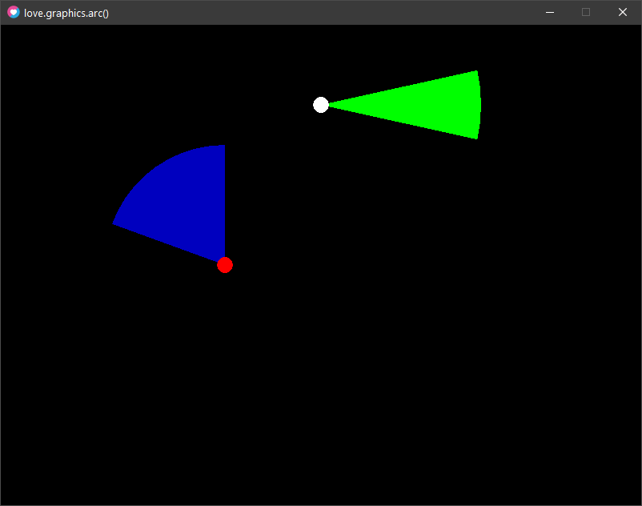

Rendu :   Exemple avec les **arcType** : **"pie"** ou **"open"** ou **"closed" :**  

```
love.window.setTitle("FaconKode.fr : ArcMode and arcType")

function love.draw()

  local x1 = 100
  local x2 = 300
  local x3 = 500
  local x4 = 700
  local y1 = 150
  local y2 = 300
  local y3 = 450
  local radius = 50
  local angle1 = math.rad(45)
  local angle2 = math.rad(270)
  local segments = nil

  -- drawmode : line (contour) no arcType
  love.graphics.print( "line Mode no arcType", 20, 20)
  love.graphics.arc( "line",            x1, y1, radius, angle1, angle2, segments )
  love.graphics.arc( "line",            x1, y2, radius, angle1, angle2, segments )
  love.graphics.arc( "line",            x1, y3, radius, angle1, angle2, segments )

  -- drawmode : fill (plein) no arcType
  love.graphics.print( "fill Mode no arcType", 220, 20)
  love.graphics.arc( "fill",            x2, y1, radius, angle1, angle2, segments )
  love.graphics.arc( "fill",            x2, y2, radius, angle1, angle2, segments )
  love.graphics.arc( "fill",            x2, y3, radius, angle1, angle2, segments )

  -- drawmode : line (contour) + arcType
  love.graphics.print( "line Mode + arcType", 420, 20)
  --
  love.graphics.arc( "line", "pie",     x3, y1, radius, angle1, angle2, segments )
  love.graphics.print( "arcType : pie", 420, y1-80)
  --
  love.graphics.arc( "line", "open",    x3, y2, radius, angle1, angle2, segments )
  love.graphics.print( "arcType : open", 420, y2-80)
  --
  love.graphics.arc( "line", "closed",  x3, y3, radius, angle1, angle2, segments )
  love.graphics.print( "arcType : closed", 420, y3-80)
  --

  -- drawmode : fill (plein) + arcType
  love.graphics.print( "fill Mode + arcType", 620, 20)
  --
  love.graphics.arc( "fill", "pie",     x4, y1, radius, angle1, angle2, segments )
  love.graphics.print( "arcType : pie", 620, y1-80)
  --
  love.graphics.arc( "fill", "open",    x4, y2, radius, angle1, angle2, segments )
  love.graphics.print( "arcType : open", 620, y2-80)
  --
  love.graphics.arc( "fill", "closed",  x4, y3, radius, angle1, angle2, segments )
  love.graphics.print( "arcType : closed", 620, y3-80)
  --

end
--

```

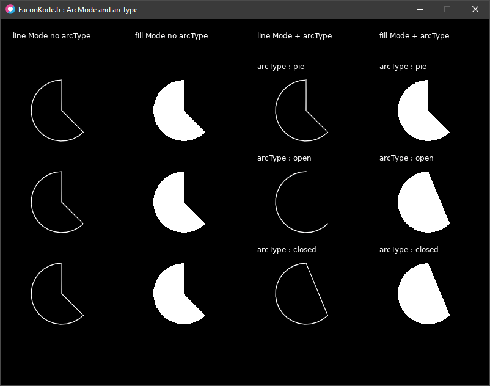

Rendu : **Remarque : L'arcType** est bien facultatif, on note bien que le mode **"pie"** est utilisé par défaut si **l'arcType** n'est pas présent.  

### Vous avez acquis les compétences suivantes :

- dessiner des points

- dessiner des rectangles

- dessiner des cercles

- dessiner des arcs de cercles

* * *
