Les Concepts sont essentiels pour maîtriser les principes utilisés dans la conception de Jeux Vidéos.

Les concepts suivants sont écrits en Lua avec le framework Love2D.

Respecter bien l'ordre ci-dessous pour aborder les différents concepts, car ils suivent une progression évolutive tout en considérant les connaissances acquises sur les cours précédemment vus ensemble.

Les Concepts essentiels du Jeu Vidéo seront abordés avec Love2D (Lua) car c'est un langage facilement transposable (que l'on peut appliquer sur d'autres langages).

## [La GameLoop](https://gamelogiq.dev/liste-des-differents-cours/6-les-concepts-essentiels/la-gameloop/ "La GameLoop")

[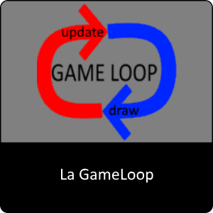](https://gamelogiq.dev/liste-des-differents-cours/6-les-concepts-essentiels/la-gameloop/ "La GameLoop")

* * *

## [Les formes simples, la logique Objet et le Delta Time](https://gamelogiq.dev/liste-des-differents-cours/6-les-concepts-essentiels/les-formes-simples-la-logique-objet-et-le-deltatime/ " Les formes simples, la logique Objet et le DeltaTime")

[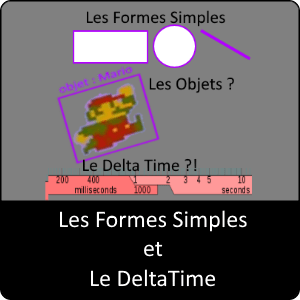](https://gamelogiq.dev/liste-des-differents-cours/6-les-concepts-essentiels/les-formes-simples-la-logique-objet-et-le-deltatime/)

* * *

## [Les Images et Les Angles](https://gamelogiq.dev/liste-des-differents-cours/6-les-concepts-essentiels/concept-essentiel-les-images-et-les-angles/ "Les Images et Les Angles")

* * *

## [Tableau à 2 dimensions (2D)](https://gamelogiq.dev/liste-des-differents-cours/6-les-concepts-essentiels/tableau-a-2-dimensions-2d/ "Tableau à 2 dimensions (2D)")

[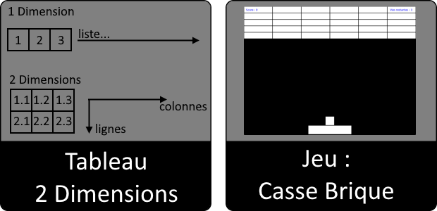](https://gamelogiq.dev/liste-des-differents-cours/6-les-concepts-essentiels/tableau-a-2-dimensions-2d/)

* * *

## Les Sons et la musique

_Module en travaux_

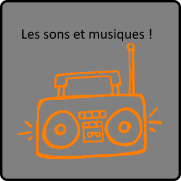

* * *

## La Modularité

_Module en travaux_

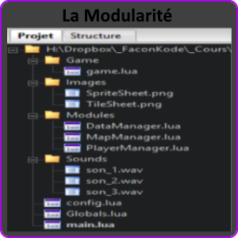

* * *

## La Génération aléatoire et son utilité

_Module en travaux_

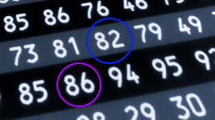

* * *

## Utiliser une collection d'image (TileSheets, SpriteSheets)

_Module en travaux_

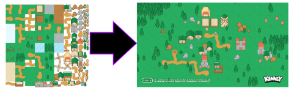

* * *

## Créer une Map en 2D (TileMapping)

_Module en travaux_

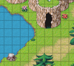

* * *

## Utiliser un Timer (cycle du temps)

_Module en travaux_

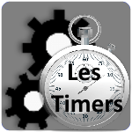

* * *

## Faire des animations d'images (frames)

_Module en travaux_

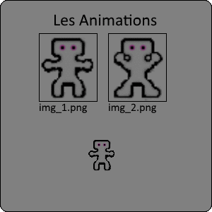

* * *

## **Les collisions d'Objets en 2D**

_Module en travaux_

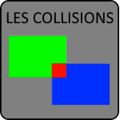

* * *

## Créer une Intelligence Artificielle

_Module en travaux_

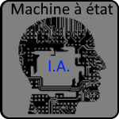
