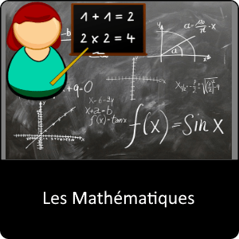
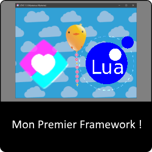
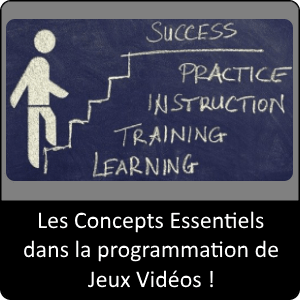
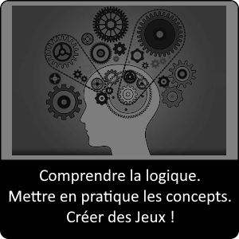



Vous trouverez dans cette page tout le contenu des cours concernant la création de jeu vidéo.

En passant de la théorie à la pratique, avec des exercices fondés sur des concepts utilisés dans le monde professionnel du jeu vidéo.

Le contenu est donc évolutif et s'adresse du simple débutant jusqu'aux personnes confirmées.

Dès le début le contenu est accessible aux débutants, vous pourrez alors déjà réaliser différents types de jeux en 2D comme des plateformers, des RPG, des jeux de combats, des point and clic, des jeux d'arcades de tous types, etc.  
Seule votre créativité sera votre limite en suivant les techniques enseignées sur GameLogic.dev pour créer les jeux que vous avez imaginés.

Bon apprentissage à tous.

## **[1\. Découverte de GameLogic.dev](decouverte-du-monde-du-jeu-video-et-de-ses-outils-de-developpement/index.md)**

##### _À propos du cours_

Découvrir en quoi consiste la création de jeux vidéo, ses origines et les outils qu'on dispose pour les réaliser.

* * *

## **[2\. Installation de mon premier Outil (IDE)](installation-love2d-et-parametrage-de-lide-zerobrane/index.md)**

##### _À propos du cours_

Guide d'installation pas à pas de votre environnement de travail.

* * *

## **[3\. Les Notions en Mathématique Conseillé pour le Game Developpement](3-les-mathematiques-les-bases-en-gamedev/index.md)**

##### _À propos du cours_

Ce module a pour but de vous aider à comprendre des notions de mathématiques que l'on aborde généralement en Classe de 5ᵉ et 4ᵉ.  
  
Cela vous aidera à surmonter des difficultés de compréhension.  
  
Ce dernier reste facultatif, mais fortement conseillez =)

Le contenu a été sélectionné avec les critères de choix suivants :

- **Accessible !**

- **De qualité !**

- **Cours, exemples et exercices**

* * *

## **[4\. Apprendre Mon Premier Langage](4-apprendre-mon-premier-langage-avec-lua-les-bases-lua/index.md)**

##### _À propos du cours_

Dans ce cours, vous apprendrez les **bases du langage Lua** qui vont permettront de créer facilement vos futurs jeux vidéo.

* * *

## **[5\. Mon Premier Framework avec Lua et Love2D](5-mon-premier-framework-avec-lua-et-love2d-les-bases-love2d/index.md)**

##### _À propos du cours_

Love2D est un Framework, c’est une surcouche qui introduit des rajouts et des modifications à Lua…

Love2D introduit donc en surcouche à Lua les modifications suivantes,  optimisations de Lua pour une utilisation avec le jeu vidéo via LuaJit, un noyau qui gère les composants graphiques, audio, contrôleur de jeux, etc. avec SDL2,  une bibliothèque graphique optimiser pour l’affichage 2D-3D avec OpenGL, une bibliothèque audio avec OpenAL, etc.

Tout cela est condensé dans Love2D qui a pour objectif de simplifier l’accessibilité de ces ajouts avec des fonctions simples à utiliser pour le programmeur.

Love2D est alors capable d’afficher du texte, de charger des polices, de charger des sons, des musiques, de charger des images et de les afficher, de les manipuler, de gérer plusieurs formats images, audio ou vidéo, de gérer les entrées du clavier, des manettes, des joysticks, il possède des ajouts de formules mathématiques simplifiés, permet de créer une simulation de la physique en 2D, permet la gestion du temps simplifié, de gérer des connexions réseau, etc.

* * *

## **[6\. Les Concepts indispensables du GameDevelloper](6-les-concepts-essentiels/ "6. Les Concepts indispensables du GameDevelloper")**

##### _À propos du cours_

Découvrez ici les Concepts essentiels pour maîtriser les outils du développeur utilisés dans la conception de Jeux Vidéo avec des jeux prototype pour apprendre en s'amusant.

* * *

## [7\. Challenges : création de Jeux](7-creation-de-jeux.md)

_À propos du cours_

Venez tester vos connaissances, comprendre la logique de certains jeux tout en mettant en pratique les concepts qu'on a appris.

* * *
