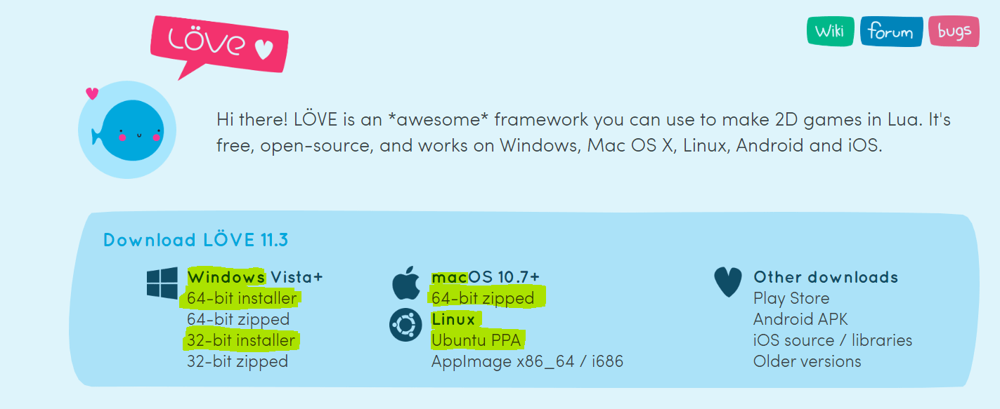
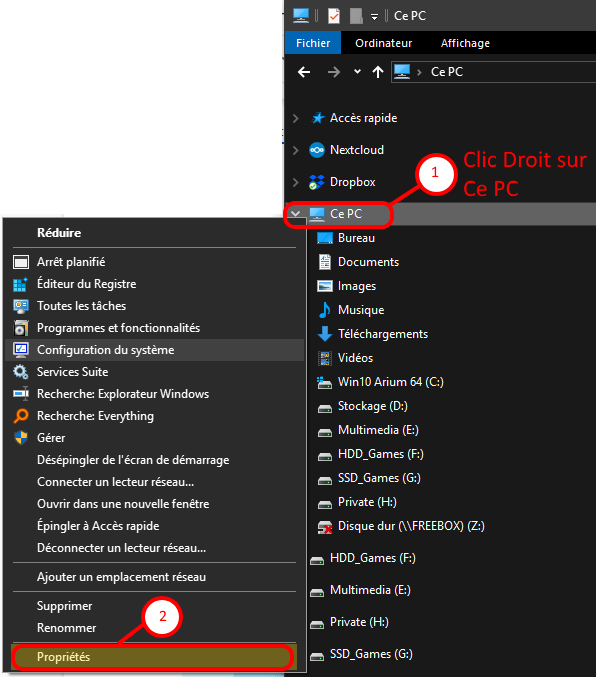
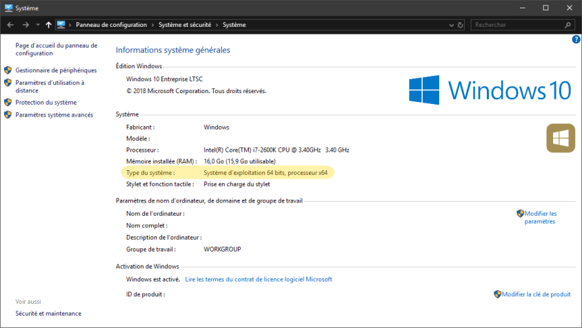
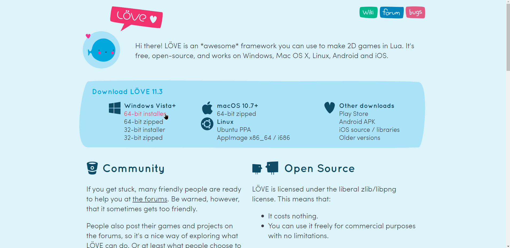
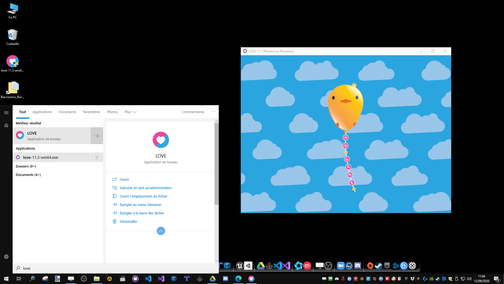
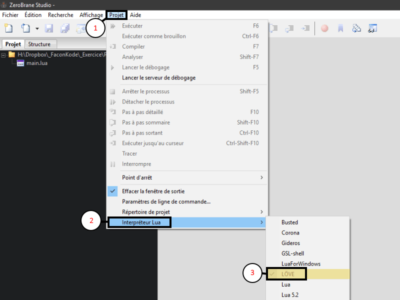

## Installer Love2D

Pour installer  Love2D il vous suffit d’aller sur le site officiel :

[https://love2d.org/](https://love2d.org/)

Puis sélectionner la version qui correspond à votre système.  
  
Si vous ne connaissez pas la version en bits de votre système 32 (x86) ou 64 (x64) :  

* * *

  
Si vous ne possédez pas de processeur x64 c’est que votre système est en 32 bits ;)

Maintenant que vous avez défini la bonne version de Love2D pour votre pc, installez-le.

Guide : Télécharger et Procédez à l'installation :  
_(il n’y a pas besoin de modifier les paramètres par défaut)_  

* * *

Vous pouvez vérifier que l'installation à bien fonctionné en exécutant Love :  

* * *

## Paramétrer ZeroBrane Studio

Jusqu’à présent nous utilisions l'interpréteur Lua par défaut.

Il nous suffit de sélectionner Löve dans l'interpréteur pour changer d'environnement.

procédez comme ceci dans ZeroBrane :

C'est tout… ;)

Si vous exécutez un de vos anciens projet et vous devriez apercevoir une fenêtre Love2D s’ouvrir, cela signifie que tout fonctionne correctement, bravo !

Après cela, nous verrons comment afficher du texte à l'écran, et il est important de bien comprendre l'utilisation de Love2D…

* * *
