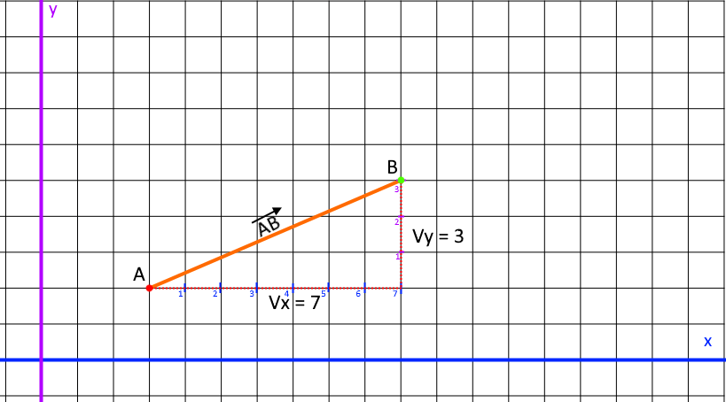
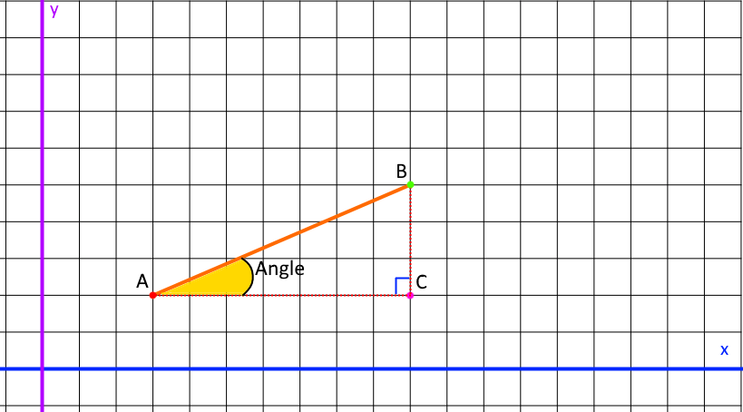

### Mise en situation :

Le Vecteur AB suivant :  



forme un angle :



### Les Fonctions :

Pour connaitre l'angle d'un Vecteur on utilise la fonction [atan2 — Wikipédia (wikipedia.org)](https://fr.wikipedia.org/wiki/Atan2)

_Attention ! Comme nous l'avons vu dans le Chapitre sur les Angles, les fonctions renvois des angles en Radian !_

### La Fonction math.angle() en Code (Pythagore) :

```
function math.angle(x1,y1, x2,y2)
    return math.atan2(y2-y1, x2-x1)
end
```

### Démonstration :

```
function math.angle(x1,y1, x2,y2) return math.atan2(y2-y1, x2-x1) end

local A = {x=3, y=2}
local B = {x=10, y=5}

local AB = {}
AB.vector = {}
AB.vector.x = B.x - A.x
AB.vector.y = B.y - A.y
AB.angleRadian = math.angle(A.x,A.y, B.x,B.y)
AB.angleDegre = math.deg(AB.angleRadian)

print("Le vecteur AB dispose des valeurs suivantes :")
print("AB vector x = "..AB.vector.x)
print("AB vector y = "..AB.vector.y)
print("angle radian = "..AB.angleRadian)
print("angle degre = "..AB.angleDegre)
```

sortie console :

```
function math.angle(x1,y1, x2,y2) return math.atan2(y2-y1, x2-x1) end

local A = {x=3, y=2}
local B = {x=10, y=5}

local AB = {}
AB.vector = {}
AB.vector.x = B.x - A.x
AB.vector.y = B.y - A.y
AB.angleRadian = math.angle(A.x,A.y, B.x,B.y)
AB.angleDegre = math.deg(AB.angleRadian)

print("Le vecteur AB dispose des valeurs suivantes :")
print("AB vector x = "..AB.vector.x)
print("AB vector y = "..AB.vector.y)
print("angle radian = "..AB.angleRadian)
print("angle degre = "..AB.angleDegre)
```

### Connaitre la distance parcourue, quand on connait la position des points A et B ?

### La Fonction math.dist() en Code :

```
function math.dist(x1,y1, x2,y2)
    return ((x2-x1)^2+(y2-y1)^2)^0.5
end

```

### Démonstration :

```
function math.dist(x1,y1, x2,y2) return ((x2-x1)^2+(y2-y1)^2)^0.5 end

local A = {x=3, y=2}
local B = {x=10, y=5}

local distance = math.dist(A.x,A.y,   B.x,B.y)
print("distance parcourue de "..distance.." pixels.")
```

sortie console :

```
distance parcourue de 7.6157731058639 pixels.
```

* * *
