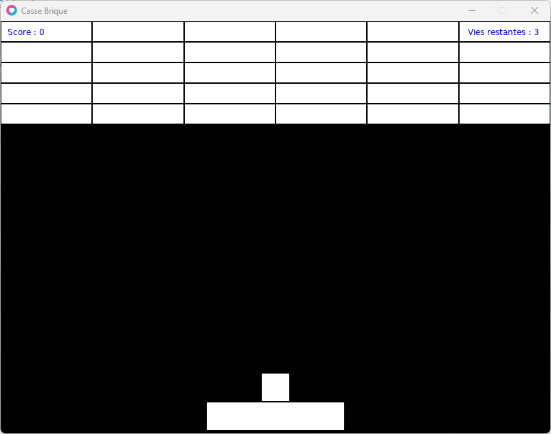

## Ajouter de l'intérêt : Score et Vies !

Nous allons créer une table **game** qui contiendra le **score** et les **vies** du joueur.

- Par défaut le score est à 0

- Nous mettrons 3 vies à notre joueur

```
local game = {score=0, vies=3}
```

- Pour augmenter le score nous allons ajouter 10 points par brique detruite.

```
game.score = game.score + 10
```

```
-- collision entre la balle et les briques : 
  local x, y, w, h -- nos variables de positions et dimensions de nos briques
  x = 0
  y = 0
  w = 800 / 6
  h = 30
  for ligne=1, 5 do
    for colonne=1, 6 do

      if briques[ligne][colonne] == 1 then -- on test la brique si celle-ci vaut 1

        -- test collision en X ?
        if balle.x + balle.w > x and balle.x < x + w then

          -- test collsion en Y ?
          if balle.y + balle.h > y and balle.y < y + h then
            balle.y = y+h
            balle.vy = 0 - balle.vy
            briques[ligne][colonne] = 0 -- ainsi la brique ne sera plus a tester
            game.score = game.score + 10 -- on augmente le score de 10 points !
          end
        end

      end

      x = x + w
    end
    x = 0
    y = y + h
  end
```

- Lorsque la balle touche le bord bas nous enlèverons une vie

```
  -- la balle est perdue si elle a touchee le bord en bas
  if balle.y + balle.h > 600 then
    balle.isGlue = true
    balle.vy = -1
    balle.vx = -1
    game.vies = game.vies - 1 -- on enleve une vie au joueur
  end
```

Nous allons ajouter une table **niveau** qui contiendra le nombre de **lignes** et **colonnes** de notre tableau 2D.

Nous ajouterons également une variable **totalBriques** à notre table **niveau**, pour savoir si le niveau est totalement détruit.

Nous ferons un simple un calcul :  
**totalBriques** \= **lignes** x **colonnes**

Et nous enlèverons 1 à la valeur de **totalBriques** lors de la destruction d'une brique.

Nous allons donc créer une fonction ou l'on y déplacera notre code de création du tableau 2D des briques.

Ainsi nous pourrons l'appeler à notre convenance.

Nous utiliserons la table niveau pour créer cette fonction que l'on nommera **create()**  
Soit : **niveau.create()**

```
local niveau = {lignes=5, colonnes=6, totalBriques=0}

function niveau.create()

-- creation des briques
  for ligne=1, 5 do
    briques[ligne] = {}
    for colonne=1, 6 do
      briques[ligne][colonne] = 1
    end
  end
  
end
```

Il nous maintenant modifier **les valeurs fixes** des boucles de la création du tableau par les valeurs de la table **niveau**.

```
function niveau.create()

-- creation des briques
  for ligne=1, niveau.lignes do
    briques[ligne] = {}
    for colonne=1, niveau.colonnes do
      briques[ligne][colonne] = 1
    end
  end
  
end
```

Dans cette fonction nous allons aussi y ajouter le calcul pour la variable **niveau.totalBriques** :

```
function niveau.create()

-- creation des briques
  for ligne=1, niveau.lignes do
    briques[ligne] = {}
    for colonne=1, niveau.colonnes do
      briques[ligne][colonne] = 1
    end
  end
  
  niveau.totalBriques = niveau.lignes * niveau.colonnes -- total de briques
  
end
```

Désormais il nous faut ajouter **l'appel à cette fonction**, nous la mettrons dans **love.load()**

```
function love.load()
  niveau.create()
end
```

Maintenant un peu de refactoring.

_Refactoring : modifier du code présent par un code plus performant / évolué._

Nous allons remplacer **partout dans le code les valeurs fixes** des boucles de notre tableau par les valeurs de notre nouvelle table **niveau**.

## Pourquoi utiliser ces valeurs dans une table ?

Car maintenant nous pouvons augmenter la valeur des lignes.

Et nos boucles de collision et de draw seront dynamiques, elles n'auront qu'à parcourir le nombre de lignes et colonnes indiquées dans cette table.

C'est super pratique.

## Décompte des briques détruites

Tout comme pour le score, nous ajouterons notre petit calcul dans notre collision balle Vs briques.

```
niveau.totalBriques = niveau.totalBriques - 1
```

```
  -- collision entre la balle et les briques : 
  local x, y, w, h -- nos variables de positions et dimensions de nos briques
  x = 0
  y = 0
  w = 800 / 6
  h = 30
  for ligne=1, niveau.lignes do
    for colonne=1, niveau.colonnes do

      if briques[ligne][colonne] == 1 then -- on test la brique si celle-ci vaut 1

        -- test collision en X ?
        if balle.x + balle.w > x and balle.x < x + w then

          -- test collsion en Y ?
          if balle.y + balle.h > y and balle.y < y + h then
            balle.y = y+h
            balle.vy = 0 - balle.vy
            briques[ligne][colonne] = 0 -- ainsi la brique ne sera plus a tester
            game.score = game.score + 10 -- on augmente le score de 10 points !
            niveau.totalBriques = niveau.totalBriques - 1 -- decompte des briques détruites
          end
        end

      end

      x = x + w
    end
    x = 0
    y = y + h
  end
```

## Affichage du score

Nous afficherons le score à l'écran pour informer le joueur en haut à gauche de l'écran.

Nous l'afficherons en bleu...

```
function love.draw()
  
  -- le score
  love.graphics.setColor(0,0,1,1) -- red, green, blue, alpha
  love.graphics.print("Score : "..game.score, 10, 8)
  love.graphics.setColor(1,1,1,1) -- on remets la couleur par defaut pour la suite des appels
  
end
```

## Affichage des vies

Nous afficherons les nombres de vies restantes à l'écran pour informer le joueur celui-ci en haut à droite.

```
function love.draw()
  
  -- les vies
  love.graphics.setColor(0,0,1,1) -- red, green, blue, alpha
  love.graphics.print("Vies restantes : "..game.vies, 680, 8)
  love.graphics.setColor(1,1,1,1) -- on remets la couleur par defaut pour la suite des appels
  
end
```

Il faut rajouter ces deux affichages après l'affichage des briques sinon il ne sera pas visible.

```
function love.draw()

  -- notre raquette
  love.graphics.rectangle("fill", raquette.x, raquette.y, raquette.w, raquette.h)

  -- notre balle
  love.graphics.rectangle("fill", balle.x, balle.y, balle.w, balle.h)

  local x, y, w, h -- nos variables briques
  x = 0
  y = 0
  w = 800 / 6
  h = 30

  for ligne=1, niveau.lignes do

    for colonne=1, niveau.colonnes do
      if briques[ligne][colonne] == 1 then -- on affiche la brique si celle-ci vaut 1
        love.graphics.rectangle("fill", x+1, y+1, w-2, h-2)
      end
      x = x + w -- a chaque colonne on decale notre variable x de la largeur d une brique
    end

    x = 0 -- on remets la position x pour la ligne suivante
    y = y + h -- on decalle la position y pour la ligne suivante
  end

  -- le score
  love.graphics.setColor(0,0,1,1) -- red, green, blue, alpha
  love.graphics.print("Score : "..game.score, 10, 8)
  love.graphics.setColor(1,1,1,1) -- on remets la couleur par defaut pour la suite des appels

  -- les vies
  love.graphics.setColor(0,0,1,1) -- red, green, blue, alpha
  love.graphics.print("Vies restantes : "..game.vies, 680, 8)
  love.graphics.setColor(1,1,1,1) -- on remets la couleur par defaut pour la suite des appels

end
```

* * *

Le code complet a cette étape :

```
love.window.setTitle("Casse Brique")

local raquette = {x=300, y=555, w=200, h=40, speed=250}

local balle = {x=0, y=0, w=40, h=40, isGlue=true, vx=-1, vy=-1, speed=300}

local briques = {} -- nos briques

local game = {score=0, vies=3}

local niveau = {lignes=5, colonnes=6, totalBriques=0}

function niveau.create()

-- creation des briques
  for ligne=1, niveau.lignes do
    briques[ligne] = {}
    for colonne=1, niveau.colonnes do
      briques[ligne][colonne] = 1
    end
  end

  niveau.totalBriques = niveau.lignes * niveau.colonnes -- total de briques

end
--

function love.load()
  niveau.create()
end

function love.update(dt)
  if balle.isGlue == true then
    balle.x = raquette.x + ((raquette.w / 2) - (balle.w / 2))
    balle.y = raquette.y - (balle.h +  2)
  elseif balle.isGlue == false then
    balle.x = balle.x + (balle.vx * balle.speed * dt)
    balle.y = balle.y + (balle.vy * balle.speed * dt)
  end

  -- la balle rebondi sur le bord droit ou gauche
  if balle.x < 0 then
    balle.x = 0
    balle.vx = 0 - balle.vx
  elseif balle.x + balle.w > 800 then
    balle.x = 800 - balle.w
    balle.vx = 0 - balle.vx
  end

  -- la balle rebondi sur le bord en haut
  if balle.y < 0 then
    balle.y = 0
    balle.vy = 0 - balle.vy
  end

  -- la balle est perdue si elle a touchee le bord en bas
  if balle.y + balle.h > 600 then
    balle.isGlue = true
    balle.vy = -1
    balle.vx = -1
    game.vies = game.vies - 1 -- on enleve une vie au joueur
  end

  -- deplacement de la raquette Droite ou Gauche
  if love.keyboard.isDown("left") then
    raquette.x = raquette.x - (raquette.speed * dt)
  elseif love.keyboard.isDown("right") then
    raquette.x = raquette.x + (raquette.speed * dt)
  end

  -- limiter le deplacement de la raquette a la fenetre du jeu
  if raquette.x < 0 then
    raquette.x = 0
  elseif raquette.x + raquette.w > 800 then
    raquette.x = 800 - raquette.w
  end

  -- collision balle avec raquette :
  -- test collision en X ?
  if balle.x + balle.w > raquette.x and balle.x < raquette.x + raquette.w then

    -- test collsion en Y ?
    if balle.y + balle.h > raquette.y then

      -- 1 | on replace la balle juste au dessus de la raquette
      balle.y = raquette.y - balle.h

      -- 2 | on inverse la direction VY de la balle
      balle.vy = 0 - balle.vy

    end

  end

  -- collision entre la balle et les briques : 
  local x, y, w, h -- nos variables de positions et dimensions de nos briques
  x = 0
  y = 0
  w = 800 / 6
  h = 30
  for ligne=1, niveau.lignes do
    for colonne=1, niveau.colonnes do

      if briques[ligne][colonne] == 1 then -- on test la brique si celle-ci vaut 1

        -- test collision en X ?
        if balle.x + balle.w > x and balle.x < x + w then

          -- test collsion en Y ?
          if balle.y + balle.h > y and balle.y < y + h then
            balle.y = y+h
            balle.vy = 0 - balle.vy
            briques[ligne][colonne] = 0 -- ainsi la brique ne sera plus tester
            game.score = game.score + 10 -- on augmente le score de 10 points !
            niveau.totalBriques = niveau.totalBriques - 1 -- decompte des briques détruites
          end
        end

      end

      x = x + w
    end
    x = 0
    y = y + h
  end

end
--

function love.draw()

  -- notre raquette
  love.graphics.rectangle("fill", raquette.x, raquette.y, raquette.w, raquette.h)

  -- notre balle
  love.graphics.rectangle("fill", balle.x, balle.y, balle.w, balle.h)

  local x, y, w, h -- nos variables briques
  x = 0
  y = 0
  w = 800 / 6
  h = 30

  for ligne=1, niveau.lignes do

    for colonne=1, niveau.colonnes do
      if briques[ligne][colonne] == 1 then -- on affiche la brique si celle-ci vaut 1
        love.graphics.rectangle("fill", x+1, y+1, w-2, h-2)
      end
      x = x + w -- a chaque colonne on decale notre variable x de la largeur d une brique
    end

    x = 0 -- on remets la position x pour la ligne suivante
    y = y + h -- on decalle la position y pour la ligne suivante
  end

  -- le score
  love.graphics.setColor(0,0,1,1) -- red, green, blue, alpha
  love.graphics.print("Score : "..game.score, 10, 8)
  love.graphics.setColor(1,1,1,1) -- on remets la couleur par defaut pour la suite des appels

  -- les vies
  love.graphics.setColor(0,0,1,1) -- red, green, blue, alpha
  love.graphics.print("Vies restantes : "..game.vies, 680, 8)
  love.graphics.setColor(1,1,1,1) -- on remets la couleur par defaut pour la suite des appels

end

function love.keypressed(key)
  if key == "space" and balle.isGlue == true then
    balle.isGlue = false
  end
end
```



Nous avons bien le score qui s'incrémente à la destruction des briques.  
Notre total de vies descend bien lorsqu'on perd la balle.

* * *

Nous allons pouvoir attaquer la remise à zéro de la partie lorsque le joueur n'a plus de vies.

Nous verrons aussi comment créer un nouveau stage après la destruction de toutes les briques.

* * *
