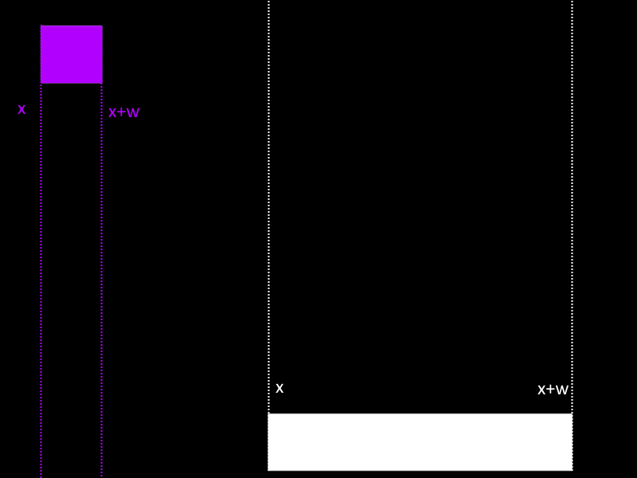
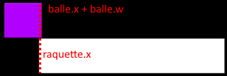
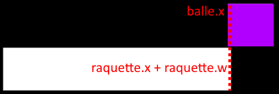
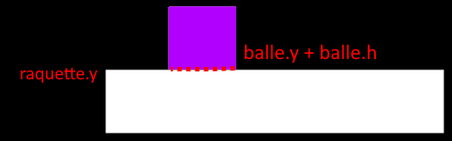

## Collision avec la raquette !

Pour savoir si notre balle collisionne avec la raquette nous avons besoin de deux conditions.

- Connaître sa position en X, comparé à notre raquette

- Connaître sa position en Y, comparé à notre raquette

Si ces deux conditions sont vraies alors notre balle collisionne avec la raquette !

## Collision en X

Pour connaître si la condition en X, est vraie.

Nous n'avons pas besoin de calculs, juste de deux conditions.

Voici un schéma :



- On veut savoir si la position **droite de la balle** est **supérieure** à la **position gauche de la raquette.**



- On veut savoir si la position **gauche de la balle** est **inférieur** à la **position droite de la raquette.**



Si ces deux conditions sont vraies, il a un début de collision entre notre balle et la raquette.

```
if balle.x + balle.w > raquette.x and balle.x < raquette.x + raquette.w then
	-- la collision en X est vrai !
end
```

## Collision en Y

Pour connaître si la condition en Y, est vrai.

Nous testerons la position Y uniquement si la condition en X est vraie, ainsi on simplifie le code.

Nous n'avons pas besoin de calculs non plus, juste d'une seule condition.

- On veut savoir si la position **basse de la balle** est **supérieure** à la **position haute de la raquette.**



Si cette condition est aussi vraie. Alors il y a bien une collision avec notre raquette.

```
function love.update(dt)
  if balle.x + balle.w > raquette.x and balle.x < raquette.x + raquette.w then
      -- la collision en X est vrai !
      if balle.y + balle.h > raquette.y then
          -- collsion !
      end
  end
end
```

Maintenant que nous savons s’il y a une collision. Nous devons faire repartir la balle dans l'autre sens.

## Renvois de la balle

Pour faire ceci, il nous suffit de replacer la balle au-dessus de la raquette puis de changer sa direction VY.

```
function love.update(dt)  
	if balle.x + balle.w > raquette.x and balle.x < raquette.x + raquette.w then
      	-- la collision en X est vrai !
     	if balle.y + balle.h > raquette.y then
          -- collsion !
          -- 1 | on replace la balle juste au dessus de la raquette
          balle.y = raquette.y - balle.h
          -- 2 | on inverse la direction VY de la balle
          balle.vy = 0 - balle.vy
      	end
  	end
end
```

Plus qu'à ajouter ceci à notre code :

```
love.window.setTitle("Casse Brique")

local raquette = {x=300, y=555, w=200, h=40, speed=250}

local balle = {x=0, y=0, w=40, h=40, isGlue=true, vx=-1, vy=-1, speed=300}

local briques = {} -- nos briques

-- creation des briques
for ligne=1, 5 do
  briques[ligne] = {}
  for colonne=1, 6 do
    briques[ligne][colonne] = 1
  end
end
--

function love.update(dt)
  if balle.isGlue == true then
    balle.x = raquette.x + ((raquette.w / 2) - (balle.w / 2))
    balle.y = raquette.y - (balle.h +  2)
  elseif balle.isGlue == false then
    balle.x = balle.x + (balle.vx * balle.speed * dt)
    balle.y = balle.y + (balle.vy * balle.speed * dt)
  end

  -- la balle rebondi sur le bord droit ou gauche
  if balle.x < 0 then
    balle.x = 0
    balle.vx = 0 - balle.vx
  elseif balle.x + balle.w > 800 then
    balle.x = 800 - balle.w
    balle.vx = 0 - balle.vx
  end

  -- la balle rebondi sur le bord en haut
  if balle.y < 0 then
    balle.y = 0
    balle.vy = 0 - balle.vy
  end

  -- la balle est perdue si elle a touchee le bord en bas
  if balle.y + balle.h > 600 then
    balle.isGlue = true
    balle.vy = -1
    balle.vx = -1
  end

  -- deplacement de la raquette Droite ou Gauche
  if love.keyboard.isDown("left") then
    raquette.x = raquette.x - (raquette.speed * dt)
  elseif love.keyboard.isDown("right") then
    raquette.x = raquette.x + (raquette.speed * dt)
  end

  -- limiter le deplacement de la raquette a la fenetre du jeu
  if raquette.x < 0 then
    raquette.x = 0
  elseif raquette.x + raquette.w > 800 then
    raquette.x = 800 - raquette.w
  end

  -- collision balle avec raquette :
  -- test collision en X ?
  if balle.x + balle.w > raquette.x and balle.x < raquette.x + raquette.w then
    
    -- test collsion en Y ?
    if balle.y + balle.h > raquette.y then
    
    -- 1 | on replace la balle juste au dessus de la raquette
      balle.y = raquette.y - balle.h
      
      -- 2 | on inverse la direction VY de la balle
      balle.vy = 0 - balle.vy
      
    end
    
  end
  
end
--

function love.draw()

  -- notre raquette
  love.graphics.rectangle("fill", raquette.x, raquette.y, raquette.w, raquette.h)

  -- notre balle
  love.graphics.rectangle("fill", balle.x, balle.y, balle.w, balle.h)

  local x, y, w, h -- nos variables briques

  x = 0
  y = 0
  w = 800 / 6
  h = 30

  for ligne=1, 5 do

    for colonne=1, 6 do
      love.graphics.rectangle("fill", x+1, y+1, w-2, h-2)  
      x = x + w -- a chaque colonne on decale notre variable x de la largeur d une brique
    end

    x = 0 -- on remets la position x pour la ligne suivante
    y = y + h -- on decalle la position y pour la ligne suivante
  end

end

function love.keypressed(key)
  if key == "space" and balle.isGlue == true then
    balle.isGlue = false
  end
end
```

Apercu en image :

Parfait !

La balle rebondit bien sur la raquette !

* * *

Plus qu'à tester avec nos briques !

* * *
