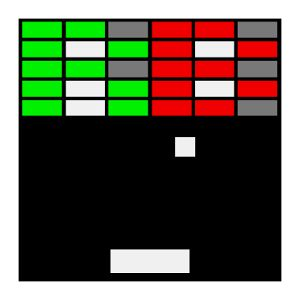
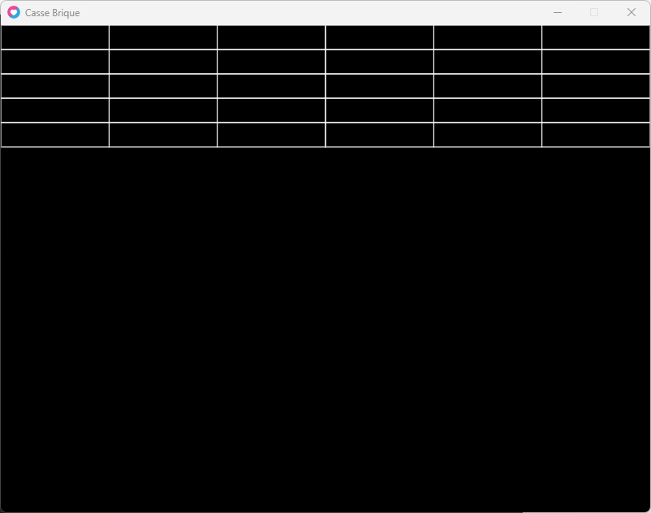
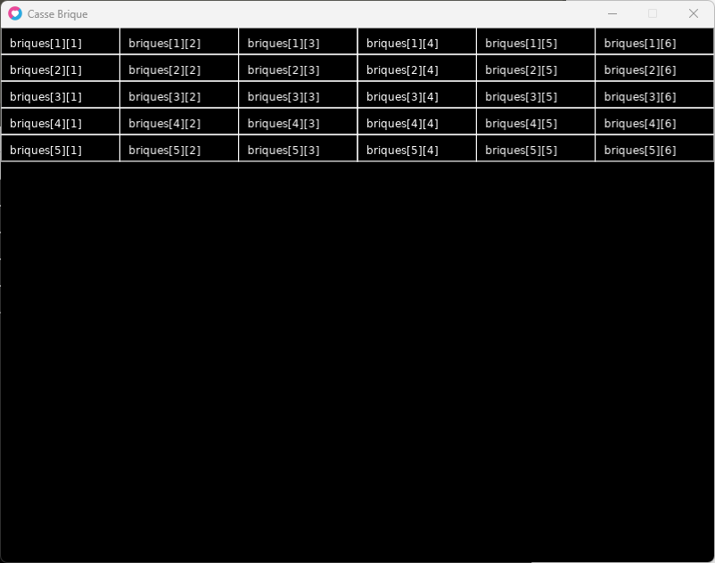
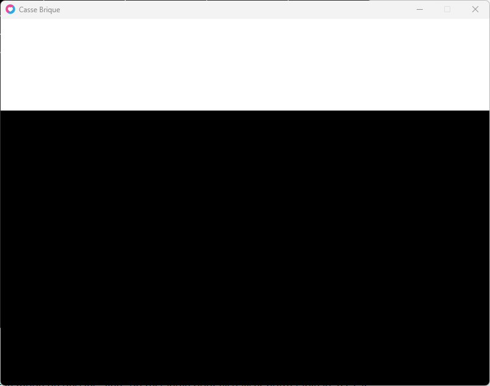

Voici l'image d'un casse brique que l'on va essayer de reproduire.

Vous voyez les briques en haut de l'écran ?

Celles-ci représentent un joli tableau 2D !

* * *

## 1- Créer les briques dans notre tableau

```
local briques = {}
```

Nous avons 5 lignes et 6 colonnes.

Nous allons donc créer 5 index dans la première dimension qui correspondront à nos lignes.

Et dans chacun de ces index nous allons créer 6 index qui correspondront a nos colonnes.

Nous mettrons simplement une valeur de 1 à nos briques du tableau.

```
local briques = {}

briques[1] = {} -- ligne 1
briques[1][1] = 1 -- ligne 1, colonne 1
briques[1][2] = 1 -- ligne 1, colonne 2
briques[1][3] = 1 -- ligne 1, colonne 3
briques[1][4] = 1 -- ligne 1, colonne 4
briques[1][5] = 1 -- ligne 1, colonne 5
briques[1][6] = 1 -- ligne 1, colonne 6

briques[2] = {} -- ligne 2
briques[2][1] = 1 -- ligne 2, colonne 1
briques[2][2] = 1 -- ligne 2, colonne 2
briques[2][3] = 1 -- etc.
briques[2][4] = 1
briques[2][5] = 1
briques[2][6] = 1

briques[3] = {} -- ligne 3
briques[3][1] = 1 -- ligne 3 colonne1
briques[3][2] = 1 -- etc.
briques[3][3] = 1
briques[3][4] = 1
briques[3][5] = 1
briques[3][6] = 1

briques[4] = {} -- ligne 4
briques[4][1] = 1 -- ligne 4 colonne 1
briques[4][2] = 1 -- etc.
briques[4][3] = 1
briques[4][4] = 1
briques[4][5] = 1
briques[4][6] = 1

briques[5] = {} -- ligne 5
briques[5][1] = 1 -- ligne 5 colonne 1
briques[5][2] = 1 -- etc.
briques[5][3] = 1
briques[5][4] = 1
briques[5][5] = 1
briques[5][6] = 1
```

Nous pourrons accéder aux briques comme ceci :

```
briques[numero_de_ligne][numero_de_colonne]
```

Bon pour l'exemple c'est bien...

Mais les Dev's sont réputés pour être fainéants, non ?

* * *

## 1-Bis Créer les briques dans notre tableau avec des boucles !

Donc pour vous faciliter la vie, nous allons refaire tout ce code, en utilisant simplement deux boucles imbriquées !

Avec une première boucle pour les lignes et une autre boucle pour les colonnes.

Ainsi, tout ce pavé de code sera résumé en quelques lignes seulement !

```
local briques = {}

for ligne=1, 5 do -- pour chaques lignes
	briques[ligne] = {} -- je creer un tableau dans ma table briques

	for colonne=1, 6 do -- pour chaques colonnes contenu dans ma ligne
		briques[ligne][colonne] = 1 -- je mets la valeur 1 a ma brique
	end

end
```

Plutôt cool, non ?

* * *

## 2- Afficher les Briques

Maintenant que nous avons notre tableau 2D.

Nous allons pouvoir les afficher !

Pour faire cela nous allons réutiliser la même boucle ci-dessus dans le **love.draw()**

Nous allons dessiner les briques en tant que rectangles, nous aurons donc besoin de ces 4 variables :

- position X

- position Y

- largeur W

- hauteur H

Les positions X et Y nous servirons pour dessiner notre brique.

Les dimensions W et H nous servirons pour dessiner notre brique.

Nous calculons la largeur d'une brique en prenant la largeur de la fenêtre divisée par le nombre de colonnes, soit : 800 / 6

Nous allons assigner une hauteur de 30 par défaut à nos briques

Dans la boucle nous allons décaler les positions X et Y, pour les afficher convenablement !

```
local briques = {} -- nos briques

-- creation des briques
for ligne=1, 5 do
  briques[ligne] = {}
  for colonne=1, 6 do
    briques[ligne][colonne] = 1
  end
end
--

function love.draw()
  
  local x, y, w, h -- nos variables
  
  x = 0
  y = 0
  w = 800 / 6
  h = 30

  for ligne=1, 5 do
    
    for colonne=1, 6 do
    	love.graphics.rectangle("line", x, y, w, h)  
    	x = x + w -- a chaque colonne on decale notre variable x de la largeur d une brique
    end

    x = 0 -- on remets la position x pour la ligne suivante
    y = y + h -- on decalle la position y pour la ligne suivante
  end

end
```



Ça fonctionne !

* * *

OK, mais quelle brique correspond à quoi ?

Nous allons afficher du texte pour indiquer la ligne et la colonne dans la brique pendant le draw afin de nous repérer et que vous puissiez enfin visualiser l'effet de tableau avec le rendu graphique :

```
local briques = {} -- nos briques

-- creation des briques
for ligne=1, 5 do
  briques[ligne] = {}
  for colonne=1, 6 do
    briques[ligne][colonne] = 1
  end
end
--

function love.draw()

  local x, y, w, h -- nos variables

  x = 0
  y = 0
  w = 800 / 6
  h = 30

  for ligne=1, 5 do

    for colonne=1, 6 do
      love.graphics.rectangle("line", x, y, w, h)  

      -- Qui est la ?
      local text = "briques["..ligne.."]["..colonne.."]"
      love.graphics.print(text, x + 10, y+ 10)

      x = x + w -- a chaque colonne on decale notre variable x de la largeur d une brique
    end

    x = 0 -- on remets la position x pour la ligne suivante
    y = y + h -- on decalle la position y pour la ligne suivante
  end

end
```



Voila, j'espere que vous visualiser maintenant la correspondance entre notre table et ses 2 dimensions.

```
briques[numero_ligne][numero_colonne]
```

* * *

Ci-dessus, j'ai volontairement utilisé le mode de dessin "line" de love.graphics.rectangle() qui dessine uniquement le contour du rectangle pour bien visualiser notre tableau 2D, car comme il n'y a pas d'espace pour le moment entre nos briques, nous ne pourrions les distinguées correctement si nous avions fais un dessin avec le rectangle complet.  
  
Voyez par vous-même avec le mode "fill" (plein) :



Pour contourner ce problème, nous allons simplement tricher dans l'appel de **love.graphics.rectangle()** de nos briques dans **love.draw()**.

Pour ce faire, nous allons tricher sur la position X et Y, avec 1 pixel de décalage.  
Comme les rectangles seront décalés, il nous faut aussi les réduire de 2 pixels également sur les dimensions W et H :

```
love.window.setTitle("Casse Brique")

local briques = {} -- nos briques

-- creation des briques
for ligne=1, 5 do
  briques[ligne] = {}
  for colonne=1, 6 do
    briques[ligne][colonne] = 1
  end
end
--

function love.draw()
  
  local x, y, w, h -- nos variables
  
  x = 0
  y = 0
  w = 800 / 6
  h = 30

  for ligne=1, 5 do
    
    for colonne=1, 6 do
    	love.graphics.rectangle("fill", x+1, y+1, w-2, h-2)  
    	x = x + w -- a chaque colonne on decale notre variable x de la largeur d une brique
    end

    x = 0 -- on remets la position x pour la ligne suivante
    y = y + h -- on decalle la position y pour la ligne suivante
  end

end
```


Voilà !

Ce n’est déjà pas si mal pour votre premier tableau 2D.

Je vous recommande de relire, de revoir les bases si nécessaire, voire de venir demander de l'aide sur notre [Discord](https://gamelogiq.dev/discord/) si vous rencontrez des difficultés sur cet exercice.

* * *
