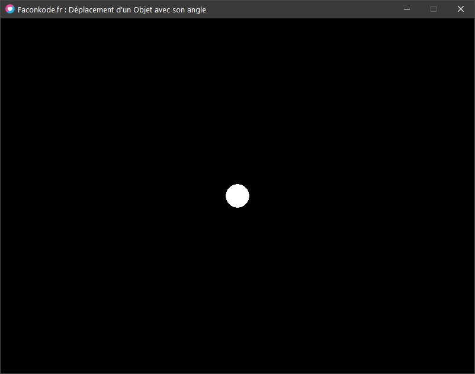

Nous avons vu récemment comment déterminer le nouveau point d'un Objet avec son Vecteur et son Angle avec la formule suivante :

```
-- déplacement avec un angle 
Objet.x = Objet.x + (math.cos(Objet.angleRadian) * Objet.speed)
Objet.y = Objet.y + (math.sin(Objet.angleRadian) * Objet.speed)
```

La Formule avec le DeltaTime, il suffit simplement de multiplier la distance par le delatime !

### La Formule avec le DeltaTime :

```
function love.update(dt)
    -- déplacement avec un angle et le deltatime
    Objet.x = Objet.x + (math.cos(Objet.angleRadian) * Objet.speed * dt)
    Objet.y = Objet.y + (math.sin(Objet.angleRadian) * Objet.speed * dt)
end

```

### Exemple Simple :

Créons un **Objet** de Type **Cercle** que l'on appelera **Circle**.

il possède un point **x**\=400 et **y**\=300

il possède aussi un **rayon** de 20 et une **vitesse** de 600.

il possède un **angle** par défaut à 0. la **touche** "**z**" nous servira à le faire avancer avec le **DeltaTime**.

la **touche** "**s**" nous servira à le faire reculer avec le **DeltaTime**.

les **touche** "**q**" et "**d**" nous servirons à **baisser** ou **augmenter** son **angle** avec la valeur du **DeltaTime**.

###   Création de l'objet et de son affichage :

```
local Circle = {}
Circle.x = 400
Circle.y = 300
Circle.rayon = 20
Circle.vitesse = 600
Circle.angle = 0

function love.draw()
  love.graphics.circle("fill", Circle.x, Circle.y, Circle.rayon)
end
```

Rendu :



### Ajout des contrôles du clavier :

```
function love.update(dt)

  -- rotations de l'angle : augmente ou diminue
  if love.keyboard.isDown("q") then -- diminue l'angle
    Circle.angle = Circle.angle - (10 * dt)
  end
  --
  if love.keyboard.isDown("d") then -- augmente l'angle
    Circle.angle = Circle.angle + (10 *dt)
  end

  -- mouvements : avance ou recule
  if love.keyboard.isDown("z") then -- avance
    Circle.x = Circle.x + math.cos(Circle.angle) * Circle.vitesse * dt
    Circle.y = Circle.y + math.sin(Circle.angle) * Circle.vitesse * dt
  end
  --
  if love.keyboard.isDown("s") then -- recule
    Circle.x = Circle.x + math.cos(Circle.angle) * (0-Circle.vitesse) * dt
    Circle.y = Circle.y + math.sin(Circle.angle) * (0-Circle.vitesse) * dt
  end

end
--
```

### Code Complet :

```
love.window.setTitle("Faconkode.fr : Déplacement d'un Objet avec son angle")
 
local Circle = {}
Circle.x = 400
Circle.y = 300
Circle.rayon = 20
Circle.vitesse = 60
Circle.angle = 0
 
function math.angle(x1,y1, x2,y2) return math.atan2(y2-y1, x2-x1) end
 
 
function love.update(dt)
 
  -- rotations de l'angle : augmente ou diminue
  if love.keyboard.isDown("q") then -- diminue l'angle
    Circle.angle = Circle.angle - (2 * dt)
  end
  --
  if love.keyboard.isDown("d") then -- augmente l'angle
    Circle.angle = Circle.angle + (2 *dt)
  end
 
  -- mouvements : avance ou recule
  if love.keyboard.isDown("z") then -- avance
    Circle.x = Circle.x + math.cos(Circle.angle) * Circle.vitesse * dt
    Circle.y = Circle.y + math.sin(Circle.angle) * Circle.vitesse * dt
  end
  --
  if love.keyboard.isDown("s") then -- recule
    Circle.x = Circle.x + math.cos(Circle.angle) * (0-Circle.vitesse) * dt
    Circle.y = Circle.y + math.sin(Circle.angle) * (0-Circle.vitesse) * dt
  end
 
end
--
 
function love.draw()
  -- dessin du Circle
  love.graphics.circle("fill", Circle.x, Circle.y, Circle.rayon)
  
  -- dessin de l'angle
  love.graphics.print("Circle.angle = "..Circle.angle)
  local distLine = 35
  love.graphics.line(Circle.x, Circle.y,  Circle.x+(math.cos(Circle.angle) * distLine), Circle.y+(math.sin(Circle.angle) * distLine) )
end
--
```

### Optimisation, avec la mise à jour de l'angle avec la souris :

  L'angle de notre Objet, Il sera défini avec le point du **Cercle** et le point de la position de la **Souris**, ces points formeront ainsi son angle directeur. Rappel, la fonction math.angle() :

```
function math.angle(x1,y1, x2,y2) return math.atan2(y2-y1, x2-x1) end
```

- utilisation de la fonction math.angle() pour trouver l'angle entre le Cercle vers la Souris

- utilisation de math.anbgle() dans love.update(dt)

```
love.window.setTitle("Faconkode.fr : Déplacement d'un Objet avec son angle")

local Circle = {}
Circle.x = 400
Circle.y = 300
Circle.rayon = 20
Circle.vitesse = 60
Circle.angle = 0

function math.angle(x1,y1, x2,y2) return math.atan2(y2-y1, x2-x1) end

function love.update(dt)

  -- mise a jour de l'angle avec la souris :
  Circle.angle = math.angle(Circle.x, Circle.y,   love.mouse.getX(), love.mouse.getY())

  -- mouvements : avance ou recule
  if love.keyboard.isDown("z") then -- avance
    Circle.x = Circle.x + math.cos(Circle.angle) * Circle.vitesse * dt
    Circle.y = Circle.y + math.sin(Circle.angle) * Circle.vitesse * dt
  end
  --
  if love.keyboard.isDown("s") then -- recule
    Circle.x = Circle.x + math.cos(Circle.angle) * (0-Circle.vitesse) * dt
    Circle.y = Circle.y + math.sin(Circle.angle) * (0-Circle.vitesse) * dt
  end

end
--

function love.draw()
  -- dessin du Circle
  love.graphics.circle("fill", Circle.x, Circle.y, Circle.rayon)

  -- dessin de l'angle
  love.graphics.print("Circle.angle = "..Circle.angle)
  local distLine = 35
  love.graphics.line(Circle.x, Circle.y,  Circle.x+(math.cos(Circle.angle) * distLine), Circle.y+(math.sin(Circle.angle) * distLine) )
  
  -- commandes
  love.graphics.print("Press Z or S for Forward/Backward".."n".."The Mouse is Directional Angle", 0, 20)
end
--
```

* * *
