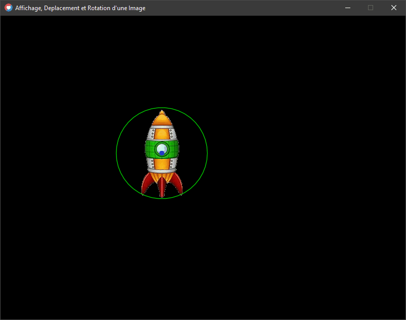

### Ressources :

[Télécharger l'image](https://www.dropbox.com/s/rvztza4c2c8913a/vaisseau.png?dl=0)  

### Exercice :

- Afficher l'image

- Appliquer un déplacement horizontale (axe X) avec les touches "q" et "d"

- Appliquer un déplacement verticale (axe Y) avec les touches "z" et "s"

- Appliquer une rotation avec les touches "left" et "right"

- afficher l'image avec sont point d'origine au Centre.

### Rendu attendu :

### A vous Maintenant !

Reprenez ce que l'on vient de voir jusqu'à maintenant pour réussir cet exercice. Si vous n'y arrivez pas suivez le conseil ci-dessous...

### conseil :

Il faut d'abord prototyper sur papier, puis seulement après taper le code !

1. Créer en tout premier lieu un schéma sur une feuille papier avec des croquis pour vos déplacements avec un pseudo code écris à la main sur le croquis de ce que vous devez faire.

3. Décrivez bien votre pseudo code : étape par étape.

5. Taper votre code dans l'ide en vous aidant de vos croquis et pseudo codes.

* * *
