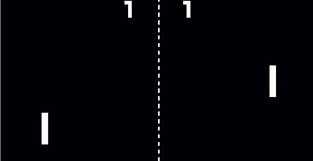

Bon, j'espère que tout le monde connaît le jeu du [pong](https://fr.wikipedia.org/wiki/Pong).

Le système est assez simple.

- 2 raquettes.

- 1 balle.

- Affichage du score des joueurs.

- Affichage du filet.

- L'angle du rebond de la balle change selon le point d'impact sur la raquette.

- Le premier joueur à obtenir 11 points remporte la partie.

## Les raquettes

```
local raquettes = {}

function raquettes.new(positionX)
  local raquette = {x=positionX, y=225, yDef=225, w=20, h=150, speed=300}
  function raquette.draw()
    love.graphics.rectangle("fill", raquette.x,  raquette.y,  raquette.w,  raquette.h)
  end
  return raquette
end
```

## La balle

```
local balle = {x=0, y=0, w=15, h=15, speed=250, follow=true, joueur=1}

function balle.update(dt)
	if balle.follow then
		-- suis la raquette du joueur
	else
		-- bouge tte seule
	end
end

function balle.draw()
  love.graphics.rectangle("fill", balle.x, balle.y, balle.w, balle.h)
end
```

## Les joueurs

```
local joueur = {}

function joueur.load()
  -- joueur 1
  joueur[1] = {score=0}
  joueur[1].raquette = raquettes.new(10) -- positionX
  joueur[1].keys = {up="z", down="s", fire="space"}
  -- joueur 2
  joueur[2] = {score=0}
  joueur[2].raquette = raquettes.new(770) -- positionX
  joueur[2].keys = {up="up", down="down", fire="return"}
end

function joueur.update(dt)
  for n=1, 2 do
    local j = joueur[n]
    local pad = joueur[n].raquette
    if love.keyboard.isDown(j.keys.up) and love.keyboard.isDown(j.keys.down) then
      -- nothing
    elseif love.keyboard.isDown(j.keys.up) then
      pad.y = pad.y - (pad.speed * dt)
    elseif love.keyboard.isDown(j.keys.down) then
      pad.y = pad.y + (pad.speed * dt)
    end
    -- limit to screen
    if pad.y <= 0 then
      pad.y = 0
    elseif pad.y + pad.h >= 600 then
      pad.y = 600 - pad.h
    end
  end
end
--

function joueur.draw()
  for n=1, #joueur do
    joueur[n].raquette.draw()
  end
end
```

## Le filet

```
local filet = {x=400,y=0,w=1,h=600}

function filet.draw()
  love.graphics.rectangle("fill", filet.x, filet.y, filet.w, filet.h)
end
```

## Le Score

```
local gameUI = {}

function gameUI.draw()
  love.graphics.print("J1 : "..joueur[1].score, 200, 10)
  love.graphics.print("J2 : "..joueur[2].score, 600, 10)
end
```

* * *

**Avec ceci essayer de créer la logique du jeu...**

* * *

_Voir la solution a la page suivante_

* * *
