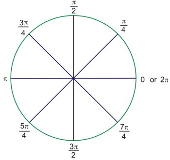
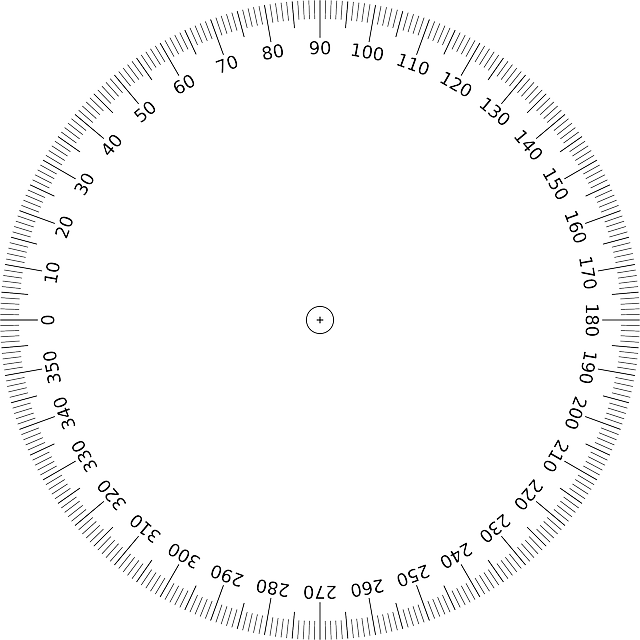
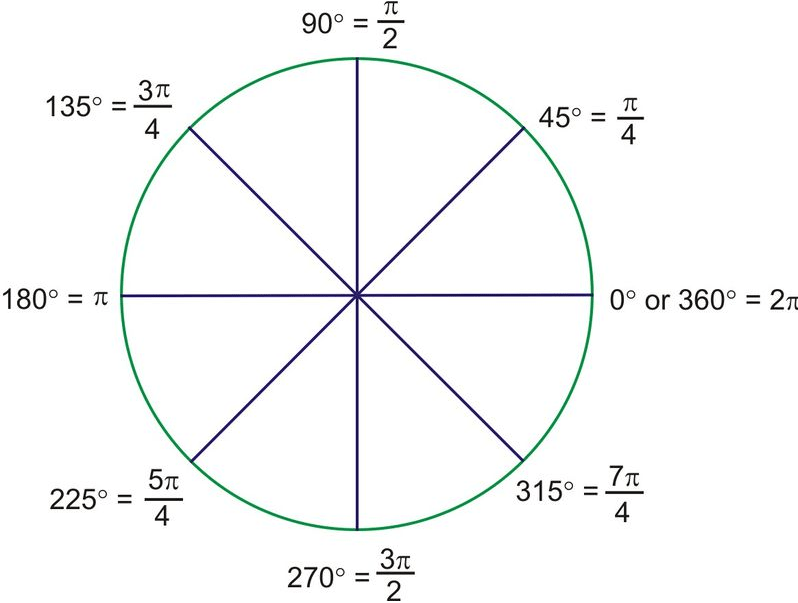

### 1 - Qu'est-ce que l'angle Radian ?

  _Tout d'abord, il faut savoir que c'est l'angle par défaut qui est utilisé par Love2D !_ C'est une unité de mesure indispensable utilisé en trigonométrie ! L'angle Radian commence à _0 rad_  et se termine à _2 Pi rad_

- à 0 l'angle est nul.

- avec un demi Pi on forme un angle droit.

- avec Pi (3.14...) l'angle est plat.

- avec 2 Pi l'angle est plein.

### L'angle Radian, conclusion :

- L'angle Radian n'est pas très utilisé au quotidien du fait qu'il est représenté par des division de Pi qui est lui-même un nombre décimal.

- _L'angle Radian est indispensable dans les fonctions trigonométriques !_

  [Plus d'informations sur Wikipédia : angle Radian — Wikipédia (wikipedia.org)](https://fr.wikipedia.org/wiki/Radian).    

### 2 - Qu'est-ce que l'angle degré ?

C'est l'angle le plus simple à retenir, car L'angle degré commence à _0 deg_ et se termine à _360 deg_    

- à 0° l'angle est nul.

- avec 90° degré on forme un angle droit.

- avec 180° degré l'angle est plat.

- avec 360° degré l'angle est plein.

##### L'angle Degré, conclusion : 

- L'angle Degré est Simple à retenir et couramment utilisé, de ce fait il est plus simple de se faire comprendre en parlant de degré.

- _L'angle Degré ne permet pas d'effectuer les fonctions trigonométriques !_

  [Plus d'informations sur Wikipédia : angle Degré (angle) — Wikipédia (wikipedia.org)](https://fr.wikipedia.org/wiki/Degr%C3%A9_\(angle\))    

### 3 - Comparaison d'angles couramment utilisés entre le Radian et le Degré :

| nom de l'angle | valeur en radians | valeur en degrés |
| --- | --- | --- |
| **angle nul** | **0 rad** | **0°** |
|   | π/6 rad | 30° |
|   | π/4 rad | 45° |
| radian | 1 rad | 57° 17′ 44″ 48‴ |
|   | π/3 rad | 60° |
| **angle droit** | **π/2 rad** | **90°** |
|   | 2π/3 rad | 120° |
|   | 3π/4 rad | 135° |
| **angle plat** | **π rad** | **180°** |
|   | 5π/4 rad | 225° |
|   | 3π/2 rad | 270° |
|   | 7π/4 rad | 315° |
| **angle plein** | **2π rad** | **360°** |

### 4 - Conclusion Radian ou Degré ?

  Nous utiliserons l'angle degré pour placer des objets avec des rotations courantes. angle degré que nous convertirons en Radian pour Love2D grâce à des fonctions intégrées à lua et beaucoup d'autres langages.

Nous utiliserons donc l'angle radian, le principal angle reconnu par les frameworks. Si l'angle radian est principalement utilisé, car c'est le seul à nous permettre l'utilisation de fonctions trigonométrique de déduire des vecteurs X et Y en partant d'un angle.

Les vecteurs nous serviront ainsi à connaitre les vélocités de déplacement des objets !  

### 5 - important !

  Les angles indiqués ci-dessus sont basés sur des repères non modifiés ! C’est-à-dire en respectant ceci :

| _\-x, +y_ | **+Y** | _+x, +y_ |
| --- | --- | --- |
| **\-X** | _0,0_ | **+X** |
| _\-x, -y_ | **\-Y** | _+x, -y_ |

  Rappel Love2D inverse l'axe des ordonnés Y :

| _\-x, -y_ | **\-Y** | _+x, -y_ |
| --- | --- | --- |
| **\-X** | _0,0_ | **+X** |
| _\-x, +y_ | **+Y** | _+x, +y_ |

# **_Les repères en degré sous Love2D :_**

* * *
