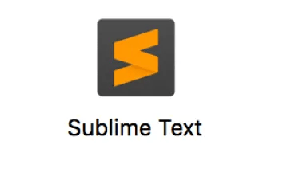
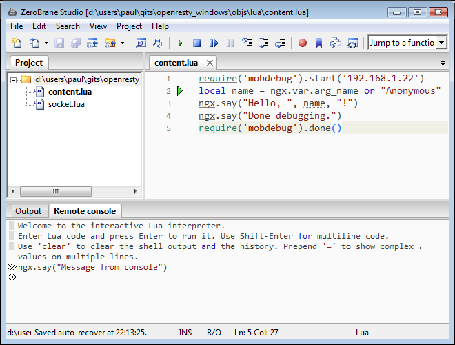
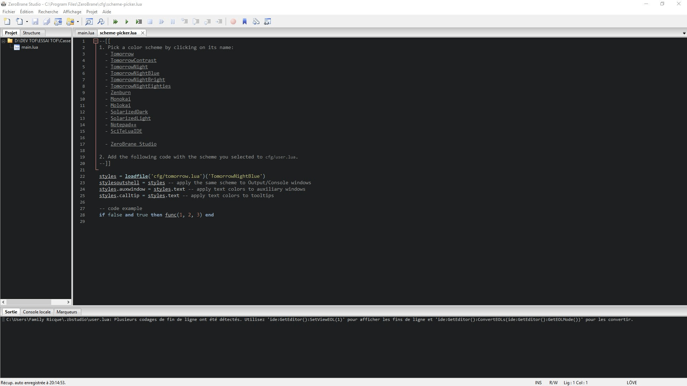

Pour programmer, nous aurons besoin d’un éditeur de texte pour taper votre code avec un compilateur et d’un interpréteur pour exécuter notre code.

Heureusement, tout ceci se trouve déjà dans des logiciels dédiés aux développeurs.

Ce sont des **IDE** qui font tout cela tout seuls comme des grands.

- Alors qu’est-ce qu’un IDE ?

| ZeroBrane | Sublime text | VS Code |
| --- | --- | --- |
|  |  |  |

**IDE** Signifie :  
**Integrated Development Environment  
**le nom français :  
**Environnement de Développement** **Intégré** (EDI).

Nous utiliserons pendant le parcours majoritairement **les termes en anglais**, pour la simple et bonne raison que lors de vos futures recherches sur internet il vous faudra les connaître en anglais, car le langage informatique utilise des termes en anglais.

Alors pas la peine de vous prendre la tête à connaître par cœur les termes en français-anglais, si ce n’est pour votre propre culture et par curiosité.

Concrètement, un IDE c’est un logiciel de traitement de texte évolué qui propose de nombreuses palettes d’outils destinés au développeur pour organiser son code, le déboguer et l'exécuter.

Comme notre objectif est d’utiliser par la suite le framework LUA de Love2D.  
On peut voir sur leur site web, qu'ils nous conseillent plusieurs IDE différents.

| [ZeroBrane Studio](http://studio.zerobrane.com/),  [Sublime Text](https://love2d.org/wiki/Sublime_Text),  [Notepad++](https://love2d.org/wiki/Notepad%2B%2B),  and  [SciTE](https://love2d.org/wiki/SciTE) allow you to launch the game from within their code editors.   source : [https://love2d.org/wiki/Getting\_Started](https://love2d.org/wiki/Getting_Started) |
| --- |

Nous retiendrons une attention particulière à **ZeroBrane** qui propose des palettes d’outils simples, déjà préconfiguré et dispose de l’essentiel tout simplement. De plus, il est disponible sur Windows, Mac et Linux. Cet IDE est idéal pour débuter.

Note : Je l’utilise moi-même personnellement lorsque je veux coder en Lua, car je le trouve simple, rapide et efficace.

Voici une capture d’écran pour voir à quoi ressemble ZeroBrane :  
  
Une fois paramétré avec le thème sombre :  

* * *
