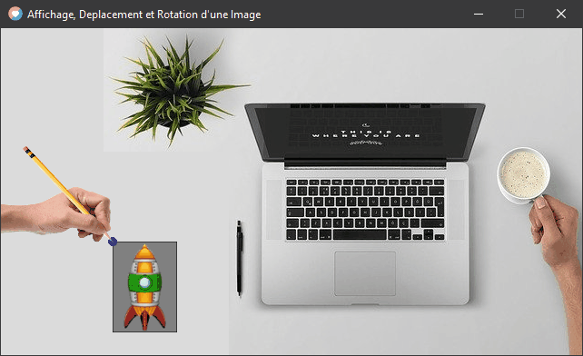
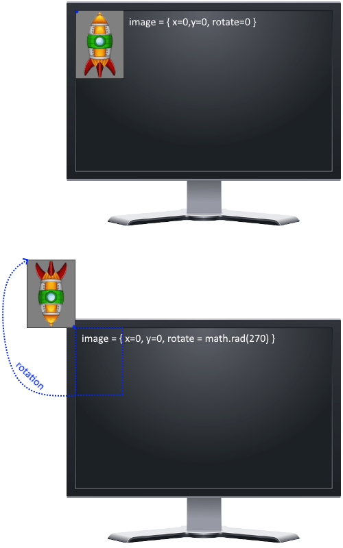
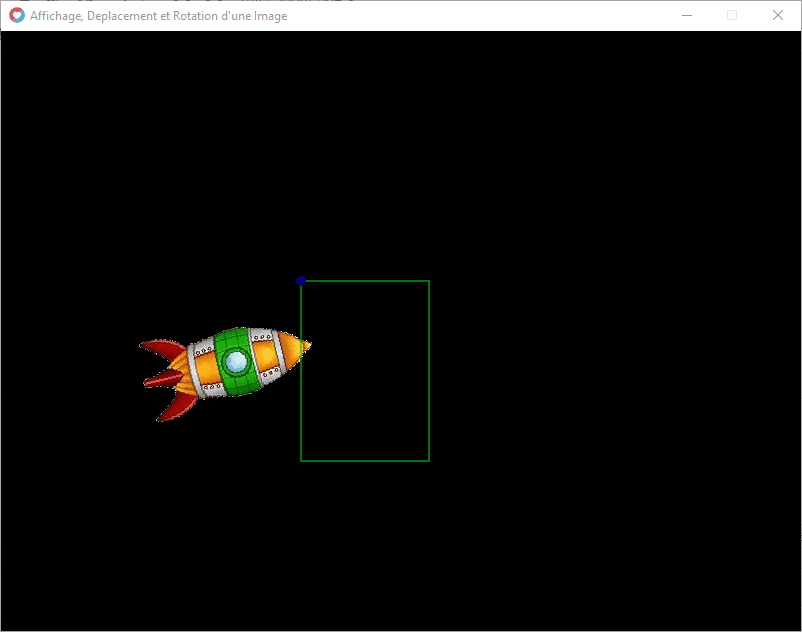
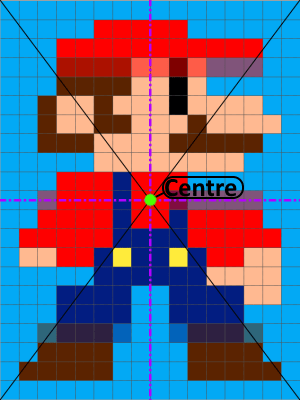
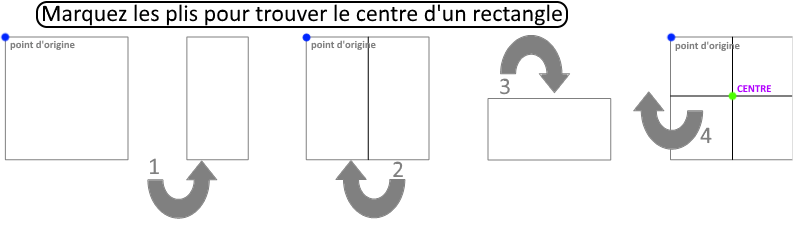
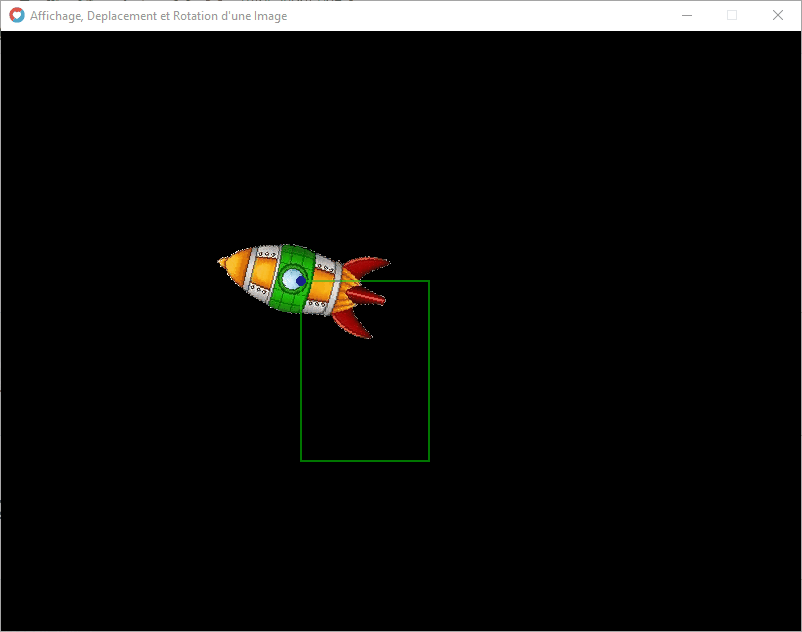

### Appliquer une rotation à l'image

  Lorsqu'on applique une rotation à l'image, elle s'applique à partir du point d'origine.

Prenez une image en cartoon ou une feuille de papier bien a plat sur votre bureau et mettez-y une pointe de compas sur le point d'origine (en haut à gauche).

Maintenant Sans faire bouger votre compas, appliquer une rotation à votre image...

### Exemple :



_Animation réalisé avec Love2D_  

Bien maintenant que vous voyez le principe, appliquons cette rotation à notre vaisseau !

Créons la variable _rotate_ avec un _angle radian_ égale à 0 (valeur par défaut)

```
local vaisseau = {}

vaisseau.imageData = love.graphics.newImage("bureau_vaisseau.png")
vaisseau.w , vaisseau.h = vaisseau.imageData:getDimensions()

vaisseau.x, vaisseau.y = 123, 235

vaisseau.rotate = 0
```

  Maintenant nous voulons que l'image tourne sans s'arrêter, nous lui appliquerons donc une incrémentation dans l'update(dt) :

```
function love.update(dt)
    vaisseau.rotate = vaisseau.rotate + dt
end
```

Seulement, il y a un petit problème, regardez le schéma ci-dessous !



Comme on peut le voir dans le schéma, on va devoir également modifier sa valeur _`x à 300 et y à 250`_, car sans cela notre image sort de la fenêtre Love2D !

Le code complet :

```
local vaisseau = {}

vaisseau.imageData = love.graphics.newImage("vaisseau.png")
vaisseau.w , vaisseau.h = vaisseau.imageData:getDimensions()

vaisseau.x, vaisseau.y = 300, 250

vaisseau.rotate = 0

local color = {} -- color = {r,g,b,a}
color.white =   {1,   1,    1,    1}
color.blue =    {0,   0,    1,    0.8}
color.green =   {0,   1,    0,    0.8}

function love.update(dt)
  vaisseau.rotate = vaisseau.rotate + dt
end

function love.draw()

  -- l'image du vaisseau :
  love.graphics.setColor(color.white)
  love.graphics.draw( vaisseau.imageData, vaisseau.x, vaisseau.y, vaisseau.rotate)

  -- son contour vert :
  love.graphics.setColor(color.green)
  love.graphics.rectangle("line", vaisseau.x, vaisseau.y, vaisseau.w, vaisseau.h)

  -- le point d'origine de l'image en bleue:
  love.graphics.setColor(color.blue)
  love.graphics.circle("fill", vaisseau.x, vaisseau.y, 5)

end
```



Bien ! Notre image du _vaisseau_ tourne !

Oui elle Tourne, mais comme on peut le voir l'image ne tourne pas correctement pour en faire un jeu, car il faudrait que le point d'origine soit en son centre...  

Voyons comment faire cela.

_Bonne nouvelle, nous avons déjà tous les éléments pour le faire =)_

## Mettre le point d'origine au centre d'une image !

### Comment trouver le centre de notre image ?

_Exemple du centre de l'image de notre Plombier fétiche :_



#### Travaux Pratique !

Prenez une feuille vierge d'imprimante ou toute autre feuille de forme carrée ou rectangle, ça fera l'affaire =)

**Avec votre feuille, réaliser l'exercice suivant :**

1. pliez sur la moitié de la largeur de votre feuille bien symétrique, marquez bien le pli.

3. dépliez votre feuille.

5. pliez sur la moitié de hauteur de votre feuille bien symétrique, marquez bien le pli.

7. dépliez votre feuille.

9. **Vous distinguez bien le centre de la feuille grâce à l'intersection des deux pliures !**



### Conclusion :

_Pour trouver le point au Centre de nos images, il nous suffit de calculer la moitié de sa Hauteur et la moitié de sa Largeur !_  

### Formule du calcul pour trouver la moitié d'une dimension :

_Il suffit de **Diviser par 2** la dimension_

ou pour les plus matheux, on peut aussi : _**Multiplier par 0.5**_

### Solution Love2D

Nous avons déjà la largeur et la hauteur de notre image =) Alors il suffit de les diviser par 2 ! Créons les variables _ox_ et _oy_ qui représenteront le point du centre de notre image

```
local vaisseau = {}

vaisseau.imageData = love.graphics.newImage("vaisseau.png")
vaisseau.w , vaisseau.h = vaisseau.imageData:getDimensions()
vaisseau.ox = vaisseau.w/2
vaisseau.oy = vaisseau.h/2
```

### Afficher l'image en son centre

```
local vaisseau = {}

vaisseau.imageData = love.graphics.newImage("vaisseau.png")
vaisseau.w , vaisseau.h = vaisseau.imageData:getDimensions()
vaisseau.ox = vaisseau.w/2
vaisseau.oy = vaisseau.h/2

vaisseau.x, vaisseau.y = 300, 250

vaisseau.rotate = 0

local color = {} -- color = {r,g,b,a}
color.white =   {1,   1,    1,    1}
color.blue =    {0,   0,    1,    0.8}
color.green =   {0,   1,    0,    0.8}

function love.update(dt)
  vaisseau.rotate = vaisseau.rotate + dt
end

function love.draw()

  -- l'image du vaisseau :
  love.graphics.setColor(color.white)
  love.graphics.draw( vaisseau.imageData, vaisseau.x, vaisseau.y, vaisseau.rotate, vaisseau.sx, vaisseau.sy, vaisseau.ox, vaisseau.oy)

  -- son contour vert :
  love.graphics.setColor(color.green)
  love.graphics.rectangle("line", vaisseau.x, vaisseau.y, vaisseau.w, vaisseau.h)

  -- le point d'origine de l'image en bleue:
  love.graphics.setColor(color.blue)
  love.graphics.circle("fill", vaisseau.x, vaisseau.y, 5)

end
```

Rendu :  



C'est déjà plus joli, comme rotation !


### Remarque Importante :

Regardez bien le rectangle vert, qui suit le contour de la position de notre image avec ses points repères.

Le rectangle est dessiné avec ses coordonnées x et y ainsi que sa largeur et sa hauteur qui ne sont qutre que son w et h.

Or, il ne suit pas du tout l'image !

C'est bien pour cela que l'on parle d'_offsets_ ! (décalage de l'image...)

Parce que la position réelle de notre image dans notre code ce sont ses cordonnées X et Y, et elles n'ont pas été changées !

Essayez bien de comprendre et mémoriser cette information, car c'est un concept qui une fois mémorisez, vous épargnera beaucoup de temps sur les recherches d'éventuels bugs.

### Exemple d'erreurs possibles :

**Question :** Dans mon code, je vois bien que mon personnage s’arrête contre les murs, mais à l'écran il traverse quand même le mur ? je ne comprends pas pourquoi, Aidez-moi ?

_**Réponse :** Vous avez oublié de calculer les offsets dans les collisions contre les murs_  

### Autre Exemple d'erreurs possibles :

**Question :** Je ne comprends pas pourquoi, mais quand je retourne mon image je la vois plus à l'écran, pourquoi  ?

_**Réponse :** Oublier de mettre les offset OX et OY pour effectuer la rotation_  

* * *
