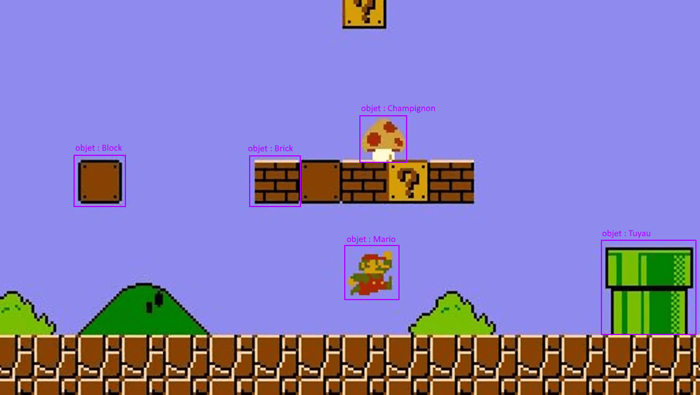
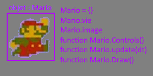
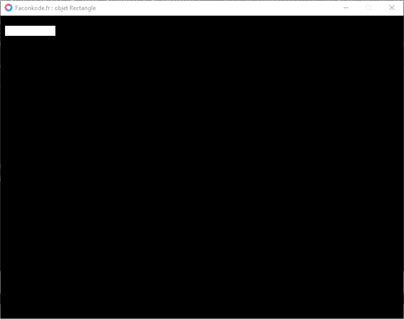

### **Théorie : Un Objet c'est quoi ?**

Dans la programmation, tout ou presque est fondé sur le concept de base des objets... on parle souvent de POO (_programmation oriented object_). Un objet représente une entité à part entière. Par exemple dans Super Mario Bros, _Mario_ est un _Objet_. c'est un élément du jeu à part entière. L'_Objet_ _Mario_ dispose de ses propres fonctions de déplacements, de ses propres propriétés (points de vie, position, etc.), il dispose également de ses propres images, animations, etc.

##### Exemple d'objets :

##### 

##### Détaillons les objets dans l'exemple :

- **Mario est un objet et dispose de :** - de variables : points de vie, position, taille Grand ou Petit, etc. - de fonctions : pour se déplacer, sauter, être dessiné à l'écran, etc.

- **Block est un objet et dispose de :** - de variables : position, utilisé Oui ou Non, Etc. - de fonctions : pour s'animer pendant son activation, être dessiné à l'écran, etc.

- **Brick est un objet et dispose de :** - de variables : position, détruite Oui ou Non, Etc. - de fonctions : pour s'animer pendant sa destruction, être dessiné à l'écran, etc.

- **Champignon est un objet et dispose de :** - de variables : position, utilisé Oui ou Non, Etc. - de fonctions : pour se déplacer pendant son activation, être dessiné à l'écran, etc.

- **Tuyau est un objet et dispose de :** - de variables : position, utilisé Oui ou Non, Etc. - de fonctions : pour téléporter Mario (le joueur) dans une autre partie du Niveau, d'animer la caméra pendant son activation, être dessiné à l'écran, etc.

  Il y a bien évidements d'autres objets dans le jeu de Super Mario Bros que nous pourrions lister, cependant nous ne nous attarderons pas plus sur ceux-cis.   **La Programmation Objet avec Lua ?**   Lua n'est un pas un langage POO (programmation oriented object) ! La Programmation Objet n'est pas disponible en Lua comme elle peut l'être avec d'autres langages POO. Cependant un Objet peut être assimilé... En _Lua_ on utilise alors une _Table_ qui représentera notre _Objet_ ! On parle alors de langage Assimilé Objet. Lua est un langage de [Programmation orientée prototype — Wikipédia (wikipedia.org)](https://fr.wikipedia.org/wiki/Programmation_orient%C3%A9e_prototype)   Un langage POO dispose généralement de variables de types : tableaux, de tables (listes), et de Classes et d'objet :) et des types habituelles de nombres, de textes, etc. Pour Lua on parle d'Objet assimilé car c'est le Programmeur qui décide de lui-même que tel ou tel éléments sera une Classe ou un Objet, etc. Car en Lua il n'existe pas les types Classe et Objet.  

### **POO vs Assimilé Objet Lua ?**

- En **POO** un objet appartient à une classe qui possède des fonctions propres a celle-ci. On dit que l'objet hérite d'une classe. Pseudo code POO :

```
Hero = Classe -- on déclarre une nouvelle classe, Hero disposera de ses propres fonctions 
Mario = new Hero() -- on déclare Mario étant un Héritier de Héro, il hérite alors de toutes les variables et fonction de cette classe (on dit qu'il est construit à partir de sa Classe)
```

- En **Assimilé Objet** un objet est représenté par une table en absence de classe et d'héritage. Pseudo code en Lua :

```
Hero = {} -- on déclarre une nouvelle table Hero qui sera assimilé comme étant une classe... Pour rappel une table peut disposer de variables, de functions, etc.
-- il faut faire sois meme l'héritage via des fonctions à creer soi meme...
function Hero.new() -- on creer donc un constructeur.
	local hero = {x=0,y=0,w=5,h=5}
	return hero
end

Mario = Hero.new() -- on déclare Mario étant un Héritier de Héro, il hérite alors de toutes les variables et fonction de ce constructeur

-- ! important ! il y a de l'héritage en lua, mais la syntaxique est un peu complexe a abordé, on verra cela plus tard : via les metatables =)
```

##### Résumé :

- En POO on parle d'héritage, car le simple fait d'indiquer que Mario soit un Héro, il dispose directement de ce qui constitue cette classe !  
    C'est les langages POO qui facilite cette approche =)

- En Assimilé Objet, on parle d'assimilation, car comme en Lua il faut faire soi-même l'héritage.



### Un Objet Simple en Lua :

  Nous allons créer un Objet de type Rectangle. Comme vu précédemment, un rectangle a besoin des points x et y et d'une largeur (w) et une hauteur (h).

#### Créons l'Objet Rectangle :

Nous lui donnerons une table que l'on nommera : `Rectangle`

```
local Rectangle = {x=10, y=20, w=100, h=20}
```

#### Rajoutons-lui sa fonction draw() :

```
local Rectangle = {x=10, y=20, w=100, h=20}

function Rectangle.draw()
  love.graphics.rectangle("fill", Rectangle.x, Rectangle.y, Rectangle.w, Rectangle.h)
end

function love.draw()
  Rectangle.draw()
end
```

Rendu :


##### Quel est l'intérêt de faire cela ?

Maintenant que le rectangle est un objet, celui-ci dispose de ses propres propriétés et a une fonction draw() Les propriétés de l'Objet Rectangle peuvent donc être modifiés au cours du jeu.   Les propriétés de L'objet Rectangle lui appartiennent, car elles sont dans sa propre table.

#### Rajoutons-lui sa fonction update(dt) :

Créons une function update(dt) a notre Objet Rectangle. On pourra alors mettre à jour sa position.  

```
local Rectangle = {x=10, y=20, w=100, h=20} -- création de l'object Rectangle

local largeurFenetre = love.graphics.getWidth() -- sert a connaitre la largeur de la fenetre de Love2D

function Rectangle.update(dt)
  
  Rectangle.x = Rectangle.x + 1 -- on déplace le rectangle d'1 pixel a droite à chaque update
  
  if Rectangle.x >= largeurFenetre then -- Si le rectangle sort de l'ecran à droite on le remet à gauche :
    
    Rectangle.x = 0 - Rectangle.w -- on le place à 0 - sa largeur, sinon il apparatrait comme par magie sans défilement =)
    
  end
  
end

function Rectangle.draw()
  love.graphics.rectangle("fill", Rectangle.x, Rectangle.y, Rectangle.w, Rectangle.h) -- on dessine le rectangle a sa position
end

function love.update(dt)
  Rectangle.update(dt)
end

function love.draw()
  Rectangle.draw()
end
```

Rendu :  



##### Exemple d'un constructeur d'objet "Héro" en Lua :

```
Hero = {} -- Table Assimilé comme Classe !!!

Mario = {} -- Table de notre personnage

function Hero.new() -- Notre constructeur de Classe, par assimlation !
  local objet = {}
  objet.vie = 3
  table.insert(Hero, objet)
  return objet  
end
--

function love.load()
  Mario = Hero.new() -- création d'un nouveau Hero par assimilation
  
  -- on vérifie l'héritage assimilé ?
  print("Mario dispose de "..Mario.vie.." vie(s).")
  
  -- on vérifie que notre Hero est bien enregistré dans la classe ?
  print("Total(s) de Hero(s) : "..#Hero)
end
--
```

Sortie console :

```
Mario dispose de 3 vie(s). 
Total(s) de Hero(s) : 1
```

### Concrètement ce qu'on doit retenir pour l'instant de l'objet en Lua ?

- En Lua un objet, c'est une table !

- Une table est assimilée comme Objet, mais que celle-ci n'est pas reconnue comme tel…

- Si l'on fait un `print(type(Mario))` celui-ci indiquera Mario comme une table et non comme un Objet ou une Classe !

- En Lua c'est le programmeur qui définit lui-même les Objets dans son code, il n'y a pas de type de variable pour les Classes.

_Ps : Pour les connaisseurs, plus tard nous aborderons les **Métatables** qui se comportent plus comme des Classes avec un système dérivé de l'**Héritage** d'Objets  (Parents> Enfants)_ _mais l'approche est bien trop abstrait pour un débutant._

* * *
