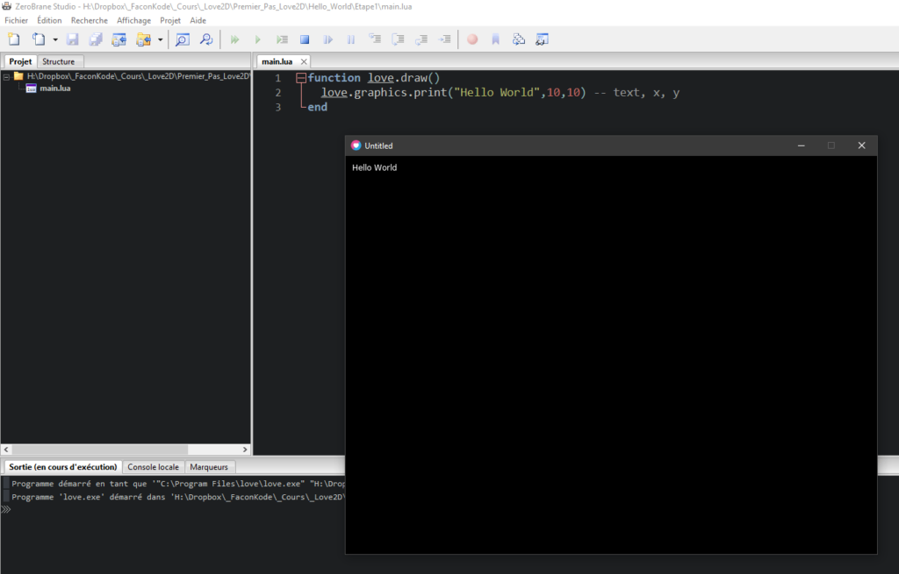
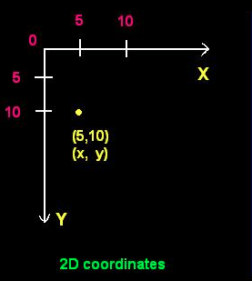
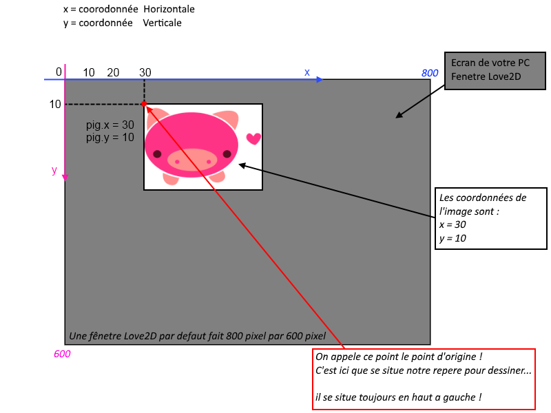
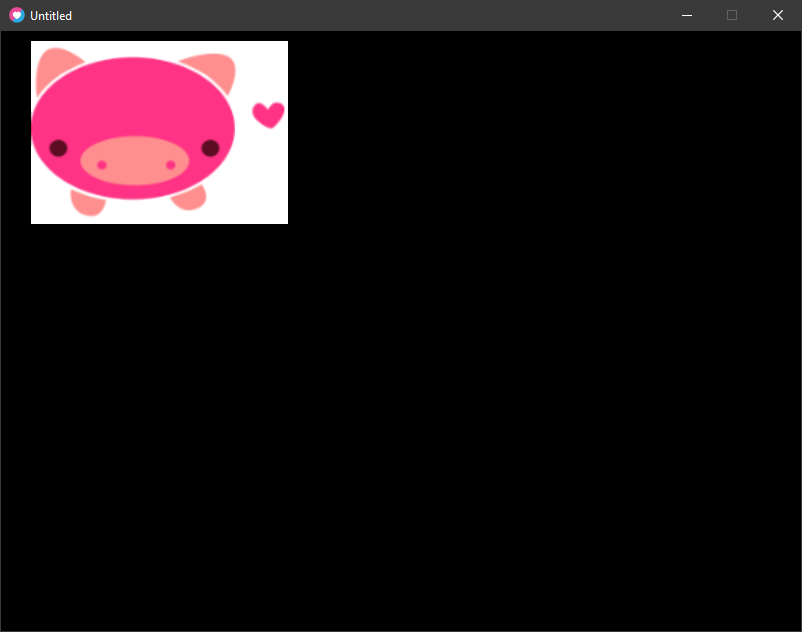

Afficher une Image avec love.graphics.draw() et connaitre son point d'origine

### Rappel exercice précédent :

Lors du chapitre précédent nous avions affiché un texte.

Nous avons mis en paramètres à **love.graphics.print()** le texte **"Hello World"** à afficher.

```
function love.draw()
  love.graphics.print("Hello World") 
end
```



**Syntaxe de love.graphics.print()**

```
love.graphics.print( text, x, y)
```

**Arguments**  
text : [string](https://www.google.com/url?q=https://love2d.org/wiki/string&sa=D&ust=1601491830776000&usg=AOvVaw03-FIAZSt7HRX3gYdZe-sL) The text to draw.  
x : [number](https://www.google.com/url?q=https://love2d.org/wiki/number&sa=D&ust=1601491830777000&usg=AOvVaw3ArITv0QIes8bzhLgXPsDT) (0) The position to draw the object (x-axis)  
y : [number](https://www.google.com/url?q=https://love2d.org/wiki/number&sa=D&ust=1601491830778000&usg=AOvVaw1_xlQQ66VZqjR7VcLpJn7W)  (0) The position to draw the object (y-axis)  
Plus d’infos : [https://love2d.org/wiki/love.graphics.print](https://www.google.com/url?q=https://love2d.org/wiki/love.graphics.print&sa=D&ust=1601491830779000&usg=AOvVaw3W_6TDvEPr8f8cODv0lLb9)

Nous avons remarqué les paramètres de positions X et Y.

## Les positions X et Y

## 

Les coordonnées X et Y sont représentés dans un repère orthonormé non visible qui se situe dans Love2D.

Il est légèrement différent de celui que vous avez l’habitude d’utiliser en géométrie.

L’axe des Y est inversé, hormis cela tout fonctionne à l’identique. Le repère de taille utilisé est le pixel.

La fenêtre de Love2D possède de repères virtuels appelés axis, ceux-ci nous permettent de déterminer la position où sera affiché nos textes, nos images et autres éléments graphiques de notre jeu dans la fenêtre Love2D.

Le repère des axes 0 (zéro) commence toujours en haut à gauche que ce soit pour la fenêtre Love2D, le plein écran.

Pour une image, un texte, etc. Le repère est également en haut à gauche de celui-ci est aussi appelé le **Point d’Origine** !

Voici un schéma avec une simulation d’affichage d’une image dans une fenêtre Love2D :

  
Simulation avec un écran avec une résolution en 800 par 600 pixels :

###   


### Afficher votre première image

Pour aller plus loin et comprendre le fonctionnement, suivez simplement la suite des cours ;)

Nous y aborderons des concepts tels que la GameLoop qui explique le fonctionnement de love.draw() et love.update(dt), la génération aléatoire.

Voici le fichier image que nous utiliserons pour l’exercice :  
[https://drive.google.com/file/d/1D4flXXyzXZ2uOwitFUxJhd9kfqTLZPgC/view?usp=sharing](https://www.google.com/url?q=https://drive.google.com/file/d/1D4flXXyzXZ2uOwitFUxJhd9kfqTLZPgC/view?usp%3Dsharing&sa=D&ust=1601491830783000&usg=AOvVaw0Cxfsq6u8r12GknKKwFehZ)

Pour afficher une image, nous devons charger l’image en mémoire puis l’afficher.

Nous utiliserons les deux fonctions suivantes de Love2D pour réaliser ceci :

* * *

Syntaxe :

```
love.graphics.newImage()
```

exemple :

```
image = love.graphics.newImage( filename )
```

**Arguments**

filename : [string](https://www.google.com/url?q=https://love2d.org/wiki/string&sa=D&ust=1601491830785000&usg=AOvVaw0UguLO5IXgcaQPcFdcKfWs) Le chemin vers le fichier de l’image.

L'afficher avec :

```
love.graphics.draw()
```

```
love.graphics.draw( drawableObject, x, y, r, sx, sy, ox, oy)
```

**Arguments :**

drrawable : [Drawable](https://www.google.com/url?q=https://love2d.org/wiki/Drawable&sa=D&ust=1601491830789000&usg=AOvVaw2YGTrOLnYoTAv8iOKKkgQb) Élément à dessiner (objet)

x : [number](https://www.google.com/url?q=https://love2d.org/wiki/number&sa=D&ust=1601491830792000&usg=AOvVaw0rUCFsqxBkgcCu4FtKYVPo) (0) : Position où dessiner l'objet (x-axis)

y : [number](https://www.google.com/url?q=https://love2d.org/wiki/number&sa=D&ust=1601491830793000&usg=AOvVaw2TduD4QMKQWK6gyiOCSbnH) (0) : Position où dessiner l'objet (y-axis)

r : [number](https://www.google.com/url?q=https://love2d.org/wiki/number&sa=D&ust=1601491830795000&usg=AOvVaw38wMgBAdFa1Yqsje0bvoU1) (0) : Rotation / Angle (en radians)  
sx : [number](https://www.google.com/url?q=https://love2d.org/wiki/number&sa=D&ust=1601491830796000&usg=AOvVaw2ZtgYgvkCs8jxbzqak0MUf) (1) : Scale facteur (x-axis)  
sy : [number](https://www.google.com/url?q=https://love2d.org/wiki/number&sa=D&ust=1601491830798000&usg=AOvVaw1FMfWr41iMdF0scIjdP5pB) (1) : Scale facteur (y-axis)

ox : [number](https://www.google.com/url?q=https://love2d.org/wiki/number&sa=D&ust=1601491830799000&usg=AOvVaw0evkseuGB7WuGYAuL5UBJd) (0) : Point d’Origine / offset (x-axis)  
oy : [number](https://www.google.com/url?q=https://love2d.org/wiki/number&sa=D&ust=1601491830801000&usg=AOvVaw2k_5Ijwet1hfHZgRSN_Ye8) (0) : Point d’Origine / offset (y-axis).

* * *

Le fait de charger l’image en mémoire, réserve un bloc mémoire pour l’image, il faut donc charger l’image qu’une seule fois sous peine de surcharger la mémoire et de provoquer un crash de votre jeu.

Il nous faut afficher l’image dans love.draw() pour qu’elle soit affichée à l’écran, car love.draw() efface l’écran 60 fois par seconde puis redessine chaque élément graphique un à un.

Code Source :

```
-- on charge l'image
monImage = love.graphics.newImage("mascotte.png")

function love.draw()
 love.graphics.draw(monImage,30,10) -- on affiche l'image en x = 30 et y = 10
end
```

Affichage de l'image :



**Félicitations, vous avez appris à utiliser les fonctions principales de Love2D.**

### Vous savez désormais faire les choses suivantes :

- _Afficher une fenêtre Love2D_

- _Changer le titre de la fenêtre Love2D_

- _Afficher du texte simple_

- _Afficher une image dans love.draw()_

* * *
